本仓库仅用于竞赛提交测试，完整仓库请访问 [compiler-lite](https://github.com/LLLLLLLLazy/compiler-lite)

# compiler-lite

`compiler-lite` 是一个以 SysY2022 为主体、带少量 C 风格扩展的编译器。
编译器使用 C++17 实现，输入单个源文件，输出 LLVM IR 或 RISC-V64 汇编。

## 目录

- [一、总览](#一总览)
- [二、构建与使用](#二构建与使用)
- [三、前端](#三前端)
- [四、中间表示与分析](#四中间表示与分析)
- [五、Pass](#五pass)
- [六、RISC-V64 后端](#六risc-v64-后端)
- [七、验证与调试](#七验证与调试)
- [八、参考作品与 AI 工具使用声明](#八参考作品与-ai-工具使用声明)
- [九、能力边界](#九能力边界)

---

# 一、总览


`main.cpp` 负责参数解析和阶段调度。不同输出选项会在流水线的不同位置结束：

- `-T`：CST 转为 AST 后输出图片；
- `-I`：输出前端刚生成的内部结构化 IR；
- `--dom`：输出 CFG 的支配树、支配边界和自然循环；
- `-L`：输出 LLVM IR，使用 `-O1` 时包含优化结果；
- 默认路径：销毁 phi，进入 RISC-V64 后端并输出汇编。

项目主要目录如下：

```text
compiler-lite/
├── main.cpp                     # 命令行与编译流水线
├── frontend/
│   ├── antlr4/
│   │   ├── MiniC.g4             # ANTLR4 文法
│   │   ├── autogenerated/       # contest 分支保留的生成文件
│   │   └── Antlr4*.{h,cpp}      # 解析入口与 CST Visitor
│   ├── AST.*                    # AST 节点
│   └── lowering/IRGenerator.*   # AST → CFG IR
├── symboltable/                 # Module 与分层作用域
├── ir/
│   ├── Instructions/            # IR 指令
│   ├── analysis/                # 支配、循环、内存与纯度分析
│   └── passes/                  # 模块级和函数级 Pass
├── backend/riscv64/             # 指令选择、寄存器分配和汇编输出
├── utils/                       # 日志、集合和位图等工具
├── thirdparty/antlr4/            # ANTLR4 完整 JAR
├── CMake/                       # 依赖查找与工具链配置
└── CMakeLists.txt
```

---

# 二、构建与使用

以下命令均在 `compiler-lite/` 下执行。

### 1. 依赖

- CMake 3.12 或更高版本
- Ninja
- 支持 C++17 的 GCC
- Java Runtime
- ANTLR4 C++ Runtime
- Graphviz 开发库

### 2. 构建

```bash
cmake -B build -S . -G Ninja \
    -DCMAKE_BUILD_TYPE=Debug \
    -DCMAKE_CXX_COMPILER=g++
cmake --build build --parallel
```

当前 `contest` 的 CMake 有两项分支特有限制：

- Clang 会把 GCC 专用的 `-Wno-maybe-uninitialized` 视为未知选项，并因 `-Werror` 失败；
- `USE_GRAPHVIZ=OFF` 时不会加入仓库内 `CMake/` 模块路径，导致 `FindANTLR4.cmake` 不可见。

因此本分支应使用上面的 “Ninja + GCC + 默认启用 Graphviz” 组合。

`contest` 的 CMake 目标名为 `compiler`，构建结果为 `build/compiler`。

当前参数检查要求帮助命令也提供 `-S` 和输入路径；下面的 `README.md`
只作为占位，不会被读取：

```bash
./build/compiler -S -h README.md
```

### 3. 常用输出

```bash
# AST 图片，需要 Graphviz
./build/compiler -S -T -o output.png input.sy

# 前端结构化 IR
./build/compiler -S -I -o output.ir input.sy

# LLVM IR
./build/compiler -S -L -O1 -o output.ll input.sy

# 支配树、支配边界和自然循环
./build/compiler -S --dom -o output.dom input.sy

# RISC-V64 汇编
./build/compiler -S -O1 -o output.s input.sy
```

LLVM IR 和汇编输出会按完整 `-o` 路径中最后一个 `.` 确定扩展名：
存在 `.` 时将其后的内容替换为 `.ll` 或 `.s`，不存在时才追加扩展名。
因此父目录名含 `.` 且文件名未带扩展名时，应显式写出目标扩展名。

### 4. 主要选项

- `-S`：进入输出流程，当前为必选项；
- `-T`：输出 AST 图片；
- `-I`：输出内部结构化 IR，不运行优化；
- `-L`：输出 LLVM IR；
- `--dom`：输出支配与循环分析结果；
- `-O0`：关闭默认 IR 优化，默认值；
- `-O1`：启用默认 IR 优化流水线；
- `-e`：允许在普通表达式位置使用完整的比较和逻辑表达式；
- `-c`：在汇编中附带线性 IR 和寄存器分配信息；
- `--riscv64-rvv=on`：启用 RVV 循环向量化和 `rv64gcv` 输出；
- `--parallel=on`：启用实验性的循环并行化；
- `--ra-stats-json=FILE`：输出寄存器分配统计。

`-T`、`-I`、`-L` 和 `--dom` 互斥。`-A` 与 `-D` 只保留旧命令行兼容性，
当前前端始终使用 ANTLR4。
当前 `-O` 参数解析只判断参数值是否恰为 `0`：`-O0` 关闭优化，
其他取值（包括 `-O1`、`-O2` 等）均按 O1 优化处理。

### 5. 汇编与运行

编译器只生成汇编，不负责汇编和链接。`contest` 不携带 SysY 运行时，
链接时需要使用竞赛环境提供的 `sylib.c`：

```bash
riscv64-linux-gnu-gcc -static -o program output.s /path/to/sylib.c
qemu-riscv64-static ./program
```

---

# 三、前端

前端分为三个阶段：

```text
Antlr4Executor
  → MiniC Lexer / Parser
  → Antlr4CSTVisitor
  → AST
  → IRGenerator
  → typed CFG IR
```

### 1. 词法与语法分析

文法位于 `frontend/antlr4/MiniC.g4`，对应的 ANTLR 生成文件在
`frontend/antlr4/autogenerated/`。

`Antlr4Executor` 读取源文件，调用 ANTLR4 Lexer 和 Parser，并把语法错误统一交给前端错误处理。
文法使用 matched/unmatched 语句处理 dangling else；加减乘除等左结合表达式使用迭代形式，
避免长表达式产生过深的解析树递归。

### 2. CST 转 AST

`Antlr4CSTVisitor` 遍历 ANTLR 生成的 CST，构造项目自己的 AST。

AST 不保存 ANTLR Parser Context。后续类型检查和 IR 生成只依赖 `AST.*`，
因此文法实现与中后端保持解耦。使用 `-T` 时，`Graph.*` 将 AST 输出为 Graphviz 图片。

### 3. 符号与作用域

`Module` 保存函数、全局变量、常量池和内建函数。`ScopeStack` 的每一层都是
名字到 `Value*` 的映射，查询从内层向外层进行，因此支持语句块嵌套和局部变量遮蔽。

`IRGenerator` 在生成函数体前会：

1. 预扫描全局常量；
2. 预声明所有函数；
3. 检查全局名字冲突；
4. 为函数体建立局部作用域。

因此函数可以先调用、后定义。局部 `static` 会转换为具有唯一名字的全局对象，
以保留跨调用生命周期。

### 4. AST Lowering

`IRGenerator` 同时完成类型检查、常量求值和 CFG 构造。

控制流的 lowering：

- `if`、`while` 和 `for` 显式创建基本块；
- `break` 和 `continue` 跳转到当前循环保存的目标块；
- `&&` 和 `||` 通过条件块与合流块实现短路求值；
- 每次添加跳转时同步维护基本块的前驱和后继。

变量与表达式的 lowering：

- 局部标量先生成入口块 `alloca`，读写使用 `load/store`；
- 多维数组递归构造数组类型，索引转换为 GEP；
- 数组实参按形参类型退化为元素指针；
- `int` 与 `float` 混合运算插入 `sitofp` 或 `fptosi`；
- 常量初始化尽量在编译期展开；
- 大数组的动态零初始化使用循环生成，避免产生大量 IR；
- `starttime()` 和 `stoptime()` 会补入源码行号；
- 字符串实参会保存为匿名全局对象，再传递首元素地址。

### 5. 支持的语言

当前支持：

- `int`、`float` 和 `void` 函数返回值；
- 全局变量、局部变量、`const`、局部 `static`；
- 标量和多维数组、嵌套初始化列表；
- 函数定义、调用、递归、标量与数组形参；
- 算术、比较、逻辑、一元运算和前后置 `++/--`；
- `if/else`、`while`、`for`、`break`、`continue`、`return`；
- SysY 整型/浮点 I/O、计时接口和 `putf`。

赋值当前按语句语义处理，属于非连续组合的表达式形式。

---

# 四、中间表示与分析

### 1. IR 结构

内部 IR 是强类型、以基本块组织的 LLVM 风格对象模型：

```text
Module
├── GlobalVariable
└── Function
    ├── FormalParam
    └── BasicBlock
        ├── predecessors / successors
        └── Instruction
            ├── Type
            ├── operands: Use
            └── users: Use
```

`Instruction` 继承 `User`，`User` 继承 `Value`。每个操作数由独立的 `Use`
连接 usee 和 user，替换值或删除指令时会同步维护双向 def-use 链。

内部结构化 IR 与 LLVM IR 是两种输出：

- `Module::outputIR` 输出项目内部表示，用于观察 lowering；
- `LLVMIREmitter` 输出 LLVM IR 文本，可交给 LLVM 工具链处理。

### 2. SSA

前端先保留 `alloca/load/store`，`-O1` 中再由 `Mem2Reg` 构造 SSA。

算法：

1. 找出地址未逃逸、只被直接读写的 `alloca`；
2. 根据支配边界计算 phi 插入位置；
3. 沿支配树 DFS 重命名变量并填写 phi incoming；
4. 删除被提升的 `alloca/load/store`。

汇编路径不保留 phi。`PhiToSelect` 先处理适合 if-conversion 的简单结构，
`PhiLowering` 再把其余 phi 转为前驱块上的并行复制；遇到复制环时引入临时值，
遇到临界边时先拆边。

### 3. 分析

`ir/analysis/` 提供 Pass 共用的分析能力：

- `DominatorTree` / `DominanceFrontier`：支配关系与 phi 插入；
- `PostDominatorTree`：控制依赖与死代码删除；
- `LoopInfo`：自然循环和循环嵌套深度；
- `ScalarEvolution`：归纳变量与仿射递推；
- `MemoryLocation` / `MemoryAccess`：根对象、索引路径和保守别名判断；
- `PureFunctionAnalysis`：基于调用图 SCC 的函数纯度；
- `CostModel`：循环变换、展开和向量化的收益判断；
- `AnalysisCache`：缓存函数级分析结果。

#### DominatorTree

`DominatorTree` 从函数入口出发构造支配树。下图左侧为 CFG，右侧为对应的支配树；
`D` 虽然同时由 `B` 和 `C` 到达，但它的直接支配者仍是 `A`。

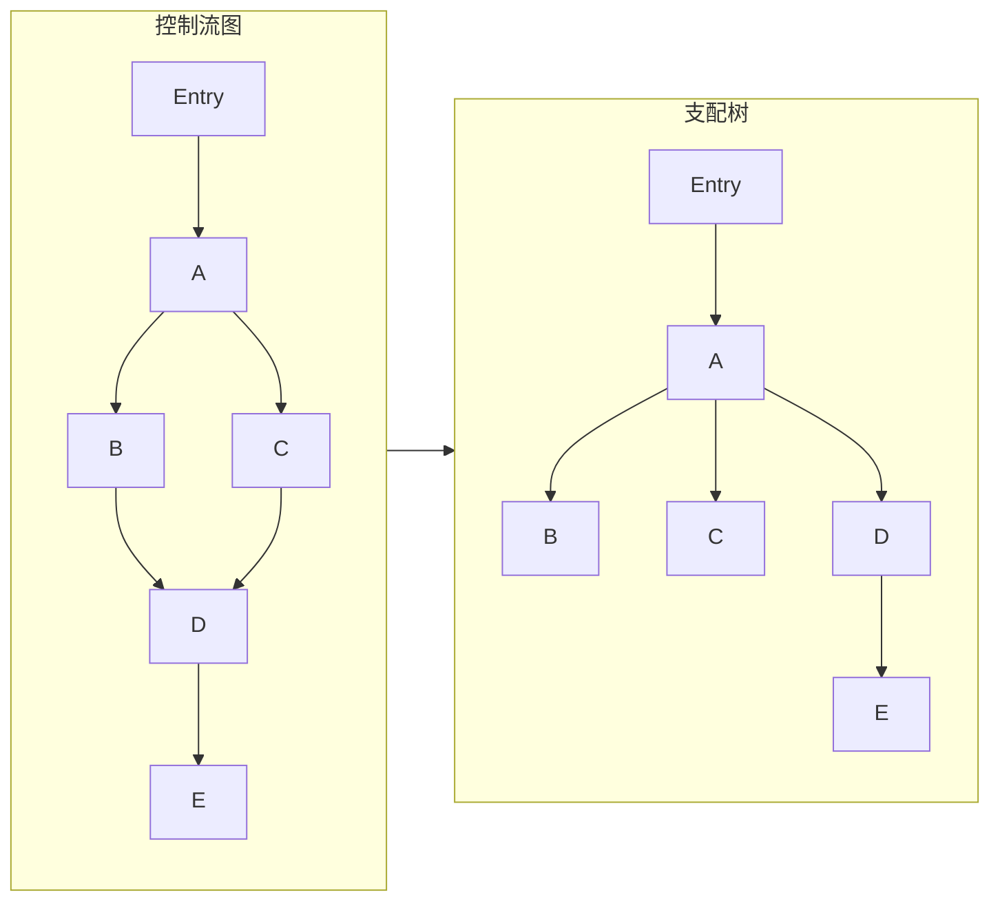

#### DominanceFrontier

对汇合块 `K`，从每个前驱沿支配树向上追溯到 `idom(K)`；
途中经过的节点都把 `K` 加入自己的支配边界。

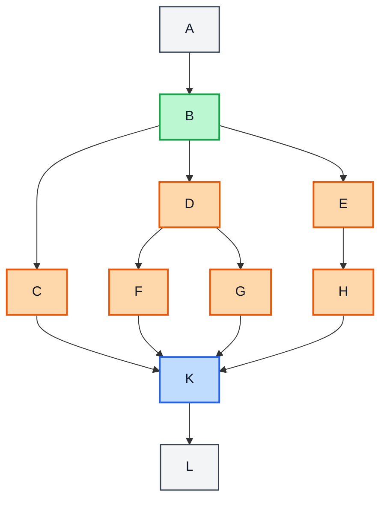

#### LoopInfo

若边 `A → B` 满足 `B` 支配 `A`，该边就是回边；从回边源反向收集到
header 的节点，与 header 一起构成自然循环。

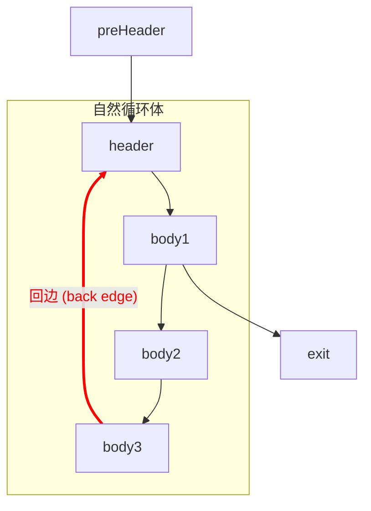

基本块的循环嵌套深度等于包含它的自然循环数量。下图中
`H1`、`A`、`D` 深度为 1，`H2`、`B`、`C` 深度为 2。

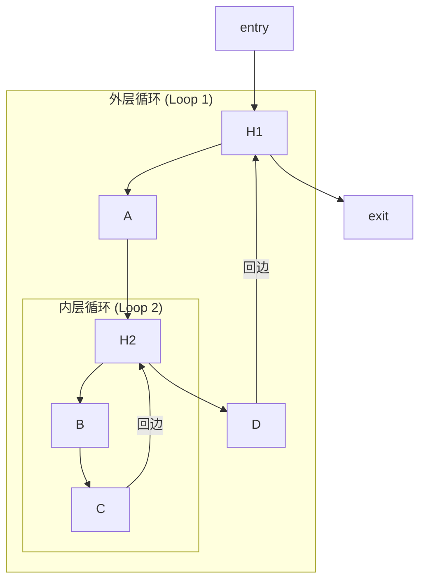

这些分析遵循保守原则：无法证明合法时，不执行变换。

---

# 五、Pass

`PassManager` 按执行粒度把 Pass 分为四类：

- `modulePass`：以整个 `Module` 为单位执行；
- `functionPass`：以 `Function` 为单位，每注册一次执行一次；
- `fixedPointFunctionPass`：整组重复执行，直到 IR 不再变化或达到轮数上限；
- `toolPass`：不独立注册进流水线，由其他 Pass 在需要时调用。

目录分类表示实现所在的位置，实际执行时机仍由 `PassManager` 的注册位置决定。
例如 `GVN` 会在一次函数级阶段和定点阶段重复使用，`PhiToSelect` 也会在
定点阶段及 phi 降级前各执行一次。

### 1. 优化流水线

`-O0` 跳过默认 IR 优化；`-O1` 注册 `PassManager` 的完整流水线。

```text
模块预处理
  InterproceduralConstProp → SmallFunctionInline
  → DeadFunctionElim → DeadGlobalStoreElim → GlobalToLocal

一次函数级
  PureCallCSE → ArrayScalarize → Mem2Reg → GVN
  → PureCallMemoize（仅单线程）→ TailRecursionElim
  → LoopParallelize（仅 --parallel=on）

内联后清理
  PostInlineCleanup → PostInlineGlobalCleanup

定点函数级，最多 18 轮
  值与循环规范化：
    LocalMemoryOpt → GVN → LICM → CanonicalizeLoop → DeadInstElim
  循环变换：
    LoopFusion → RangeModSimplify → LoopExitValueRewrite
    → DeadInstElim → RemoveEmptyLoop → LoopTiling
    → LoopStrengthReduce → GVN → MatMulInterchange → DeadInstElim
  向量化与展开：
    LoopVectorize（仅汇编路径且 --riscv64-rvv=on）
    → SimpleLoopUnroll → GVN → DeadInstElim
    → IndVarSimplify → ConstProp
  晚期值优化：
    PureCallCSE → LICM → PureCallLoopCache → PhiToSelect
    → BoundedBitLoopSolver → InstCombine → PureCallCSE
    → ConstProp → UnreachableBlockElim → DeadInstElim → CFGSimplify

定点后
  LateInline
  → PostFixedPointLoopCleanup
  → LateLoopOpt
  → PostLateLoopCFGCleanup

汇编路径
  PreLoweringPhiToSelect → PhiLowering
```

```mermaid
flowchart TB
    subgraph ModulePass["模块预处理"]
        direction LR
        MP_InterproceduralConstProp[InterproceduralConstProp] --> MP_SmallFunctionInline[SmallFunctionInline]
        MP_SmallFunctionInline --> MP_DeadFunctionElim[DeadFunctionElim]
        MP_DeadFunctionElim --> MP_DeadGlobalStoreElim[DeadGlobalStoreElim]
        MP_DeadGlobalStoreElim --> MP_GlobalToLocal[GlobalToLocal]
    end

    subgraph FunctionPass["一次函数级"]
        direction LR
        FP_PureCallCSE[PureCallCSE] --> FP_ArrayScalarize[ArrayScalarize]
        FP_ArrayScalarize --> FP_Mem2Reg[Mem2Reg]
        FP_Mem2Reg --> FP_GVN[GVN]
        FP_GVN --> FP_PureCallMemoize["PureCallMemoize<br/>仅单线程"]
        FP_PureCallMemoize --> FP_TailRecursionElim[TailRecursionElim]
        FP_TailRecursionElim --> FP_LoopParallelize["LoopParallelize<br/>仅 parallel=on"]
    end

    subgraph PostInlineCleanup
        direction LR
        PIC_SmallFunctionInline[SmallFunctionInline] --> PIC_Mem2Reg[Mem2Reg]
        PIC_Mem2Reg --> PIC_GVN[GVN]
        PIC_GVN --> PIC_LICM[LICM]
        PIC_LICM --> PIC_InstCombine[InstCombine]
    end

    subgraph PostInlineGlobalCleanup
        direction LR
        PIGC_DeadFunctionElim[DeadFunctionElim] --> PIGC_GlobalToLocal[GlobalToLocal]
        PIGC_GlobalToLocal --> PIGC_Mem2Reg[Mem2Reg]
        PIGC_Mem2Reg --> PIGC_GVN[GVN]
        PIGC_GVN --> PIGC_LICM[LICM]
        PIGC_LICM --> PIGC_InstCombine[InstCombine]
    end

    subgraph FixedPointFunctionPass["定点函数级，最多 18 轮"]
        direction TB
        subgraph group1["值优化 + 循环规范化"]
            direction LR
            G1_LocalMemoryOpt[LocalMemoryOpt] --> G1_GVN[GVN]
            G1_GVN --> G1_LICM[LICM]
            G1_LICM --> G1_CanonicalizeLoop[CanonicalizeLoop]
            G1_CanonicalizeLoop --> G1_DeadInstElim[DeadInstElim]
        end

        subgraph group2["循环变换"]
            direction LR
            G2_LoopFusion[LoopFusion] --> G2_RangeModSimplify[RangeModSimplify]
            G2_RangeModSimplify --> G2_LoopExitValueRewrite[LoopExitValueRewrite]
            G2_LoopExitValueRewrite --> G2_DeadInstElim1[DeadInstElim]
            G2_DeadInstElim1 --> G2_RemoveEmptyLoop[RemoveEmptyLoop]
            G2_RemoveEmptyLoop --> G2_LoopTiling[LoopTiling]
            G2_LoopTiling --> G2_LoopStrengthReduce[LoopStrengthReduce]
            G2_LoopStrengthReduce --> G2_GVN[GVN]
            G2_GVN --> G2_MatMulInterchange[MatMulInterchange]
            G2_MatMulInterchange --> G2_DeadInstElim2[DeadInstElim]
        end

        subgraph group3["向量化 / 展开"]
            direction LR
            G3_LoopVectorize["LoopVectorize<br/>仅 RVV"] --> G3_SimpleLoopUnroll[SimpleLoopUnroll]
            G3_SimpleLoopUnroll --> G3_GVN[GVN]
            G3_GVN --> G3_DeadInstElim[DeadInstElim]
            G3_DeadInstElim --> G3_IndVarSimplify[IndVarSimplify]
            G3_IndVarSimplify --> G3_ConstProp[ConstProp]
        end

        subgraph group4["晚期值优化"]
            direction LR
            G4_PureCallCSE1[PureCallCSE] --> G4_LICM[LICM]
            G4_LICM --> G4_PureCallLoopCache[PureCallLoopCache]
            G4_PureCallLoopCache --> G4_PhiToSelect[PhiToSelect]
            G4_PhiToSelect --> G4_BoundedBitLoopSolver[BoundedBitLoopSolver]
            G4_BoundedBitLoopSolver --> G4_InstCombine[InstCombine]
            G4_InstCombine --> G4_PureCallCSE2[PureCallCSE]
            G4_PureCallCSE2 --> G4_ConstProp[ConstProp]
            G4_ConstProp --> G4_UnreachableBlockElim[UnreachableBlockElim]
            G4_UnreachableBlockElim --> G4_DeadInstElim[DeadInstElim]
            G4_DeadInstElim --> G4_CFGSimplify[CFGSimplify]
        end

        group1 --> group2
        group2 --> group3
        group3 --> group4
        group4 -. 下一轮 .-> group1
    end

    subgraph LateInline
        direction LR
        LI_SmallFunctionInline[SmallFunctionInline] --> LI_DeadFunctionElim[DeadFunctionElim]
        LI_DeadFunctionElim --> LI_GlobalToLocal[GlobalToLocal]
        LI_GlobalToLocal --> LI_Mem2Reg[Mem2Reg]
        LI_Mem2Reg --> LI_GVN[GVN]
        LI_GVN --> LI_LICM[LICM]
        LI_LICM --> LI_InstCombine[InstCombine]
    end

    subgraph PostFixedPointLoopCleanup
        direction LR
        PFPLC_LateLoopCFGCleanup[LateLoopCFGCleanup] --> PFPLC_CFGSimplify[CFGSimplify]
        PFPLC_CFGSimplify -. 直到稳定 .-> PFPLC_LateLoopCFGCleanup
    end

    subgraph LateLoopOpt
        direction LR
        LLO_CanonicalizeLoop[CanonicalizeLoop] --> LLO_LoopConstantPromotion[LoopConstantPromotion]
    end

    subgraph PostLateLoopCFGCleanup
        direction LR
        PLLC_LateLoopCFGCleanup[LateLoopCFGCleanup] --> PLLC_CFGSimplify[CFGSimplify]
        PLLC_CFGSimplify -. 直到稳定 .-> PLLC_LateLoopCFGCleanup
    end

    subgraph PhiLoweringPipeline["汇编路径"]
        direction LR
        PL_PhiToSelect[PreLoweringPhiToSelect] --> PL_PhiLowering[PhiLowering]
    end

    ModulePass --> FunctionPass
    FunctionPass --> PostInlineCleanup
    PostInlineCleanup --> PostInlineGlobalCleanup
    PostInlineGlobalCleanup --> FixedPointFunctionPass
    FixedPointFunctionPass --> LateInline
    LateInline -. IR 变化时重新收敛 .-> FixedPointFunctionPass
    LateInline --> PostFixedPointLoopCleanup
    PostFixedPointLoopCleanup --> LateLoopOpt
    LateLoopOpt --> PostLateLoopCFGCleanup
    PostLateLoopCFGCleanup --> PhiLoweringPipeline
```

重复运行 GVN、LICM 和清理 Pass 是有意的：前一个变换产生的机会由下一轮消费，
直到 IR 不再变化或达到轮数上限。`LateInline` 若修改模块，会再执行一轮完整定点组。

### 2. modulePass

#### 2.1 InterproceduralConstProp

做小规模跨过程常量传播。若某个形参在所有调用点都接收到同一个整数或浮点常量，
则在被调函数中直接用该常量替换形参的使用，为后续折叠和循环分析暴露常量。

#### 2.2 SmallFunctionInline

把满足体积和结构限制的被调函数 CFG 克隆到调用点。当前拒绝自递归函数、
超过 8 个形参的函数、过大的局部对象以及包含不支持克隆指令的函数，
普通内联体的总指令数必须小于 200。

内联不只减少调用开销，也让常量传播、GVN 和循环优化跨越原来的函数边界。
流水线会在早期、内联后清理阶段和定点收敛后多次尝试该 Pass。

#### 2.3 DeadFunctionElim

从 `main` 沿调用图标记可达函数，删除没有被访问到的用户函数。
它通常紧跟内联运行：原调用被展开后，callee 可能不再有调用者；
删除这些函数还能释放它们对全局对象的 use，使 `GlobalToLocal` 获得更多机会。

#### 2.4 DeadGlobalStoreElim

删除“只写不读且地址不逃逸”的全局对象上的 `store`。
分析从全局对象沿 GEP use 链向下遍历；一旦发现 `load`、传参、地址比较或其他未知用途，
就保守放弃该对象。删除写入后留下的无用户 GEP 由后续死代码删除清理。

#### 2.5 GlobalToLocal

将所有使用都位于 `main` 中的标量全局对象下沉为入口块中的局部槽位，
并补上等价初始化。对其他函数，它只会缓存可证明只读、仅被直接 `load`、
且不会被函数内调用改写的全局标量，不改变跨调用可见的全局状态。

### 3. functionPass

#### 3.1 ArrayScalarize

把安全的局部数组元素拆成独立标量槽位，为 `Mem2Reg` 创造条件。
当前要求数组地址不逃逸，全部用途都能沿常量下标 GEP 追踪到类型匹配的
`load/store`；满足条件后为被访问的元素建立标量 `alloca`，重定向访存并删除原数组和死 GEP。

不支持动态下标、部分无法分析的用途或地址逃逸场景。

#### 3.2 Mem2Reg

把入口块中可提升的 `alloca/load/store` 转换为 SSA 值和 phi。
只处理地址没有逃逸、用途全部为直接 `load/store` 的局部槽位。

算法：

1. 收集可提升的 `alloca`；
2. 使用迭代支配边界确定 phi 插入点；
3. 沿支配树 DFS 重命名并填写 phi incoming；
4. 删除原来的 `alloca/load/store`。

#### 3.3 PureCallCSE

在单个基本块内消除“同一 callee + 同一实参”的重复纯函数调用。
Pass 还会复用同块中的等价表达式和重复 `load`；内存值带有版本号，
遇到 `store` 或非纯调用时立即失效，避免跨副作用错误复用旧值。

#### 3.4 PureCallMemoize

为具有重叠子问题的纯自递归函数插入固定容量哈希缓存。
当前只处理 1 个或 2 个 `i32` 参数、返回 `i32`，且一条执行路径上可能发生至少两次自递归调用的函数。

缓存以完整参数元组为键，并用 epoch 和递归深度限制生命周期。
哈希冲突覆盖旧槽，只影响命中率，不影响语义。当前 IR 没有原子或线程局部存储，
因此启用 `--parallel=on` 时不会注册该 Pass。

#### 3.5 TailRecursionElim

把尾位置的直接自调用转换为循环。Pass 新建循环头，为每个形参建立 phi，
把尾调用实参作为回边 incoming，随后用跳回循环头替代 `call + return`，
从而消除递归调用开销和递归栈增长。

#### 3.6 LoopParallelize

实验性的循环并行化，只在 `--parallel=on` 时注册。
对满足依赖安全条件的规范循环生成 4 路并行版本；
对可识别的归约循环生成 4 路部分归约，并在结束后合并结果。

Pass 会拒绝包含未知调用、无法证明的读写依赖或粒度过小的循环，
并通过 `__mtstart*`、`__mtend*` 等内建运行时接口连接后端。

#### 3.7 PhiToSelect

把简单 triangle 或 diamond 分支合流处的双 incoming phi 改写为 `select`。
转换要求条件和两个候选值在目标位置都可用，且提前计算不会引入副作用或非法执行。
该 if-conversion 能为后续 CFG 化简和位循环识别消除控制流噪声。

支持的 diamond 结构：

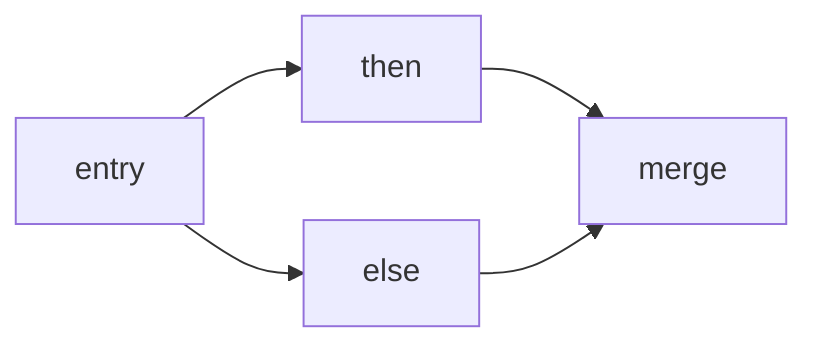

支持的 triangle 结构：

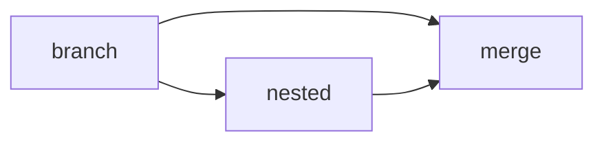

#### 3.8 PhiLowering

在进入后端前销毁剩余 phi。对每个前驱收集并行复制集合，
将其串行化后插到终结指令之前；复制形成 swap 或更长环时，
先创建临时值打破循环。

若复制必须放在临界边上，Pass 会先拆分该边。完成后 IR 中不再含 phi，
只保留后端能够直接处理的 `CopyInst`。

#### 3.9 LateLoopCFGCleanup

在循环优化结束后移除不再需要的 synthetic single-latch 中转块，
把 latch phi 折回循环头并让原回边直接跳回 header。
它通常与 `CFGSimplify` 交替执行，目标是保留优化阶段需要的规范形，
但不把额外跳转和 copy 带到最终代码。

#### 3.10 LoopRotate

将循环条件从 header 移到 preheader 和 latch：
preheader 负责零次迭代的入口预判，latch 负责后续迭代的退出判断，
循环体因此形成更接近 do-while 的布局。

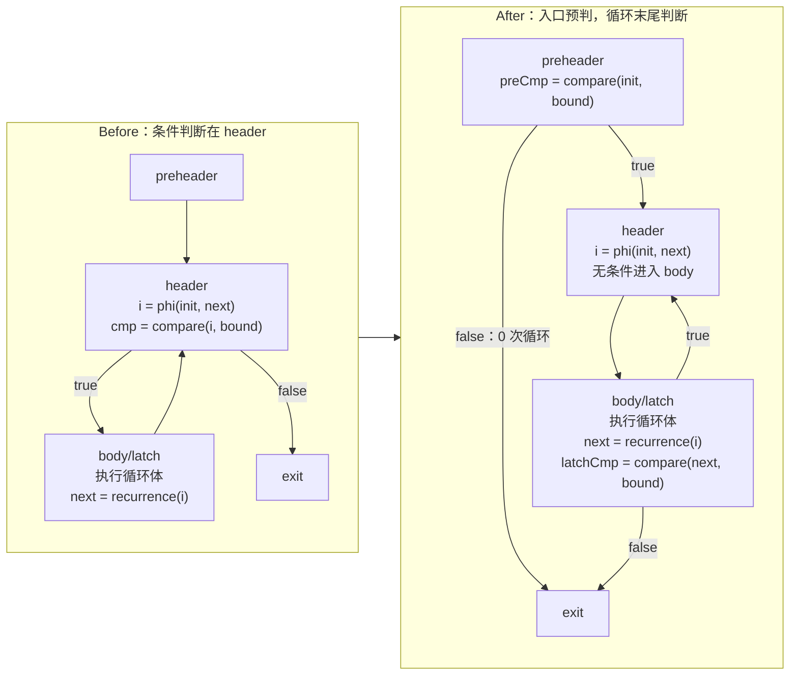

该 Pass 已实现，但当前默认流水线没有注册。开发板 A/B 测试中整体为轻微负收益，
源码保留用于后续重新评估。

### 4. fixedPointFunctionPass

#### 4.1 LocalMemoryOpt

对可归一化为非逃逸局部对象的访存做保守优化：

- 同址 store-to-load forwarding；
- 重复 `load` 消除；
- 同值 `store` 和死 `store` 删除。

别名关系统一使用 `MustAlias`、`MayAlias` 和 `NoAlias`。
动态下标或不精确地址会退化为对象级摘要，不会越过可能冲突的访问。

#### 4.2 GVN

沿支配树做全局值编号，用“操作码、类型、操作数”构造表达式键，
并用支配当前使用点的已有值替换重复计算。

对 `load`，Pass 结合局部内存位置和数据流求得的内存版本；
只有地址等价且版本未被 `store` 或有副作用调用破坏时才复用。
纯调用和常见算术、比较、转换、GEP、select 也参与编号。

#### 4.3 LICM

把循环不变量移动到 preheader，目前只做 hoist，不做 sink。
候选指令必须是可移动的纯计算，且所有操作数都来自循环外或已被判定为不变量。

对于除法、可能变化的 `load` 等不能无条件推测执行的指令，
还要求定义支配全部循环出口；所有候选都必须支配其循环内外使用点。
`load` 会额外检查循环内内存 clobber。函数纯度分析不保证调用一定终止，
所以当前实现不外提任何调用。

#### 4.4 CanonicalizeLoop

把自然循环整理为后续循环 Pass 需要的规范形：

1. 建立唯一 preheader；
2. 将多条回边汇合到唯一 latch；
3. 为混合了循环内外前驱的出口建立 dedicated exit；
4. 同步重写相关 phi incoming。

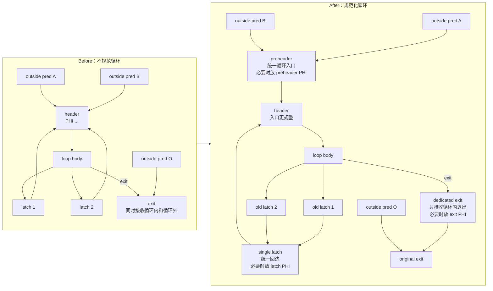

规范形便于 SCEV 和循环变换匹配，但不一定适合最终汇编，
因此晚期还会运行 `LateLoopCFGCleanup`。

#### 4.5 DeadInstElim

实现 CFG 感知的 aggressive dead code elimination。
算法分为三步：

1. 从 `store`、调用、返回等有副作用指令出发标记活指令；
2. 沿 def-use 和后支配控制依赖传播活性；
3. 将死条件分支改为安全的无条件分支，再清扫其余死指令。

与普通“无用户即删除”相比，它还能删除只负责控制死计算的分支。

#### 4.6 LoopFusion

融合两个相邻、起点、步长、上界和比较方式相同的规范计数循环，
减少循环控制开销并提高时间局部性。

若两个循环访问的根对象不同，可以直接证明独立；若共享对象，
则要求可变下标与各自归纳变量一致，使跨迭代依赖距离为零。
变换主要重连 CFG，并保持同一迭代内两个原循环体的执行顺序。

#### 4.7 RangeModSimplify

使用 SCEV 值域证明带符号操作数非负后，将
`x % 2^k` 改写为 `x & (2^k - 1)`，将 `x / 2^k` 改写为右移。
如果无法证明值域，Pass 保留原来的有符号除法或取模语义。

#### 4.8 LoopExitValueRewrite

使用 SCEV 为规范计数循环计算出口闭式值。当前处理三类递推：

- `p = p + c`：改写为 `start + c * tripCount`；
- `p = (p + c) % M`：合并为一次加法和取模；
- `p = p / 2^s`：合并为按总位数执行的带符号除法。

替换循环外使用后，原递推可能变成死代码，并进一步让
`RemoveEmptyLoop` 删除整个循环。

#### 4.9 RemoveEmptyLoop

删除没有可观察副作用、且循环内定义值不再被循环外使用的自然循环。
Pass 要求循环出口和 CFG 形态可安全重连，未知调用、写内存或外部 use
都会阻止删除。

#### 4.10 LoopTiling

对安全的二维单位步长循环做分块，默认 tile 为 `32×32`；
对足够大的常量循环嵌套可选择更大的 tile。
Pass 要求规范循环、可分析的访存根和无冲突依赖，
并使用 `CostModel` 避免对已经能放入 L1 的小工作集进行无收益分块。

#### 4.11 LoopStrengthReduce

将循环内的 `gep(base, affine(i))` 改写为指针递推：

```text
每轮重新计算 base + i * stride
  →
preheader 计算初始地址
header 用 pointer phi 保存当前地址
latch 执行 pointer += stride
```

同一基址上只差常量偏移的多个 GEP 可以共享递推指针，
从而减少循环内乘法、移位和地址加法。

#### 4.12 MatMulInterchange

识别矩阵乘法或矩阵向量乘法中的 `(j, k)` 列访问归约，
将循环重排为外层 `k`、内层 `j`，使最内层的矩阵访问变成单位步长。

当输出与输入可能同根时，Pass 使用临时行缓冲；
静态条件不足但可运行期判断时生成 guard，条件不满足仍执行原循环。
变换保持每个输出元素的浮点累加顺序。

#### 4.13 LoopVectorize

只在 `--riscv64-rvv=on` 时注册。Pass 将安全的规范单体循环改写为
RVV strip-mining 形式，每轮用剩余迭代数设置 VL，因此自然处理尾部。

当前支持 `i32`/`float` 的连续或固定步长访存、常见二元运算以及加法归约。
整数归约使用跨 strip 的向量累加器；浮点归约使用有序 reduce 保持标量加法顺序。
向量化前会检查根对象、读写别名、循环体成本和迭代次数。

#### 4.14 SimpleLoopUnroll

完全展开小常量 trip-count 循环。当前要求规范单体循环、
迭代次数不超过 16、循环体不超过 32 条可克隆指令，且不含调用或额外 phi。

展开前使用 `CostModel` 估算结果值数量与寄存器压力，
避免代码膨胀和 spill 抵消收益。

#### 4.15 IndVarSimplify

在 `LoopStrengthReduce` 已建立指针 phi 后，
把循环退出条件从整数归纳变量比较改写为 `ptr != endPtr`。
若整数计数器不再有其他用途，其 phi 和递推指令会被后续死代码删除。

该 Pass 放在循环展开之后，避免过早改变小循环形态而阻止完全展开。

#### 4.16 ConstProp

实现 Sparse Conditional Constant Propagation（SCCP）。
算法同时维护可执行 CFG 边和 SSA 值格：

```text
unknown → constant → overdefined
```

当分支条件成为常量时只标记实际可达的边；求解收敛后，
用常量替换 SSA 值、折叠条件分支，并交给不可达块与死代码 Pass 清理。

#### 4.17 PureCallLoopCache

缓存循环中“实参循环不变且 callee 不依赖调用者可见内存”的调用结果。
Pass 在循环中建立 `cache` 和 `valid` phi：第一次迭代真实调用，
后续迭代只要缓存未被内存副作用失效，就直接复用结果。

当前实现较保守，主要处理 latch 中可明确识别的调用。

#### 4.18 BoundedBitLoopSolver

识别 SysY 程序中用 `% 2`、`/ 2` 和有界循环逐位模拟
AND、OR、XOR、恒等或取反的模式，通过抽象解释计算整段循环的闭式效果，
再用原生位运算替换。

Pass 在优化版本前插入 `[0, 2^N)` 范围 guard；
条件不满足时回到原循环，因此对无法静态限定的输入仍保持语义。

#### 4.19 InstCombine

对单条 SSA 指令做局部模式化简，主要包括：

- 整数和浮点恒等式；
- 常量 `zext/sitofp/fptosi`；
- 冗余 phi、copy 和 select；
- 重复 GEP；
- 简单 add/sub 线性链；
- `abs`/负 `abs` 惯用法。

该 Pass 不负责全局数据流，复杂的跨块等价交给 GVN 和 SCCP。

#### 4.20 UnreachableBlockElim

从函数入口遍历 CFG，删除没有访问到的基本块。
删除块时同步移除前驱/后继边，并清理幸存块中来自死前驱的 phi incoming。

#### 4.21 CFGSimplify

当前处理四类局部 CFG 化简：

1. 条件分支的两个目标相同时折叠为无条件跳转；
2. 旁路只含无条件跳转的空块；
3. 合并“无条件跳转到单前驱后继”的块对；
4. 将跳向空条件块的分支直接线程化到其后继。

Case 1：两个条件分支指向同一目标时，折叠为无条件跳转。

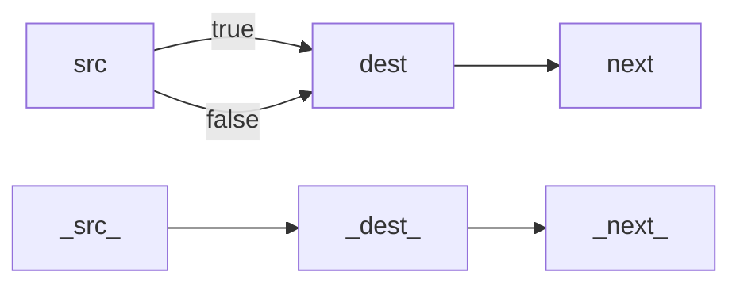

Case 2：删除只负责转跳的空块，并把它的前驱直接连到目标块。

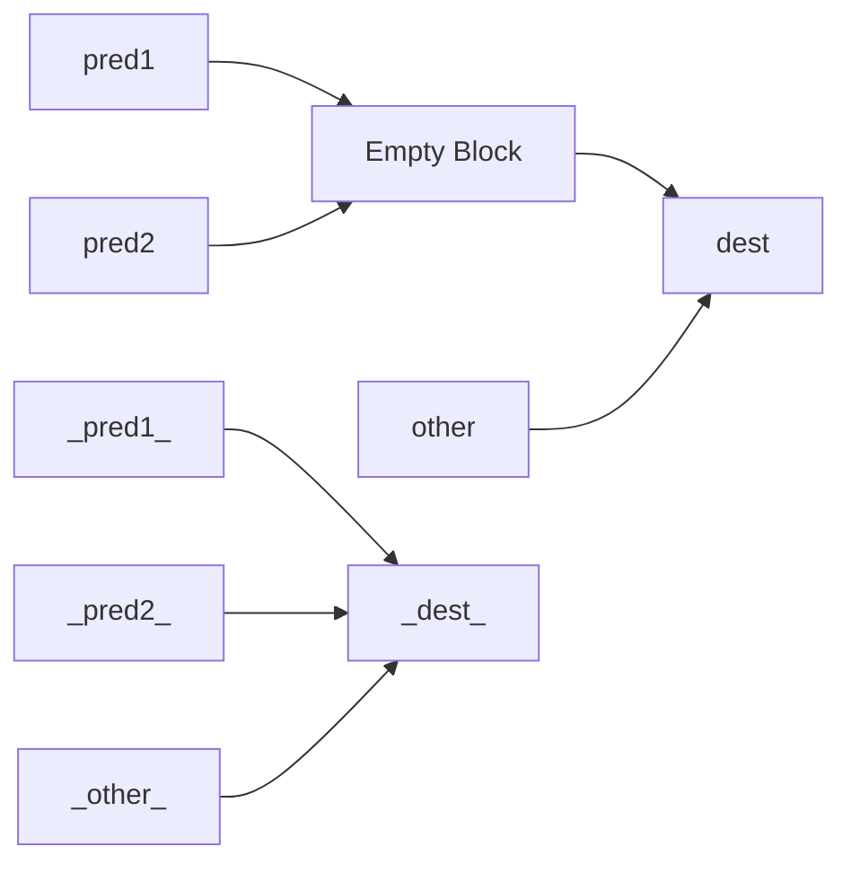

Case 3：当前块只有一个后继、后继也只有一个前驱时，合并两个块。

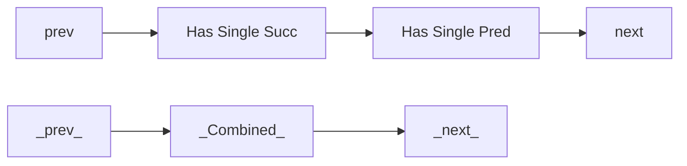

Case 4：目标是空条件块时，把当前块直接线程化到两个真实后继。

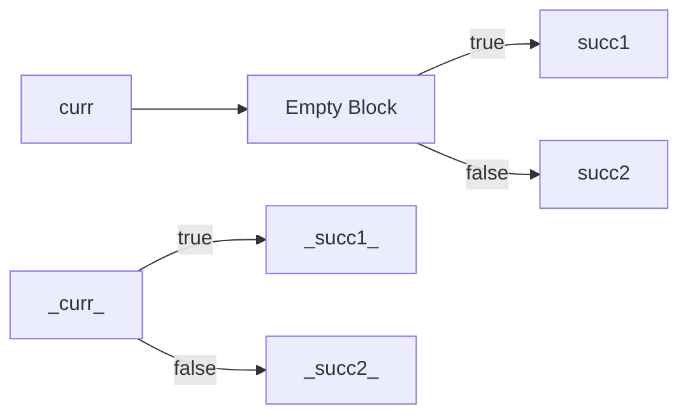

每次变换都会维护 CFG 边和 phi。该 Pass 会破坏循环规范形，
因此中期循环变换之间只使用 CFG 保形的 `DeadInstElim`，
完整 CFG 化简放在定点组尾部和循环优化收尾阶段。

#### 4.22 LoopConstantPromotion

扫描循环体中的非零浮点常量，以及值小于 `-2047` 或大于 `2047`
且至少出现两次的整数常量。浮点常量使用一次即可提升；作为整数除法或
取模除数的常量保持字面量。其余候选在 preheader 中固化为虚拟寄存器值，
避免后端在每个使用点重复物化。

该 Pass 放在晚期执行，防止后续常量传播重新把已提升的值折回立即数。

### 5. toolPass

#### 5.1 CFGStateCleanup

清理函数中悬空或不一致的 CFG 状态，包括失配的前驱/后继边和无效的 phi incoming。
该 Pass 在 `ConstProp`、`CFGSimplify`、`DeadInstElim`、`UnreachableBlockElim` 和晚期循环清理修改 CFG 后由调用方触发执行。

### 6. PassManager 组合阶段

以下名称代表 `PassManager` 将多个已有 Pass 组合而成的特定调度阶段，同样可按名称进行禁用。

#### 6.1 PostInlineCleanup

再次执行 `SmallFunctionInline`，随后对每个函数运行
`Mem2Reg → GVN → LICM → InstCombine`，立即消费新内联代码产生的机会。

#### 6.2 PostInlineGlobalCleanup

运行 `DeadFunctionElim → GlobalToLocal`。如果模块发生变化，
再用 `Mem2Reg、GVN、LICM、InstCombine` 清理受影响的函数。

#### 6.3 LateInline

主定点组收敛后再次尝试内联。循环闭式替换和空循环删除可能已经让函数缩小到内联阈值；
若本阶段改变模块，`PassManager` 会重新运行主定点组。

#### 6.4 PostFixedPointLoopCleanup

交替执行 `LateLoopCFGCleanup` 与 `CFGSimplify` 直到局部稳定，
去掉循环优化遗留的中转块并化简 CFG。

#### 6.5 LateLoopOpt

先用 `CanonicalizeLoop` 重建晚期 CFG 化简可能破坏的 preheader 和 dedicated exit，
再执行 `LoopConstantPromotion`。`LoopRotate` 原计划位于此处，但当前未启用。

#### 6.6 PostLateLoopCFGCleanup

`LateLoopOpt` 可能重新引入 synthetic latch，本阶段再次交替运行
`LateLoopCFGCleanup` 和 `CFGSimplify`，生成更直接的后端输入。

#### 6.7 PreLoweringPhiToSelect

汇编路径在 `PhiLowering` 前最后执行一次 `PhiToSelect`，
尽量减少需要转换为并行 copy 的 phi 数量。

### 7. 调试与开关

调试某个 Pass 时可以单独关闭：

```bash
MINIC_DISABLE_PASSES=LoopFusion,SimpleLoopUnroll \
    ./build/compiler -S -O1 -o output.s input.sy
```

`MINIC_DISABLE_PASSES` 匹配的是 `PassManager` 注册名。
组合阶段内部直接调用的子 Pass 不会单独经过名称检查；例如要禁止晚期内联，
应关闭 `LateInline`，而不只是关闭早期的 `SmallFunctionInline` 注册项。

可配合 `MINIC_DUMP_PASSES=1`、`MINIC_OPT_REMARKS=1` 和
`MINIC_DISABLE_PROFITABILITY=1` 观察调度、变换原因和收益门。

---

# 六、RISC-V64 后端

### 1. 流程

```text
无 phi IR
  → CFG 活跃性分析
  → 多段活跃区间与干涉图
  → copy 合并、Greedy 分配、分裂或 spill
  → 栈帧布局
  → RISC-V64 指令选择
  → ScratchAllocator 二次分配
  → patch 物理寄存器
  → RiscV64Peephole
  → 汇编输出
```

后端按函数运行。IR 值先完成寄存器分配，指令选择产生的临时值再由
`ScratchAllocator` 分配。这两类值使用不同的位置域，避免机器临时值反向进入 IR 活跃性模型。

### 2. 活跃区间与寄存器分配

`LiveIntervalAnalysis` 先计算基本块的 `live-in/live-out`，再按块反向扫描，
为每个值构造多段活跃区间。循环回边和 phi lowering 产生的 copy 都包含在数据流中。

Greedy 分配器按 spill weight 处理区间：

```text
spillWeight ≈ (useCount / intervalLength) × 10^loopDepth
```

对每个区间依次尝试：

1. 使用空闲物理寄存器；
2. 驱逐权重更低的干涉区间；
3. 在调用点或循环边界分裂区间；
4. 分配 spill 栈槽。

整数、浮点和 RVV 值分别进入 GPR、FPR 和 VR 寄存器池。跨调用值不会分配到会被
clobber 的 caller-saved 寄存器；常量和廉价地址计算可以在使用点重物化。

### 3. 调用约定与栈帧

- 整数和指针参数使用 `a0-a7`；
- 浮点参数使用 `fa0-fa7`；
- 超出寄存器容量的参数进入 8 字节对齐的栈参数区；
- 整数返回值使用 `a0`，浮点返回值使用 `fa0`；
- 栈帧按 16 字节对齐；
- 栈帧包含保存寄存器、局部对象、spill 槽和 outgoing 参数区；
- 只保存实际使用的 callee-saved 寄存器；
- 叶函数不保存 `ra`，部分调用路径可使用 shrink-wrapping；
- 当前使用固定栈帧和 `sp` 相对寻址，不建立帧指针。

### 4. 指令选择

`InstSelectorRiscV64` 处理整数、单精度浮点、访存、调用、分支、类型转换和 RVV 指令。

主要的目标相关选择：

- 12 位范围内使用立即数指令，大常量单独物化；
- 零值复用 `zero`，零比较优先使用 `seqz/snez`；
- 2 的幂乘法转换为移位；
- 常量除法和取模使用特例、偏置移位或 magic-number 序列；
- 常量 GEP 链折叠为根地址加总偏移；
- 分支布局优先利用 fall-through；
- RVV 路径生成 `vsetvli`、向量访存、运算和归约。

### 5. 机器级优化

`RiscV64Peephole` 在 ILoc 指令上迭代到稳定，主要处理：

- 地址递推、固定偏移和常量乘法；
- 栈 store-load 转发与重复 reload；
- copy 传播和无效 move；
- 机器级死定义；
- 无效跳转、跳转穿透和分支反转。

默认输出 `rv64gc`；启用 `--riscv64-rvv=on` 时输出 `rv64gcv`。

`contest` 不携带独立的后端设计文档，进一步实现可从以下源码入口阅读：

- [后端总流程](backend/riscv64/CodeGeneratorRiscV64.cpp)
- [活跃区间分析](backend/riscv64/LiveIntervalAnalysis.cpp)
- [寄存器分配](backend/riscv64/GreedyRegAllocator.cpp)
- [指令选择](backend/riscv64/InstSelectorRiscV64.cpp)
- [机器级 Peephole](backend/riscv64/RiscV64Peephole.cpp)

---

# 七、验证与调试

### 1. 分支验证

`contest` 不包含测试输入、golden output 或测试脚本。
完整功能测试、RISC-V64/QEMU 验证以及专项回归均在开发分支执行，
确认通过后再把源码同步到本分支。

在 `contest` 中可以使用外部用例做编译冒烟验证：

```bash
# LLVM IR
./build/compiler -S -L -O1 -o /tmp/output.ll /path/to/input.sy

# RISC-V64 汇编
./build/compiler -S -O1 -o /tmp/output.s /path/to/input.sy
```

### 2. 调试

按流水线逐层定位：

1. `-T` 检查语法树和表达式优先级；
2. `-I` 检查类型转换、数组索引和 CFG；
3. `--dom` 检查支配关系和自然循环；
4. `-L -O0/-O1` 对比优化前后的 LLVM IR；
5. `-c` 在汇编中查看线性 IR 与分配结果；
6. `MINIC_DISABLE_PASSES` 做 Pass 单项排查；
7. `--ra-stats-json` 检查 spill、split 和最终指令统计。

---

# 八、参考作品与 AI 工具使用声明

本项目参考了以下 2025 年作品：

| 作品编号 | 队伍 | 学校 | 项目地址 |
| --- | --- | --- | --- |
| `T202510614205710` | `0x676e616c63` | 电子科技大学 | [GitLab 项目](https://gitlab.eduxiji.net/educg-group-36290-2935672/T202510614205710-2983) |
| `T202500000205464` | 不队 | 剑桥大学 | [GitLab 项目](https://gitlab.eduxiji.net/educg-group-36290-2935672/T202500000205464-2455) |

开发过程中使用的 AI 编程代理工具（coding agents）包括 Codex 和 Claude Code；
使用的模型或 AI 服务包括 DeepSeek、ChatGPT 和 Claude。

---

# 九、能力边界

- 机器目标目前只有 RISC-V64；
- 编译器一次处理一个源文件，不执行预处理、汇编和链接；
- 程序入口必须是无参数的 `int main()`；
- 不支持头文件、结构体、联合体、C 指针声明和动态内存；
- 内部优化级别只有关闭和 O1 两档；命令行推荐使用 `-O0` 或 `-O1`，
  其他 `-O` 参数值当前也按 O1 处理；
- RVV 与循环并行化默认关闭，属于实验路径。

项目采用 [MIT License](LICENSE)。
