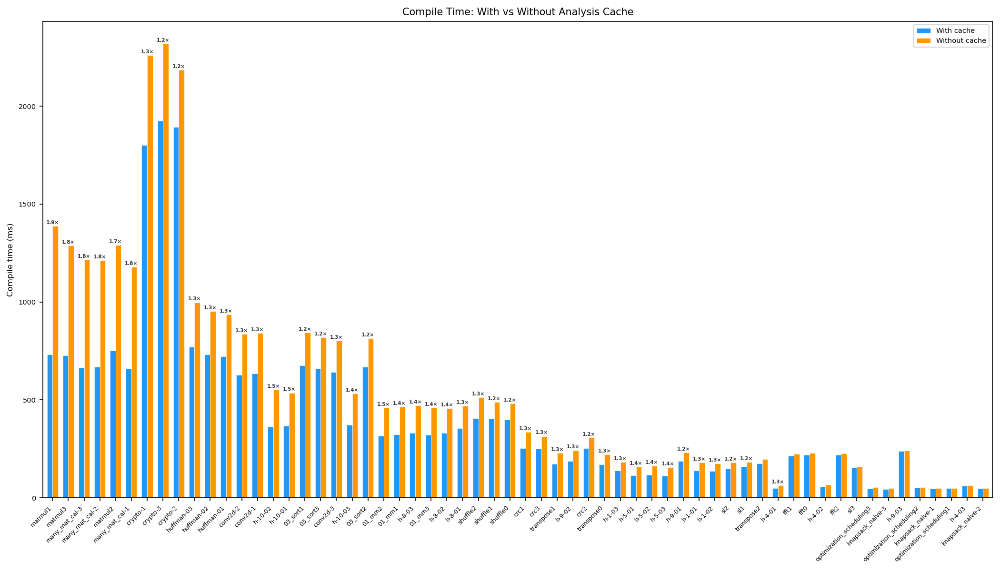
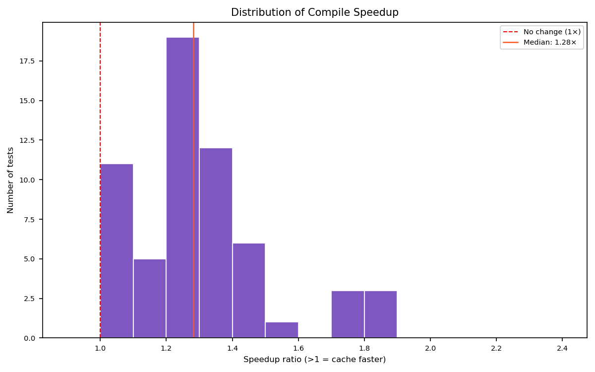
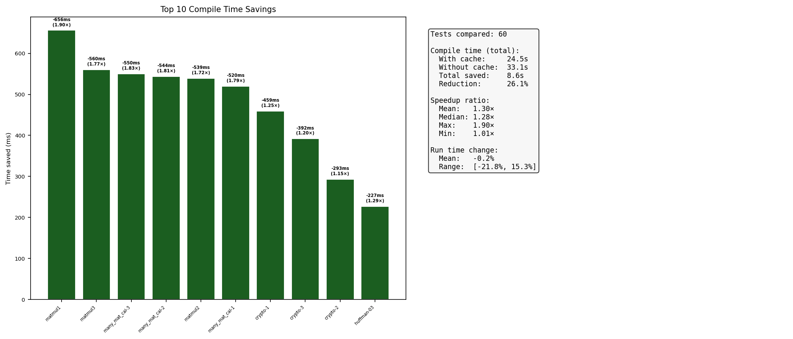
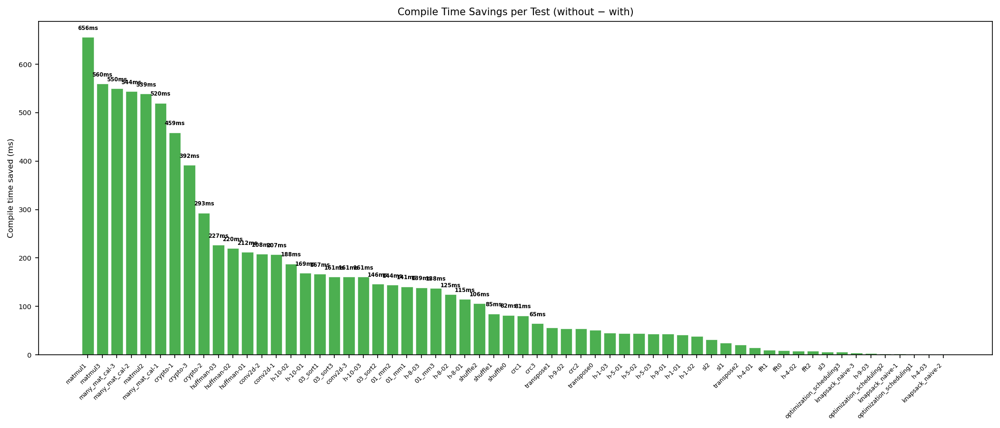
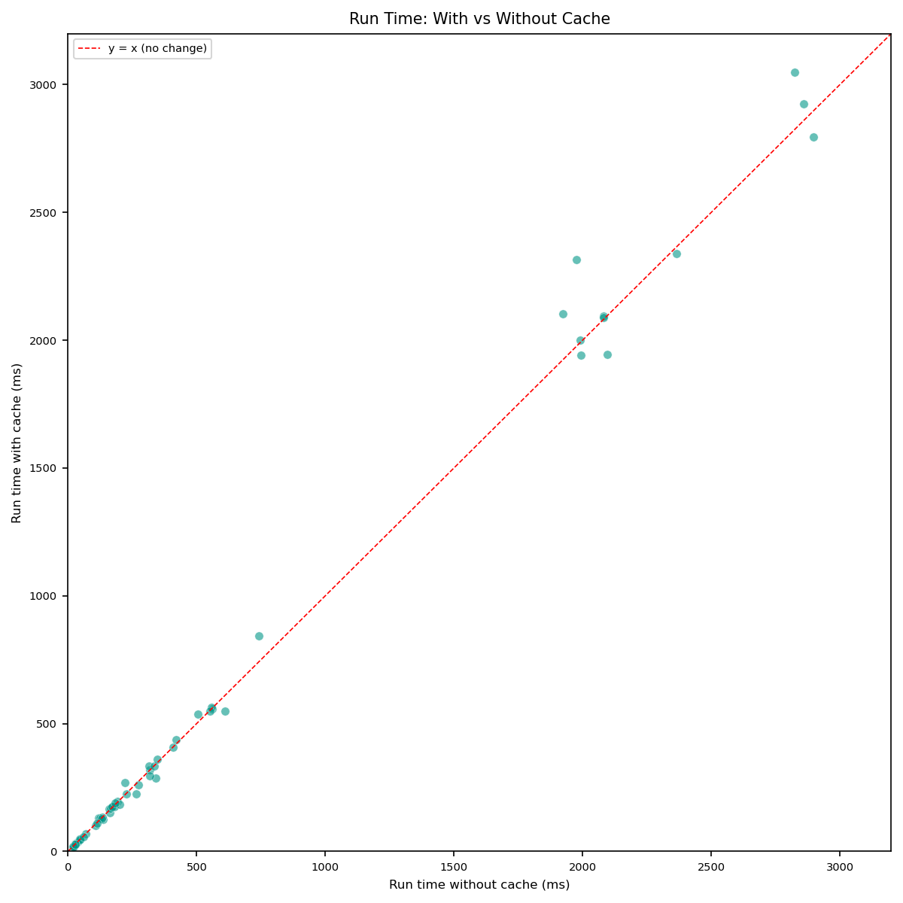

# Analysis Cache 效果评估

**结论：编译速度显著提升，运行时间几乎不变，符合预期。**

---

## 编译时间

| 指标 | 有 cache | 无 cache | 变化 |
|------|----------|----------|------|
| 总耗时 | 24.5s | 33.1s | **−8.6s (−26%)** |
| 平均 | 408ms | 551ms | −144ms |
| 中位数 | 285ms | 396ms | −111ms |

**加速比**：平均 1.27×，中位数 1.31×，最大 2.10×。

## 运行时间

| 指标 | 有 cache | 无 cache | 变化 |
|------|----------|----------|------|
| 平均 | 598ms | 590ms | +8ms |
| 中位数 | 192ms | 196ms | −4ms |

变化在噪声范围内（平均 +1.3%），确认 analysis cache 未引入语义退化。

