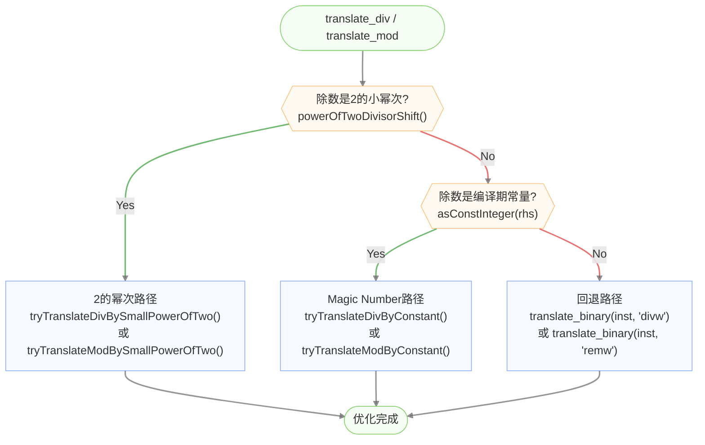
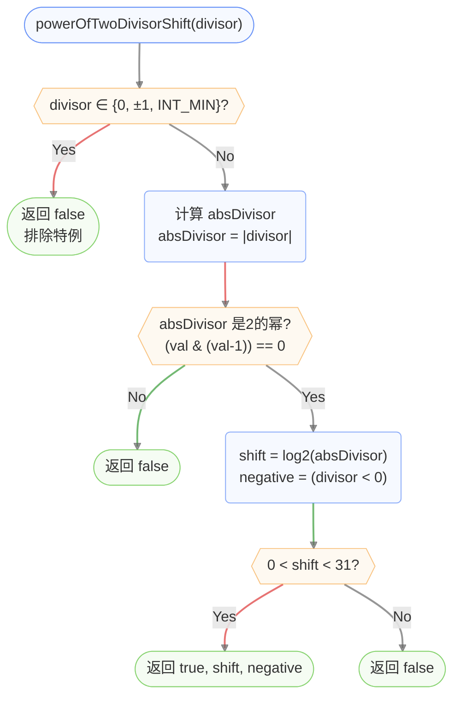
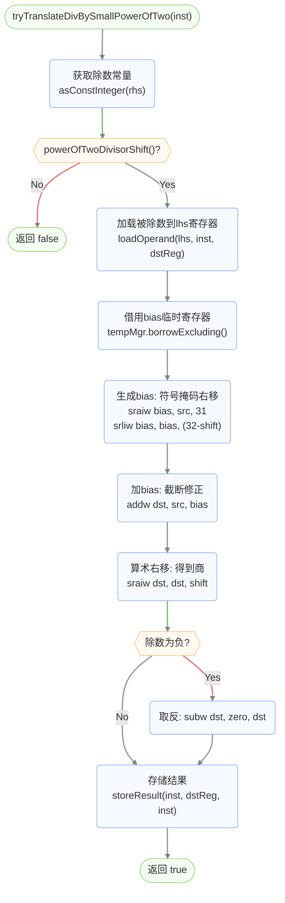
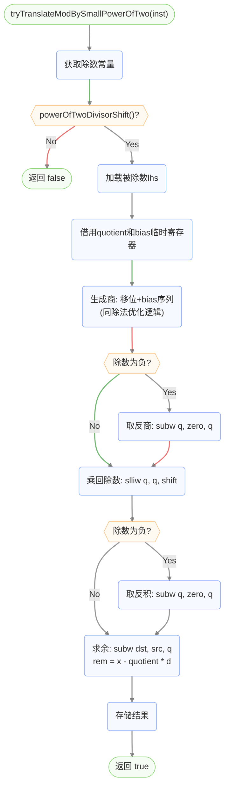
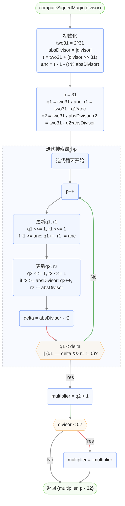
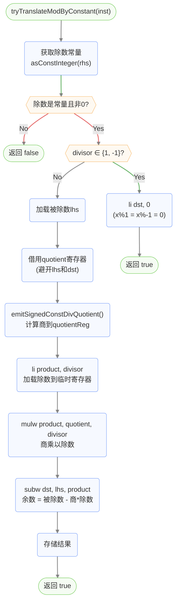
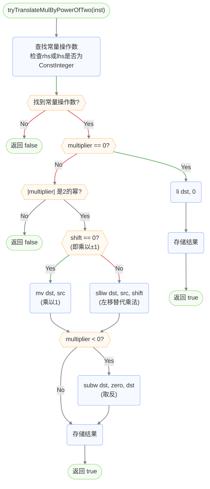

# 常量除法优化流程图

## 优化总览

常量除法优化在指令选择阶段（`InstSelectorRiscV64`）内联执行，采用三层递进策略：

1. **2的幂次除法** → 移位+bias修正（最快）
2. **一般常量除法** → Hacker's Delight magic number乘法+移位序列（较快）
3. **非常量除法** → 回退到 `divw`/`remw` 指令（最慢）



## powerOfTwoDivisorShift 判断流程



## 2的幂次除法优化 (tryTranslateDivBySmallPowerOfTwo)

将 `x / 2^k` 转换为有符号截断语义的移位序列。C整数除法向零截断，而负数右移向-∞取整，因此需要先加bias修正。



**生成指令序列示例**（`x / 4`，shift=2）：
```asm
sraiw  bias, x, 31        # bias = x的符号位扩展
srliw  bias, bias, 30      # bias = (x<0) ? 3 : 0
addw   dst, x, bias        # dst = x + bias (截断修正)
sraiw  dst, dst, 2         # dst = (x+bias) >> 2 = x/4
```

## 2的幂次取模优化 (tryTranslateModBySmallPowerOfTwo)

余数按 `x - (x / d) * d` 生成，复用除法的移位序列计算商，再乘回除数后相减。



## computeSignedMagic 算法流程 (Hacker's Delight Algorithm 10-2)

计算有符号常量除法的magic参数（multiplier和shift），使得 `high32(n * multiplier) >> shift` 等于 `n / divisor`。



## emitSignedConstDivQuotient 流程

使用magic number生成常量除法商的指令序列，处理特例后执行乘法+移位+符号修正。

```mermaid
flowchart TD
    Start(["emitSignedConstDivQuotient<br>(inst, dividend, divisor, dstReg)"]) --> LoadLhs("加载被除数<br>loadOperand(dividend, inst, dstReg)")

    LoadLhs --> SpecialCheck{{"divisor == 1?"}}
    SpecialCheck -- "Yes" --> DivBy1("mv dst, lhs<br>(x/1 = x)")
    SpecialCheck -- "No" --> NegOneCheck{{"divisor == -1?"}}

    NegOneCheck -- "Yes" --> DivByNeg1("subw dst, zero, lhs<br>(x/-1 = -x)")
    NegOneCheck -- "No" --> IntMinCheck{{"divisor == INT_MIN?"}}

    IntMinCheck -- "Yes" --> DivByIntMin("li tmp, INT_MIN<br>subw dst, lhs, tmp<br>seqz dst, dst<br>(x/INT_MIN = (x==INT_MIN)?1:0)")
    IntMinCheck -- "No" --> MagicPath["Magic Number路径"]

    subgraph MagicPath["Magic Number乘法+移位"]
        MagicPath --> ComputeMagic("computeSignedMagic(divisor)<br>获取 {multiplier, shift}")
        ComputeMagic --> LoadMagic("li magicTmp, multiplier<br>加载magic乘数到临时寄存器")
        LoadMagic --> Mul("mul dst, lhs, magicTmp<br>乘以magic乘数")
        Mul --> High32("srai dst, dst, 32<br>取高32位(算术右移32位)")
        High32 --> SignAdjCheck{{"需要符号调整?"}}

        SignAdjCheck -- "d>0, m<0" --> AddBack("addw dst, dst, lhs<br>加回被除数")
        SignAdjCheck -- "d<0, m>0" --> SubBack("subw dst, dst, lhs<br>减去被除数")
        SignAdjCheck -- "不需要" --> ShiftCheck
        AddBack --> ShiftCheck
        SubBack --> ShiftCheck

        ShiftCheck{{"magic.shift > 0?"}}
        ShiftCheck -- "Yes" --> DoShift("sraiw dst, dst, shift<br>最终算术右移")
        ShiftCheck -- "No" --> SignFix
        DoShift --> SignFix("符号修正: srliw tmp, dst, 31<br>addw dst, dst, tmp<br>(向零截断修正)")
    end

    SignFix --> End(["商已存入dstReg"])
    DivBy1 --> End
    DivByNeg1 --> End
    DivByIntMin --> End

    %%Node styles
    classDef default fill:#E2EAFE4F,stroke:#5A88F6AF
    classDef endNode fill:#DDF4D84F,stroke:#7DCF62AF
    classDef decisionNode fill:#FCEBD34f,stroke:#F6AA4BAF

    %%Link styles
    linkStyle default stroke:#666666AF,stroke-width:2px
    linkStyle 2 stroke:#339933AF,stroke-width:2px
    linkStyle 3 stroke:#DD3333AF,stroke-width:2px
    linkStyle 5 stroke:#339933AF,stroke-width:2px
    linkStyle 6 stroke:#DD3333AF,stroke-width:2px
    linkStyle 8 stroke:#339933AF,stroke-width:2px
    linkStyle 9 stroke:#DD3333AF,stroke-width:2px
    linkStyle 12 stroke:#339933AF,stroke-width:2px
    linkStyle 13 stroke:#DD3333AF,stroke-width:2px
    linkStyle 15 stroke:#339933AF,stroke-width:2px
    linkStyle 16 stroke:#DD3333AF,stroke-width:2px

    %%Node classes
    class Start,End endNode
    class SpecialCheck,NegOneCheck,IntMinCheck,SignAdjCheck,ShiftCheck decisionNode

    %%Subgraph style
    style MagicPath fill:#E2EAFE3F,stroke:#6666669F,stroke-width:1px,stroke-dasharray: 5 5
```

**生成指令序列示例**（`x / 7`，magic = {multiplier=-1840700269, shift=2}）：
```asm
li     magicTmp, -1840700269   # 加载magic乘数
mul    dst, x, magicTmp        # 乘法
srai   dst, dst, 32            # 取高32位
addw   dst, dst, x             # 符号调整 (d>0, m<0)
sraiw  dst, dst, 2             # 右移shift位
srliw  tmp, dst, 31            # 符号修正
addw   dst, dst, tmp           # 向零截断
```

## 常量取模优化 (tryTranslateModByConstant)

基于magic除法计算余数：`rem = dividend - quotient * divisor`。



## 乘法优化 (tryTranslateMulByPowerOfTwo)

将乘以2的幂转换为左移指令，作为除法优化的对照。



## 优化策略总结

| 除数类型 | 优化方法 | 生成指令 | 性能 |
|----------|----------|----------|------|
| 2的幂次 (2,4,8,16,...) | 移位+bias修正 | sraiw+srliw+addw+sraiw (4条) | 最快 |
| 一般常量 (3,5,7,...) | Magic number乘法+移位 | li+mul+srai+addw/subw+sraiw+srliw+addw (7-8条) | 较快 |
| 非常量 | 回退到硬件除法 | divw (1条，但周期长) | 最慢 |
| ±1 | 特例处理 | mv 或 subw (1条) | 最快 |
| INT_MIN | 特例处理 | li+subw+seqz (3条) | 快 |

> **注意**：IR层的 `InstCombine` 和 `ConstProp` Pass 也会在指令选择之前折叠部分常量除法（如 `x/1 → x`，`x%1 → 0`），后端的常量除法优化处理的是IR层未能折叠的运行时常量除法场景。
