# 浮点寄存器分配流程图

## 总览

浮点寄存器分配与整数寄存器共享统一的Greedy分配框架，通过 `isFloatInterval()` 区分GPR/FPR类别，分别使用独立的寄存器池和干涉集合。当前FPR池只启用caller-saved寄存器（20个），跨调用的float值会被溢出到栈上，避免引入fs*保存/恢复逻辑。

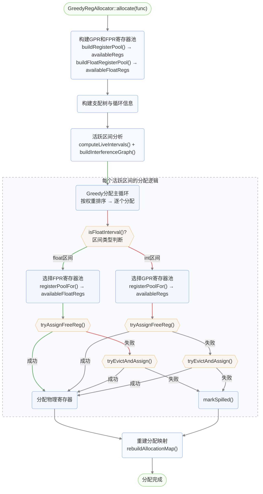

## 浮点寄存器池构建 (buildFloatRegisterPool)

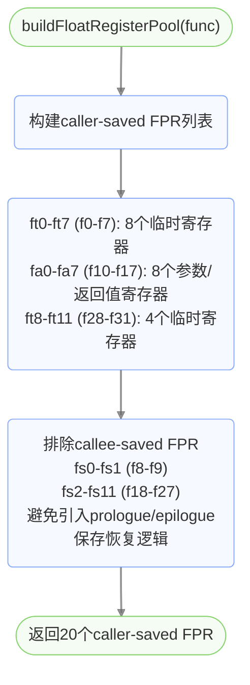

## 浮点区间判断与寄存器池选择

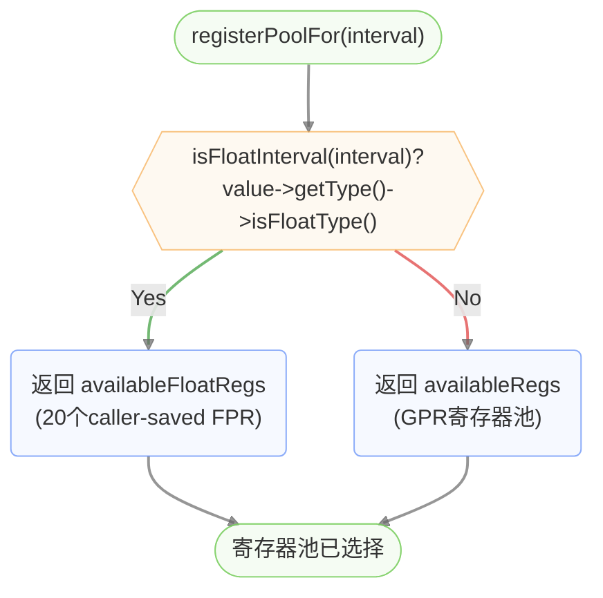

## canAssignReg 浮点寄存器可分配性判断

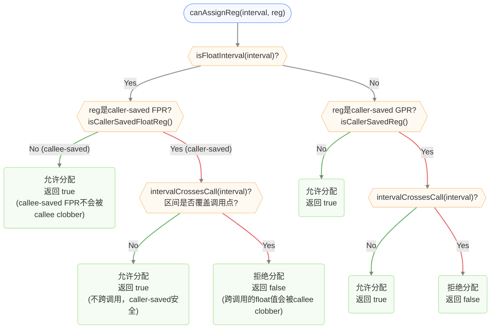

## 同类别干涉寄存器收集 (getInterferingRegsForClass)

GPR和FPR都使用0-31编号，编号相同不代表同一物理资源，因此干涉集合必须按类别过滤。

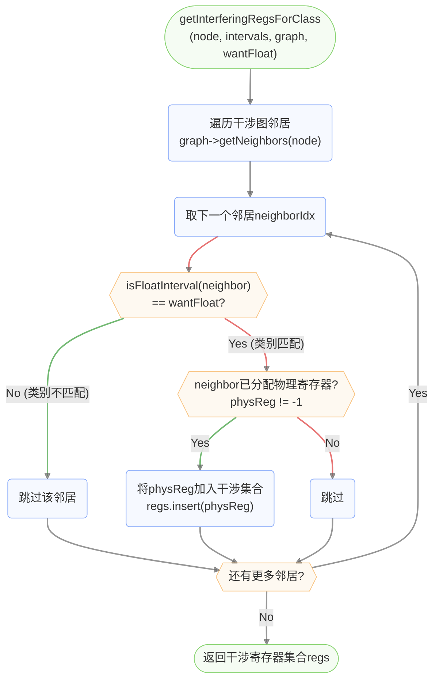

## 重建分配映射 (rebuildAllocationMap)

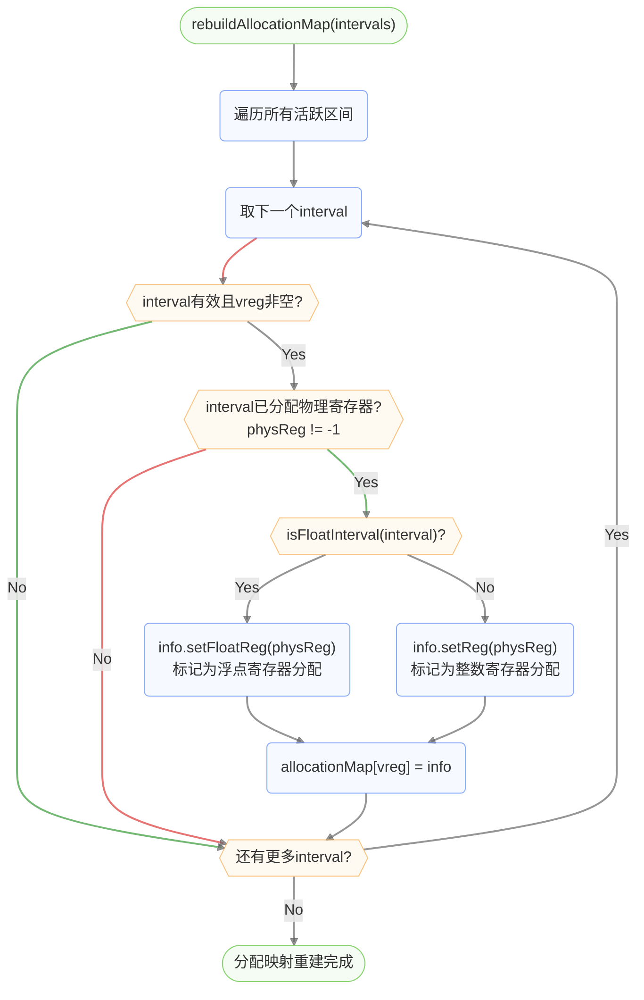

## 浮点操作数加载流程 (loadFloatOperand)

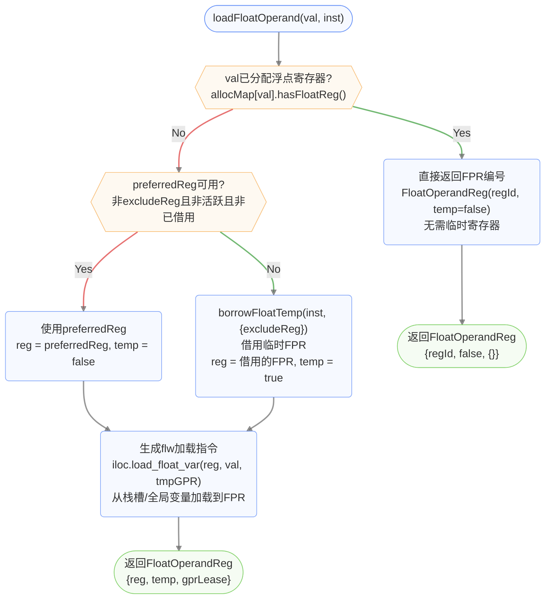

## 浮点结果存储流程 (storeFloatResult)

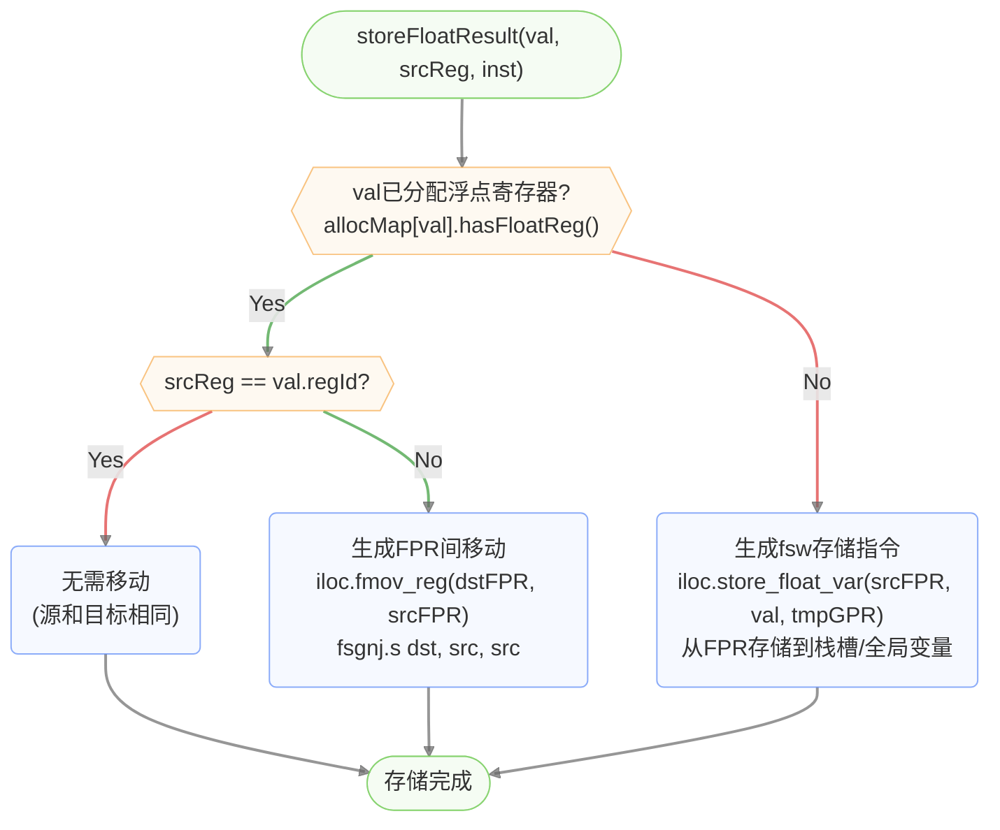

## 临时浮点寄存器借用 (borrowFloatTemp)

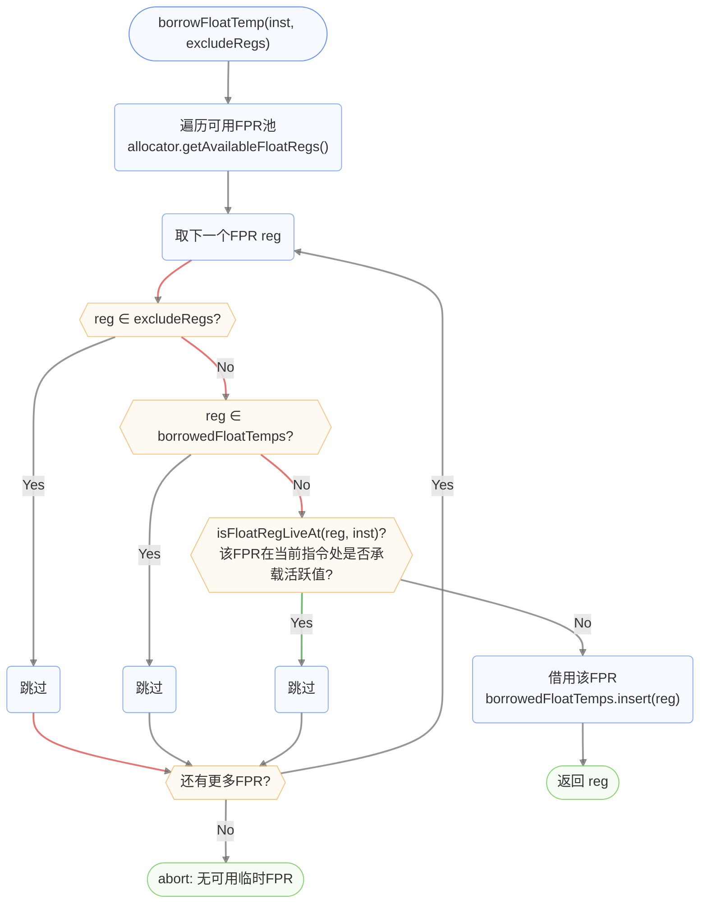

## 浮点寄存器活跃性查询 (isFloatRegLiveAt)

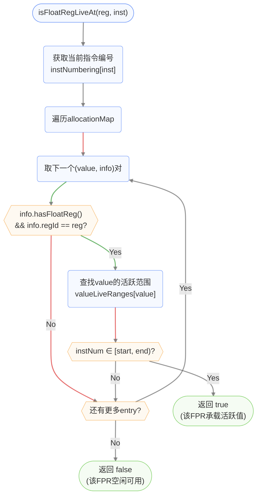

## 浮点寄存器并行移动解析 (emitFloatRegMoves)

处理基本块边界处浮点寄存器的并行移动，避免移动冲突（循环依赖）。

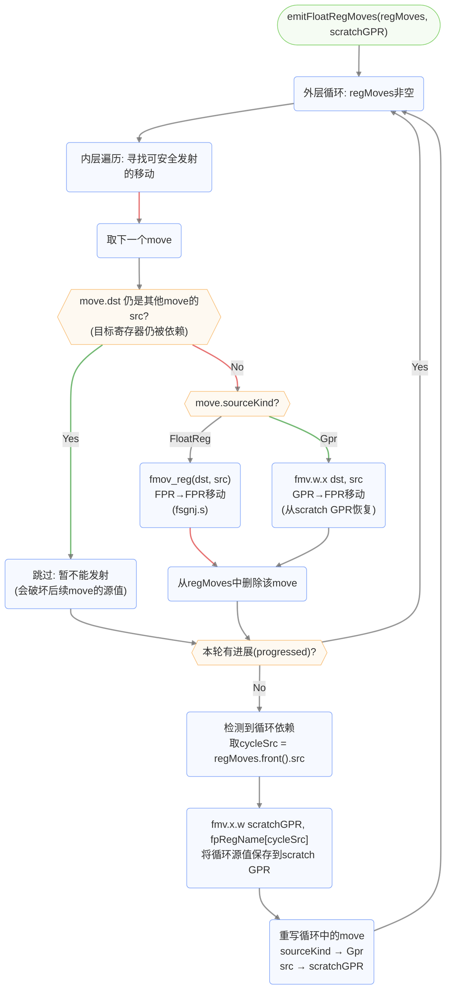

## 浮点二元运算翻译流程 (translate_fbinary)

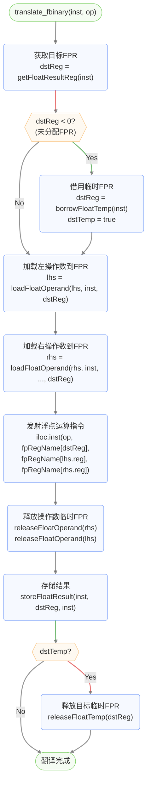

## 可用浮点寄存器池

| 类别 | 寄存器 | 编号 | 说明 |
|------|--------|------|------|
| caller-saved | ft0-ft7 | 0-7 | 临时寄存器 |
| caller-saved | fa0-fa7 | 10-17 | 参数/返回值寄存器 |
| caller-saved | ft8-ft11 | 28-31 | 临时寄存器 |
| **callee-saved (未启用)** | fs0-fs1 | 8-9 | 保存寄存器 (当前不参与分配) |
| **callee-saved (未启用)** | fs2-fs11 | 18-27 | 保存寄存器 (当前不参与分配) |

> **设计决策**：当前FPR分配只启用caller-saved寄存器（共20个），跨调用的float值会被溢出到栈上。这避免了引入fs0-fs11的prologue/epilogue保存恢复逻辑，简化了首次实现。未来可扩展启用callee-saved FPR以减少溢出。

## RegAllocInfo 浮点标记

```cpp
struct RegAllocInfo {
    int32_t regId = -1;
    bool isFloatReg = false;       // 分配的寄存器是否来自浮点寄存器文件
    bool hasReg() const;           // regId != -1 && !isFloatReg
    bool hasFloatReg() const;      // regId != -1 && isFloatReg
    void setReg(int32_t reg);      // 设置GPR分配
    void setFloatReg(int32_t reg); // 设置FPR分配
};
```

`isFloatReg` 标志确保指令选择器能正确区分GPR和FPR，即使两者使用相同的0-31编号空间。
