# 浮点寄存器分配流程图

## 总览

浮点寄存器分配与整数寄存器共享统一的Greedy分配框架，通过 `isFloatInterval()` 区分GPR/FPR类别，分别使用独立的寄存器池和干涉集合。`buildFloatRegisterPool()` 提供 18 个 caller-saved FPR（ft0-ft7、fa0-fa7、ft8-ft9；ft10-ft11 保留作指令选择临时 FPR）；默认（`--ra-callee-saved-fpr`，由 `CalleeSavedFPREnabler` 实现）再追加 fs0-fs11，共 30 个可分配 FPR，跨调用的 float 可分配到 callee-saved fs* 并在 prologue/epilogue 中保存/恢复。仅当用 `--ra-no-callee-saved-fpr` 关闭时，跨调用的 float 值才必须溢出到栈上。

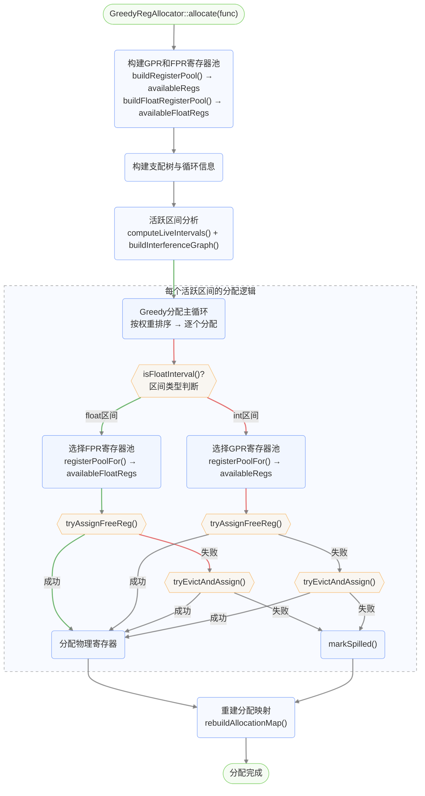
```mermaid
flowchart TD
    Start(["GreedyRegAllocator::allocate(func)"]) --> BuildPools("构建GPR和FPR寄存器池<br>buildRegisterPool() → availableRegs<br>buildFloatRegisterPool() → availableFloatRegs")

    BuildPools --> DomTree("构建支配树与循环信息")
    DomTree --> LIA("活跃区间分析<br>computeLiveIntervals() + buildInterferenceGraph()")

    LIA --> RunGreedy("Greedy分配主循环<br>按权重排序 → 逐个分配")

    subgraph PerInterval["每个活跃区间的分配逻辑"]
        RunGreedy --> Classify{{"isFloatInterval()?<br>区间类型判断"}}

        Classify -- "float区间" --> FPRPool("选择FPR寄存器池<br>registerPoolFor() → availableFloatRegs")
        Classify -- "int区间" --> GPRPool("选择GPR寄存器池<br>registerPoolFor() → availableRegs")

        FPRPool --> TryFreeF{{"tryAssignFreeReg()"}}
        GPRPool --> TryFreeI{{"tryAssignFreeReg()"}}

        TryFreeF -- "成功" --> Assigned
        TryFreeF -- "失败" --> TryEvictF{{"tryEvictAndAssign()"}}
        TryFreeI -- "成功" --> Assigned
        TryFreeI -- "失败" --> TryEvictI{{"tryEvictAndAssign()"}}

        TryEvictF -- "成功" --> Assigned("分配物理寄存器")
        TryEvictF -- "失败" --> Spilled("markSpilled()")
        TryEvictI -- "成功" --> Assigned
        TryEvictI -- "失败" --> Spilled
    end

    Assigned --> Rebuild("重建分配映射<br>rebuildAllocationMap()")
    Spilled --> Rebuild
    Rebuild --> End(["分配完成"])

    %%Node styles
    classDef default fill:#E2EAFE4F,stroke:#5A88F6AF
    classDef endNode fill:#DDF4D84F,stroke:#7DCF62AF
    classDef decisionNode fill:#FCEBD34f,stroke:#F6AA4BAF

    %%Link styles
    linkStyle default stroke:#666666AF,stroke-width:2px
    linkStyle 3,5 stroke:#339933AF,stroke-width:2px
    linkStyle 4,6 stroke:#DD3333AF,stroke-width:2px
    linkStyle 7,9 stroke:#339933AF,stroke-width:2px
    linkStyle 8,10 stroke:#DD3333AF,stroke-width:2px

    %%Node classes
    class Start,End endNode
    class Classify,TryFreeF,TryFreeI,TryEvictF,TryEvictI decisionNode

    %%Subgraph style
    style PerInterval fill:#E2EAFE3F,stroke:#6666669F,stroke-width:1px,stroke-dasharray: 5 5
```

## 浮点寄存器池构建 (buildFloatRegisterPool)

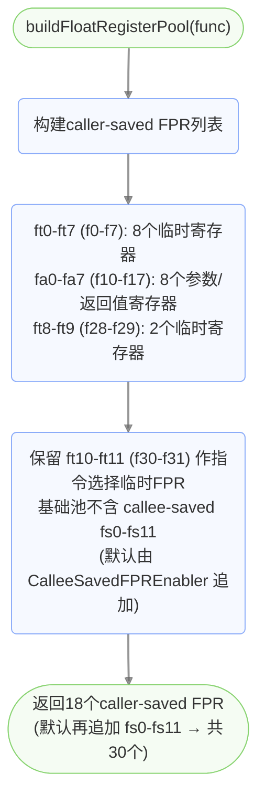
```mermaid
flowchart TD
    Start(["buildFloatRegisterPool(func)"]) --> BuildPool("构建caller-saved FPR列表")

    BuildPool --> ListRegs("ft0-ft7 (f0-f7): 8个临时寄存器<br>fa0-fa7 (f10-f17): 8个参数/返回值寄存器<br>ft8-ft9 (f28-f29): 2个临时寄存器")

    ListRegs --> ExcludeCallee("保留 ft10-ft11 (f30-f31) 作指令选择临时FPR<br>基础池不含 callee-saved fs0-fs11<br>(默认由 CalleeSavedFPREnabler 追加)")

    ExcludeCallee --> Return(["返回18个caller-saved FPR<br>(默认再追加 fs0-fs11 → 共30个)"])

    %%Node styles
    classDef default fill:#E2EAFE4F,stroke:#5A88F6AF
    classDef endNode fill:#DDF4D84F,stroke:#7DCF62AF

    %%Link styles
    linkStyle default stroke:#666666AF,stroke-width:2px

    %%Node classes
    class Start,Return endNode
```

## 浮点区间判断与寄存器池选择

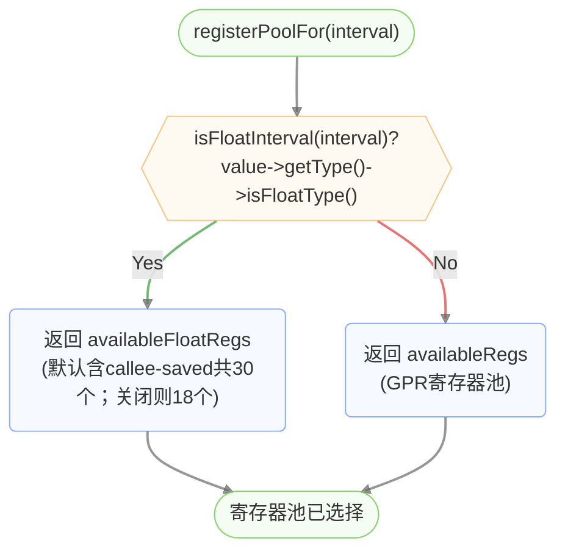
```mermaid
flowchart TD
    Start(["registerPoolFor(interval)"]) --> FloatCheck{{"isFloatInterval(interval)?<br>value->getType()->isFloatType()"}}

    FloatCheck -- "Yes" --> FPR("返回 availableFloatRegs<br>(默认含callee-saved共30个；关闭则18个)")
    FloatCheck -- "No" --> GPR("返回 availableRegs<br>(GPR寄存器池)")

    FPR --> End(["寄存器池已选择"])
    GPR --> End

    %%Node styles
    classDef default fill:#E2EAFE4F,stroke:#5A88F6AF
    classDef endNode fill:#DDF4D84F,stroke:#7DCF62AF
    classDef decisionNode fill:#FCEBD34f,stroke:#F6AA4BAF

    %%Link styles
    linkStyle default stroke:#666666AF,stroke-width:2px
    linkStyle 1 stroke:#339933AF,stroke-width:2px
    linkStyle 2 stroke:#DD3333AF,stroke-width:2px

    %%Node classes
    class Start,End endNode
    class FloatCheck decisionNode
```

## canAssignReg 浮点寄存器可分配性判断

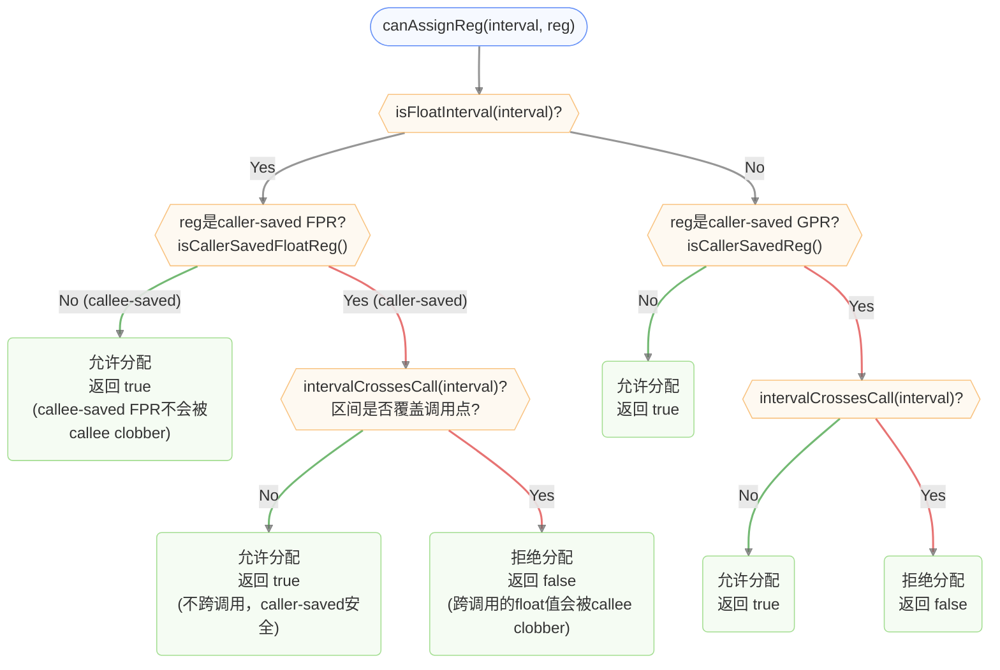
```mermaid
flowchart TD
    Start(["canAssignReg(interval, reg)"]) --> FloatCheck{{"isFloatInterval(interval)?"}}

    FloatCheck -- "Yes" --> FPRCallerCheck{{"reg是caller-saved FPR?<br>isCallerSavedFloatReg()"}}

    FPRCallerCheck -- "No (callee-saved)" --> AllowFPR("允许分配<br>返回 true<br>(callee-saved FPR不会被callee clobber)")
    FPRCallerCheck -- "Yes (caller-saved)" --> CrossCallF{{"intervalCrossesCall(interval)?<br>区间是否覆盖调用点?"}}

    CrossCallF -- "No" --> AllowFPR2("允许分配<br>返回 true<br>(不跨调用，caller-saved安全)")
    CrossCallF -- "Yes" --> DenyFPR("拒绝分配<br>返回 false<br>(跨调用的float值会被callee clobber)")

    FloatCheck -- "No" --> GPRCallerCheck{{"reg是caller-saved GPR?<br>isCallerSavedReg()"}}

    GPRCallerCheck -- "No" --> AllowGPR("允许分配<br>返回 true")
    GPRCallerCheck -- "Yes" --> CrossCallI{{"intervalCrossesCall(interval)?"}}

    CrossCallI -- "No" --> AllowGPR2("允许分配<br>返回 true")
    CrossCallI -- "Yes" --> DenyGPR("拒绝分配<br>返回 false")

    %%Node styles
    classDef default fill:#E2EAFE4F,stroke:#5A88F6AF
    classDef endNode fill:#DDF4D84F,stroke:#7DCF62AF
    classDef decisionNode fill:#FCEBD34f,stroke:#F6AA4BAF

    %%Link styles
    linkStyle default stroke:#666666AF,stroke-width:2px
    linkStyle 2,4,7,9 stroke:#339933AF,stroke-width:2px
    linkStyle 3,5,8,10 stroke:#DD3333AF,stroke-width:2px

    %%Node classes
    class AllowFPR,AllowFPR2,AllowGPR,AllowGPR2,DenyFPR,DenyGPR endNode
    class FloatCheck,FPRCallerCheck,CrossCallF,GPRCallerCheck,CrossCallI decisionNode
```

## 同类别干涉寄存器收集 (getInterferingRegsForClass)

GPR和FPR都使用0-31编号，编号相同不代表同一物理资源，因此干涉集合必须按类别过滤。

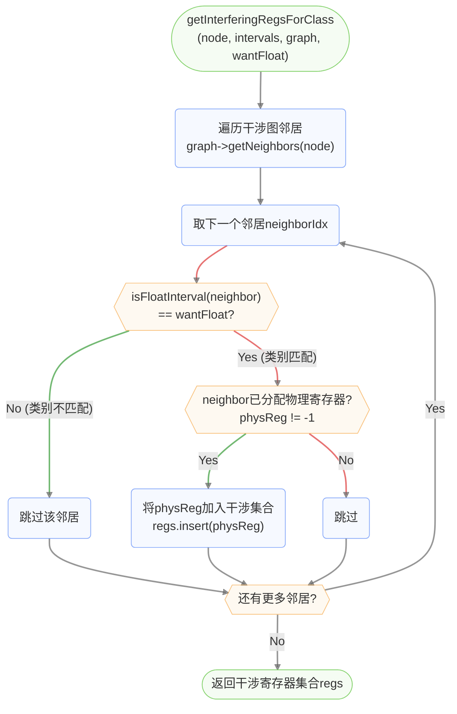
```mermaid
flowchart TD
    Start(["getInterferingRegsForClass<br>(node, intervals, graph, wantFloat)"]) --> IterNeighbors("遍历干涉图邻居<br>graph->getNeighbors(node)")

    IterNeighbors --> NextN("取下一个邻居neighborIdx")
    NextN --> ClassMatch{{"isFloatInterval(neighbor)<br>== wantFloat?"}}

    ClassMatch -- "No (类别不匹配)" --> SkipN("跳过该邻居")
    ClassMatch -- "Yes (类别匹配)" --> HasReg{{"neighbor已分配物理寄存器?<br>physReg != -1"}}

    HasReg -- "Yes" --> AddReg("将physReg加入干涉集合<br>regs.insert(physReg)")
    HasReg -- "No" --> SkipN2("跳过")
    AddReg --> MoreN
    SkipN --> MoreN
    SkipN2 --> MoreN{{"还有更多邻居?"}}

    MoreN -- "Yes" --> NextN
    MoreN -- "No" --> Return(["返回干涉寄存器集合regs"])

    %%Node styles
    classDef default fill:#E2EAFE4F,stroke:#5A88F6AF
    classDef endNode fill:#DDF4D84F,stroke:#7DCF62AF
    classDef decisionNode fill:#FCEBD34f,stroke:#F6AA4BAF

    %%Link styles
    linkStyle default stroke:#666666AF,stroke-width:2px
    linkStyle 2 stroke:#DD3333AF,stroke-width:2px
    linkStyle 3 stroke:#339933AF,stroke-width:2px
    linkStyle 5 stroke:#339933AF,stroke-width:2px
    linkStyle 4,6 stroke:#DD3333AF,stroke-width:2px

    %%Node classes
    class Start,Return endNode
    class ClassMatch,HasReg,MoreN decisionNode
```

## 重建分配映射 (rebuildAllocationMap)

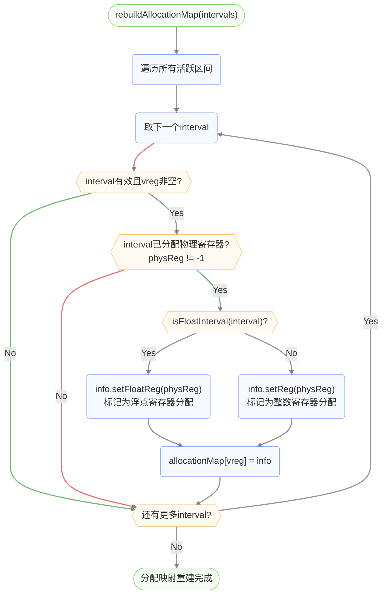
```mermaid
flowchart TD
    Start(["rebuildAllocationMap(intervals)"]) --> IterIntervals("遍历所有活跃区间")

    IterIntervals --> NextInterval("取下一个interval")
    NextInterval --> ValidCheck{{"interval有效且vreg非空?"}}
    ValidCheck -- "No" --> MoreCheck
    ValidCheck -- "Yes" --> HasPhysReg{{"interval已分配物理寄存器?<br>physReg != -1"}}

    HasPhysReg -- "No" --> MoreCheck{{"还有更多interval?"}}
    HasPhysReg -- "Yes" --> FloatCheck{{"isFloatInterval(interval)?"}}

    FloatCheck -- "Yes" --> SetFloat("info.setFloatReg(physReg)<br>标记为浮点寄存器分配")
    FloatCheck -- "No" --> SetGPR("info.setReg(physReg)<br>标记为整数寄存器分配")

    SetFloat --> WriteMap("allocationMap[vreg] = info")
    SetGPR --> WriteMap
    WriteMap --> MoreCheck

    MoreCheck -- "Yes" --> NextInterval
    MoreCheck -- "No" --> End(["分配映射重建完成"])

    %%Node styles
    classDef default fill:#E2EAFE4F,stroke:#5A88F6AF
    classDef endNode fill:#DDF4D84F,stroke:#7DCF62AF
    classDef decisionNode fill:#FCEBD34f,stroke:#F6AA4BAF

    %%Link styles
    linkStyle default stroke:#666666AF,stroke-width:2px
    linkStyle 2 stroke:#DD3333AF,stroke-width:2px
    linkStyle 3 stroke:#339933AF,stroke-width:2px
    linkStyle 5 stroke:#DD3333AF,stroke-width:2px
    linkStyle 6 stroke:#339933AF,stroke-width:2px

    %%Node classes
    class Start,End endNode
    class ValidCheck,HasPhysReg,FloatCheck,MoreCheck decisionNode
```

## 浮点操作数加载流程 (loadFloatOperand)

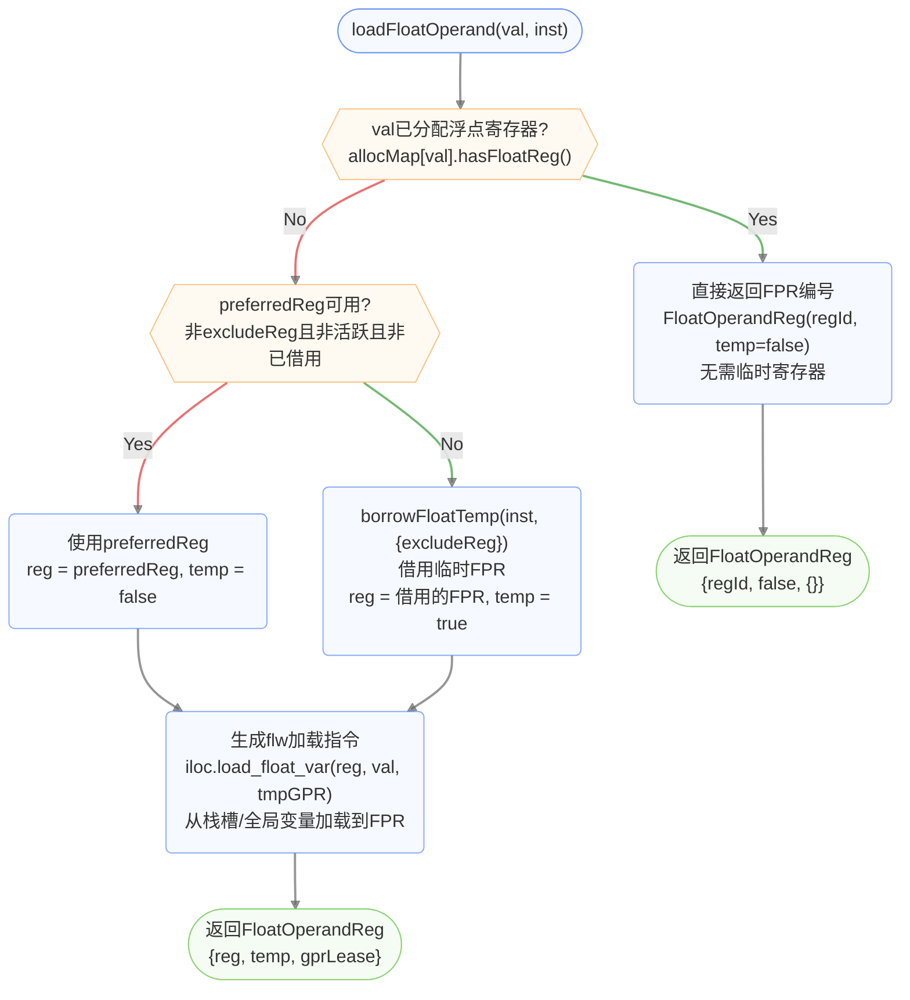
```mermaid
flowchart TD
    Start(["loadFloatOperand(val, inst)"]) --> HasFPR{{"val已分配浮点寄存器?<br>allocMap[val].hasFloatReg()"}}

    HasFPR -- "Yes" --> DirectFPR("直接返回FPR编号<br>FloatOperandReg(regId, temp=false)<br>无需临时寄存器")

    HasFPR -- "No" --> PreferredCheck{{"preferredReg可用?<br>非excludeReg且非活跃且非已借用"}}

    PreferredCheck -- "Yes" --> UsePreferred("使用preferredReg<br>reg = preferredReg, temp = false")
    PreferredCheck -- "No" --> BorrowTemp("borrowFloatTemp(inst, {excludeReg})<br>借用临时FPR<br>reg = 借用的FPR, temp = true")

    UsePreferred --> GenLoad("生成flw加载指令<br>iloc.load_float_var(reg, val, tmpGPR)<br>从栈槽/全局变量加载到FPR")
    BorrowTemp --> GenLoad

    GenLoad --> Return(["返回FloatOperandReg<br>{reg, temp, gprLease}"])
    DirectFPR --> Return2(["返回FloatOperandReg<br>{regId, false, {}}"])

    %%Node styles
    classDef default fill:#E2EAFE4F,stroke:#5A88F6AF
    classDef endNode fill:#DDF4D84F,stroke:#7DCF62AF
    classDef decisionNode fill:#FCEBD34f,stroke:#F6AA4BAF

    %%Link styles
    linkStyle default stroke:#666666AF,stroke-width:2px
    linkStyle 1 stroke:#339933AF,stroke-width:2px
    linkStyle 2 stroke:#DD3333AF,stroke-width:2px
    linkStyle 4 stroke:#339933AF,stroke-width:2px
    linkStyle 3 stroke:#DD3333AF,stroke-width:2px

    %%Node classes
    class Return,Return2 endNode
    class HasFPR,PreferredCheck decisionNode
```

## 浮点结果存储流程 (storeFloatResult)

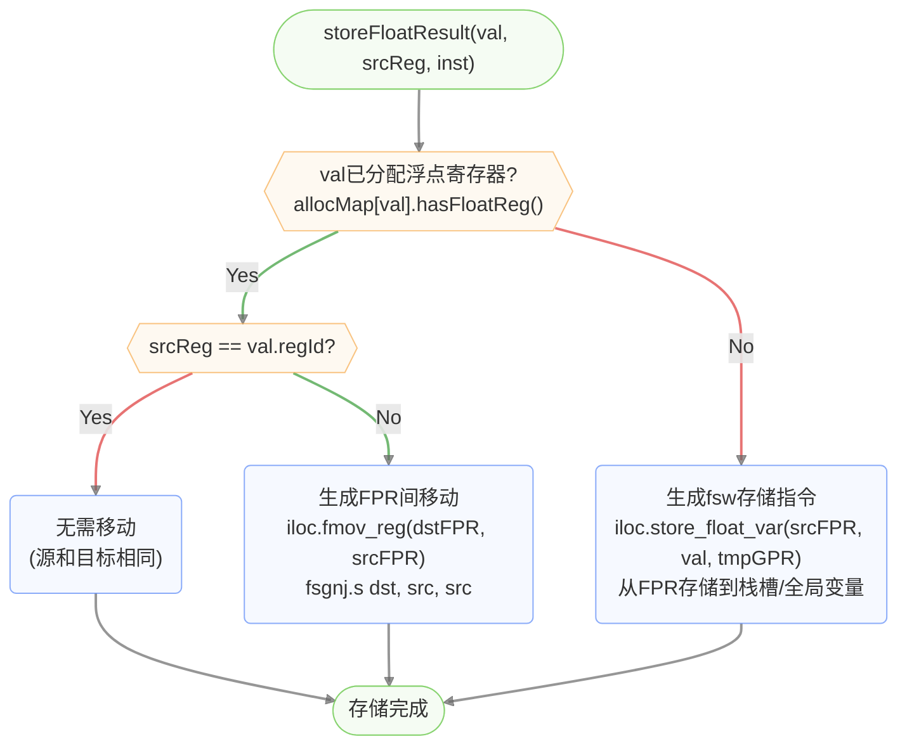
```mermaid
flowchart TD
    Start(["storeFloatResult(val, srcReg, inst)"]) --> HasFPR{{"val已分配浮点寄存器?<br>allocMap[val].hasFloatReg()"}}

    HasFPR -- "Yes" --> SameRegCheck{{"srcReg == val.regId?"}}
    SameRegCheck -- "Yes" --> Noop("无需移动<br>(源和目标相同)")
    SameRegCheck -- "No" --> GenFmov("生成FPR间移动<br>iloc.fmov_reg(dstFPR, srcFPR)<br>fsgnj.s dst, src, src")

    HasFPR -- "No" --> GenStore("生成fsw存储指令<br>iloc.store_float_var(srcFPR, val, tmpGPR)<br>从FPR存储到栈槽/全局变量")

    Noop --> End(["存储完成"])
    GenFmov --> End
    GenStore --> End

    %%Node styles
    classDef default fill:#E2EAFE4F,stroke:#5A88F6AF
    classDef endNode fill:#DDF4D84F,stroke:#7DCF62AF
    classDef decisionNode fill:#FCEBD34f,stroke:#F6AA4BAF

    %%Link styles
    linkStyle default stroke:#666666AF,stroke-width:2px
    linkStyle 1 stroke:#339933AF,stroke-width:2px
    linkStyle 2 stroke:#DD3333AF,stroke-width:2px
    linkStyle 3 stroke:#339933AF,stroke-width:2px
    linkStyle 4 stroke:#DD3333AF,stroke-width:2px

    %%Node classes
    class Start,End endNode
    class HasFPR,SameRegCheck decisionNode
```

## 临时浮点寄存器借用 (borrowFloatTemp)

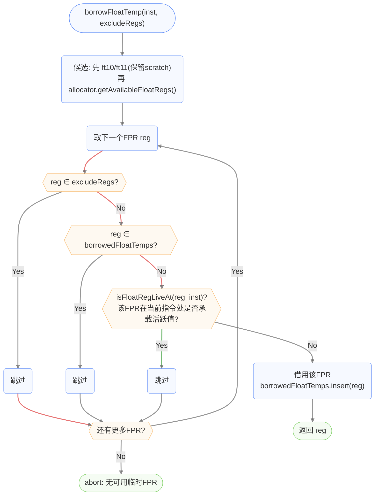
```mermaid
flowchart TD
    Start(["borrowFloatTemp(inst, excludeRegs)"]) --> IterPool("候选: 先 ft10/ft11(保留scratch)<br>再 allocator.getAvailableFloatRegs()")

    IterPool --> NextReg("取下一个FPR reg")
    NextReg --> ExcludeCheck{{"reg ∈ excludeRegs?"}}
    ExcludeCheck -- "Yes" --> SkipReg("跳过")
    ExcludeCheck -- "No" --> BorrowedCheck{{"reg ∈ borrowedFloatTemps?"}}

    BorrowedCheck -- "Yes" --> SkipReg2("跳过")
    BorrowedCheck -- "No" --> LiveCheck{{"isFloatRegLiveAt(reg, inst)?<br>该FPR在当前指令处是否承载活跃值?"}}

    LiveCheck -- "Yes" --> SkipReg3("跳过")
    LiveCheck -- "No" --> Borrow("借用该FPR<br>borrowedFloatTemps.insert(reg)")

    SkipReg --> MoreReg
    SkipReg2 --> MoreReg
    SkipReg3 --> MoreReg
    Borrow --> Return(["返回 reg"])

    MoreReg{{"还有更多FPR?"}}
    MoreReg -- "Yes" --> NextReg
    MoreReg -- "No" --> Abort(["abort: 无可用临时FPR"])

    %%Node styles
    classDef default fill:#E2EAFE4F,stroke:#5A88F6AF
    classDef endNode fill:#DDF4D84F,stroke:#7DCF62AF
    classDef decisionNode fill:#FCEBD34f,stroke:#F6AA4BAF

    %%Link styles
    linkStyle default stroke:#666666AF,stroke-width:2px
    linkStyle 2,4,6 stroke:#DD3333AF,stroke-width:2px
    linkStyle 7 stroke:#339933AF,stroke-width:2px
    linkStyle 9 stroke:#DD3333AF,stroke-width:2px

    %%Node classes
    class Return,Abort endNode
    class ExcludeCheck,BorrowedCheck,LiveCheck,MoreReg decisionNode
```

## 浮点寄存器活跃性查询 (isFloatRegLiveAt)

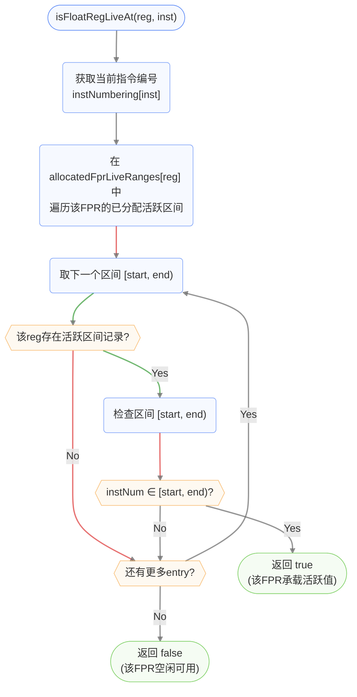
```mermaid
flowchart TD
    Start(["isFloatRegLiveAt(reg, inst)"]) --> GetInstNum("获取当前指令编号<br>instNumbering[inst]")

    GetInstNum --> IterMap("在 allocatedFprLiveRanges[reg] 中<br>遍历该FPR的已分配活跃区间")
    IterMap --> NextEntry("取下一个区间 [start, end)")
    NextEntry --> FloatRegCheck{{"该reg存在活跃区间记录?"}}

    FloatRegCheck -- "No" --> MoreCheck
    FloatRegCheck -- "Yes" --> FindRange("检查区间 [start, end)")

    FindRange --> InRange{{"instNum ∈ [start, end)?"}}
    InRange -- "Yes" --> Live(["返回 true<br>(该FPR承载活跃值)"])
    InRange -- "No" --> MoreCheck{{"还有更多entry?"}}

    MoreCheck -- "Yes" --> NextEntry
    MoreCheck -- "No" --> NotLive(["返回 false<br>(该FPR空闲可用)"])

    %%Node styles
    classDef default fill:#E2EAFE4F,stroke:#5A88F6AF
    classDef endNode fill:#DDF4D84F,stroke:#7DCF62AF
    classDef decisionNode fill:#FCEBD34f,stroke:#F6AA4BAF

    %%Link styles
    linkStyle default stroke:#666666AF,stroke-width:2px
    linkStyle 2 stroke:#DD3333AF,stroke-width:2px
    linkStyle 3 stroke:#339933AF,stroke-width:2px
    linkStyle 5 stroke:#339933AF,stroke-width:2px
    linkStyle 4,6 stroke:#DD3333AF,stroke-width:2px

    %%Node classes
    class Live,NotLive endNode
    class FloatRegCheck,InRange,MoreCheck decisionNode
```

## 浮点寄存器并行移动解析 (emitFloatRegMoves)

处理基本块边界处浮点寄存器的并行移动，避免移动冲突（循环依赖）。

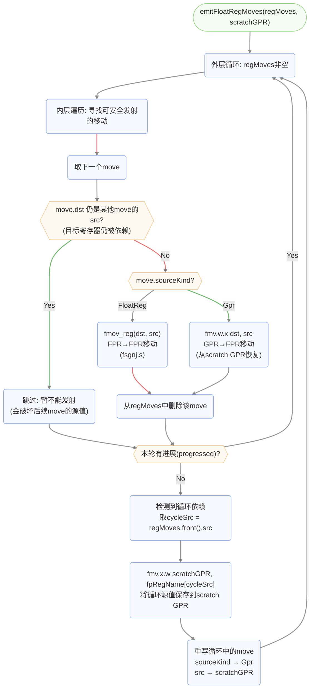
```mermaid
flowchart TD
    Start(["emitFloatRegMoves(regMoves, scratchGPR)"]) --> LoopStart("外层循环: regMoves非空")

    LoopStart --> InnerIter("内层遍历: 寻找可安全发射的移动")
    InnerIter --> NextMove("取下一个move")
    NextMove --> DstCheck{{"move.dst 仍是其他move的src?<br>(目标寄存器仍被依赖)"}}

    DstCheck -- "Yes" --> SkipMove("跳过: 暂不能发射<br>(会破坏后续move的源值)")
    DstCheck -- "No" --> EmitMove{{"move.sourceKind?"}}

    EmitMove -- "FloatReg" --> FPRMove("fmov_reg(dst, src)<br>FPR→FPR移动<br>(fsgnj.s)")
    EmitMove -- "Gpr" --> GPRMove("fmv.w.x dst, src<br>GPR→FPR移动<br>(从scratch GPR恢复)")

    FPRMove --> EraseMove("从regMoves中删除该move")
    GPRMove --> EraseMove
    SkipMove --> ProgressCheck

    EraseMove --> ProgressCheck{{"本轮有进展(progressed)?"}}
    ProgressCheck -- "Yes" --> LoopStart

    ProgressCheck -- "No" --> CycleDetect("检测到循环依赖<br>取cycleSrc = regMoves.front().src")
    CycleDetect --> SaveToGPR("fmv.x.w scratchGPR, fpRegName[cycleSrc]<br>将循环源值保存到scratch GPR")
    SaveToGPR --> RewriteMoves("重写循环中的move<br>sourceKind → Gpr<br>src → scratchGPR")
    RewriteMoves --> LoopStart

    %%Node styles
    classDef default fill:#E2EAFE4F,stroke:#5A88F6AF
    classDef endNode fill:#DDF4D84F,stroke:#7DCF62AF
    classDef decisionNode fill:#FCEBD34f,stroke:#F6AA4BAF

    %%Link styles
    linkStyle default stroke:#666666AF,stroke-width:2px
    linkStyle 2 stroke:#DD3333AF,stroke-width:2px
    linkStyle 4 stroke:#339933AF,stroke-width:2px
    linkStyle 5 stroke:#DD3333AF,stroke-width:2px
    linkStyle 7 stroke:#339933AF,stroke-width:2px
    linkStyle 8 stroke:#DD3333AF,stroke-width:2px

    %%Node classes
    class Start endNode
    class DstCheck,EmitMove,ProgressCheck decisionNode
```

## 浮点二元运算翻译流程 (translate_fbinary)

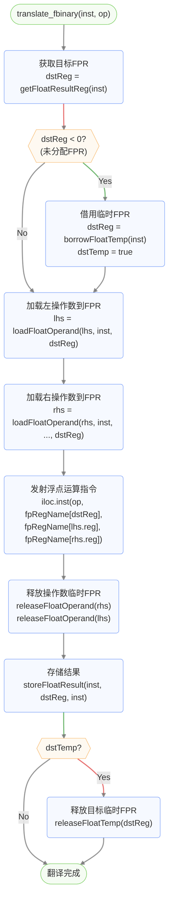
```mermaid
flowchart TD
    Start(["translate_fbinary(inst, op)"]) --> GetDst("获取目标FPR<br>dstReg = getFloatResultReg(inst)")

    GetDst --> DstCheck{{"dstReg < 0?<br>(未分配FPR)"}}
    DstCheck -- "Yes" --> BorrowDst("借用临时FPR<br>dstReg = borrowFloatTemp(inst)<br>dstTemp = true")
    DstCheck -- "No" --> LoadLhs

    BorrowDst --> LoadLhs("加载左操作数到FPR<br>lhs = loadFloatOperand(lhs, inst, dstReg)")
    LoadLhs --> LoadRhs("加载右操作数到FPR<br>rhs = loadFloatOperand(rhs, inst, ..., dstReg)")

    LoadRhs --> EmitInst("发射浮点运算指令<br>iloc.inst(op, fpRegName[dstReg],<br>fpRegName[lhs.reg], fpRegName[rhs.reg])")

    EmitInst --> ReleaseOps("释放操作数临时FPR<br>releaseFloatOperand(rhs)<br>releaseFloatOperand(lhs)")
    ReleaseOps --> StoreRes("存储结果<br>storeFloatResult(inst, dstReg, inst)")

    StoreRes --> DstTempCheck{{"dstTemp?"}}
    DstTempCheck -- "Yes" --> ReleaseDst("释放目标临时FPR<br>releaseFloatTemp(dstReg)")
    DstTempCheck -- "No" --> End(["翻译完成"])
    ReleaseDst --> End

    %%Node styles
    classDef default fill:#E2EAFE4F,stroke:#5A88F6AF
    classDef endNode fill:#DDF4D84F,stroke:#7DCF62AF
    classDef decisionNode fill:#FCEBD34f,stroke:#F6AA4BAF

    %%Link styles
    linkStyle default stroke:#666666AF,stroke-width:2px
    linkStyle 2 stroke:#339933AF,stroke-width:2px
    linkStyle 1 stroke:#DD3333AF,stroke-width:2px
    linkStyle 9 stroke:#339933AF,stroke-width:2px
    linkStyle 10 stroke:#DD3333AF,stroke-width:2px

    %%Node classes
    class Start,End endNode
    class DstCheck,DstTempCheck decisionNode
```

## 可用浮点寄存器池

| 类别 | 寄存器 | 编号 | 说明 |
|------|--------|------|------|
| caller-saved | ft0-ft7 | 0-7 | 临时寄存器 |
| caller-saved | fa0-fa7 | 10-17 | 参数/返回值寄存器 |
| caller-saved | ft8-ft9 | 28-29 | 临时寄存器 |
| **保留 (scratch)** | ft10-ft11 | 30-31 | 指令选择阶段临时FPR，不参与分配 |
| callee-saved | fs0-fs1 | 8-9 | 保存寄存器 (默认 `--ra-callee-saved-fpr` 开启时纳入分配) |
| callee-saved | fs2-fs11 | 18-27 | 保存寄存器 (默认 `--ra-callee-saved-fpr` 开启时纳入分配) |

> **设计决策**：`buildFloatRegisterPool()` 基础池为 18 个 caller-saved FPR，并保留 ft10-ft11 作指令选择临时 FPR。是否纳入 callee-saved fs0-fs11 由 `--ra-callee-saved-fpr` 控制（默认开启，经 `CalleeSavedFPREnabler` 追加，共 30 个可分配 FPR，跨调用 float 可分配到 fs* 并在 prologue/epilogue 中保存/恢复）；用 `--ra-no-callee-saved-fpr` 关闭后只用 18 个 caller-saved，跨调用 float 溢出到栈。

## RegAllocInfo 浮点标记

```cpp
struct RegAllocInfo {
    int32_t regId = -1;
    bool isFloatReg = false;        // 分配的寄存器是否来自浮点寄存器文件
    bool isVectorReg = false;       // 分配的寄存器是否来自 RVV 向量寄存器文件
    // 另有 baseRegId / offset / hasStackSlot 描述栈槽位置
    bool hasReg() const;            // regId != -1 && !isFloatReg && !isVectorReg
    bool hasFloatReg() const;       // regId != -1 && isFloatReg
    bool hasVectorReg() const;      // regId != -1 && isVectorReg
    void setReg(int32_t reg);       // 设置GPR分配
    void setFloatReg(int32_t reg);  // 设置FPR分配
    void setVectorReg(int32_t reg); // 设置VR分配
};
```

`isFloatReg`/`isVectorReg` 标志确保指令选择器能正确区分GPR/FPR/VR，即使三者使用相同的0-31编号空间。
