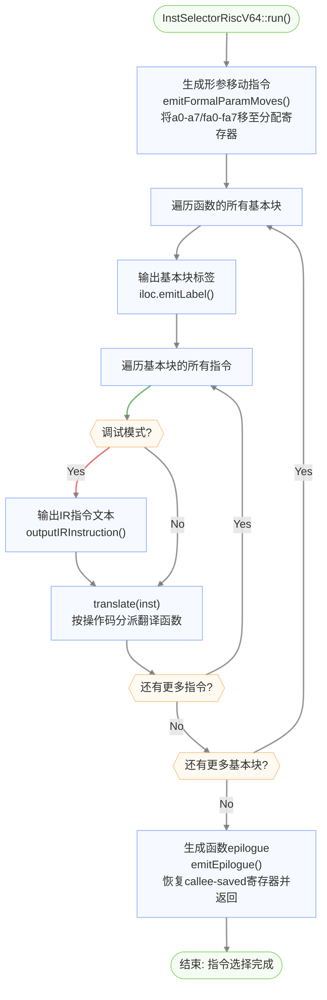
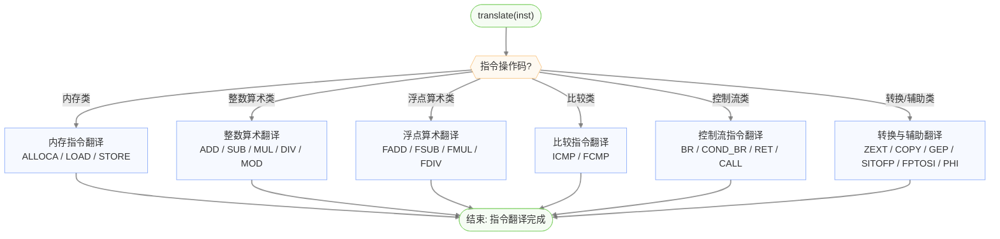
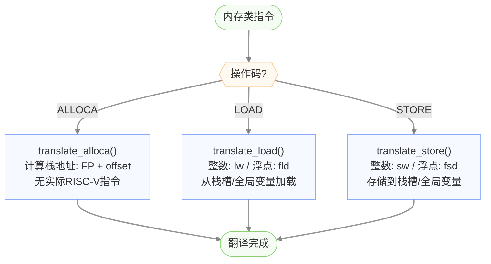
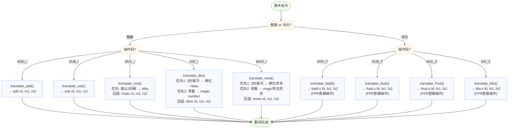
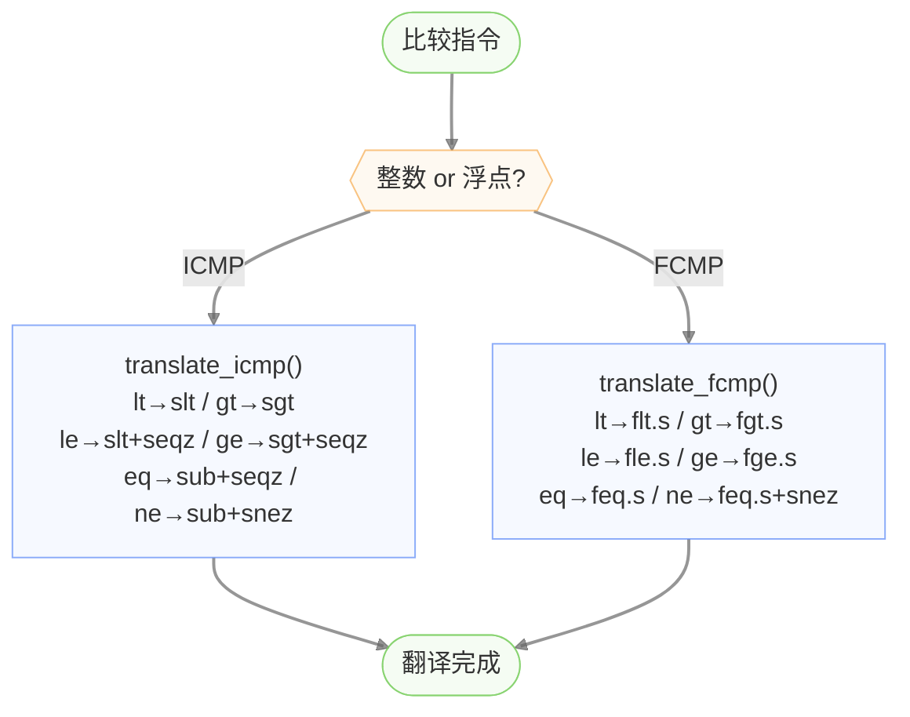
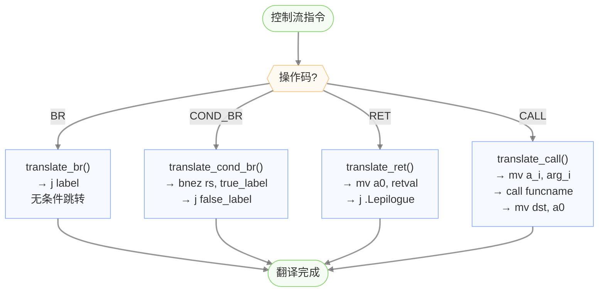
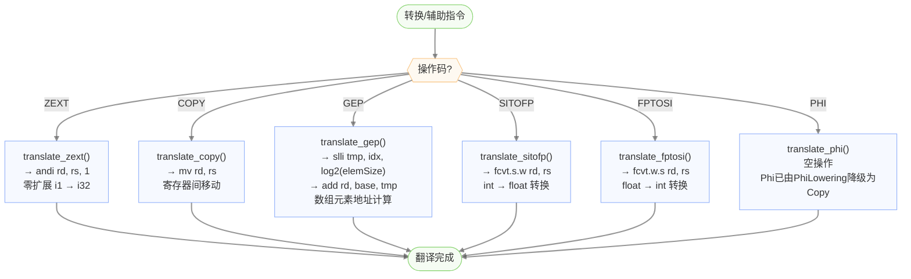
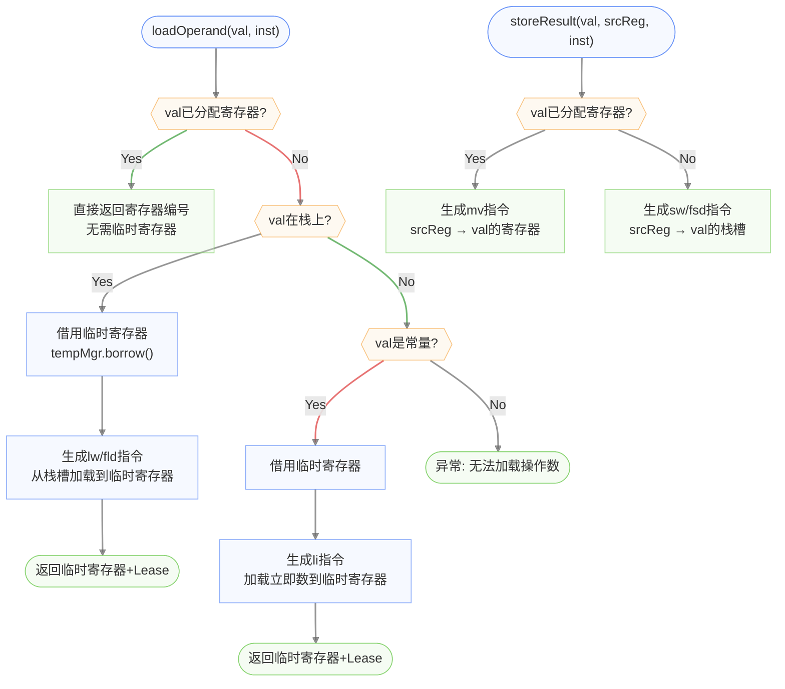
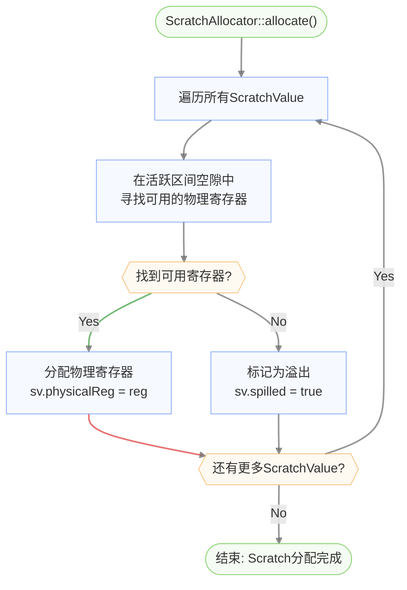
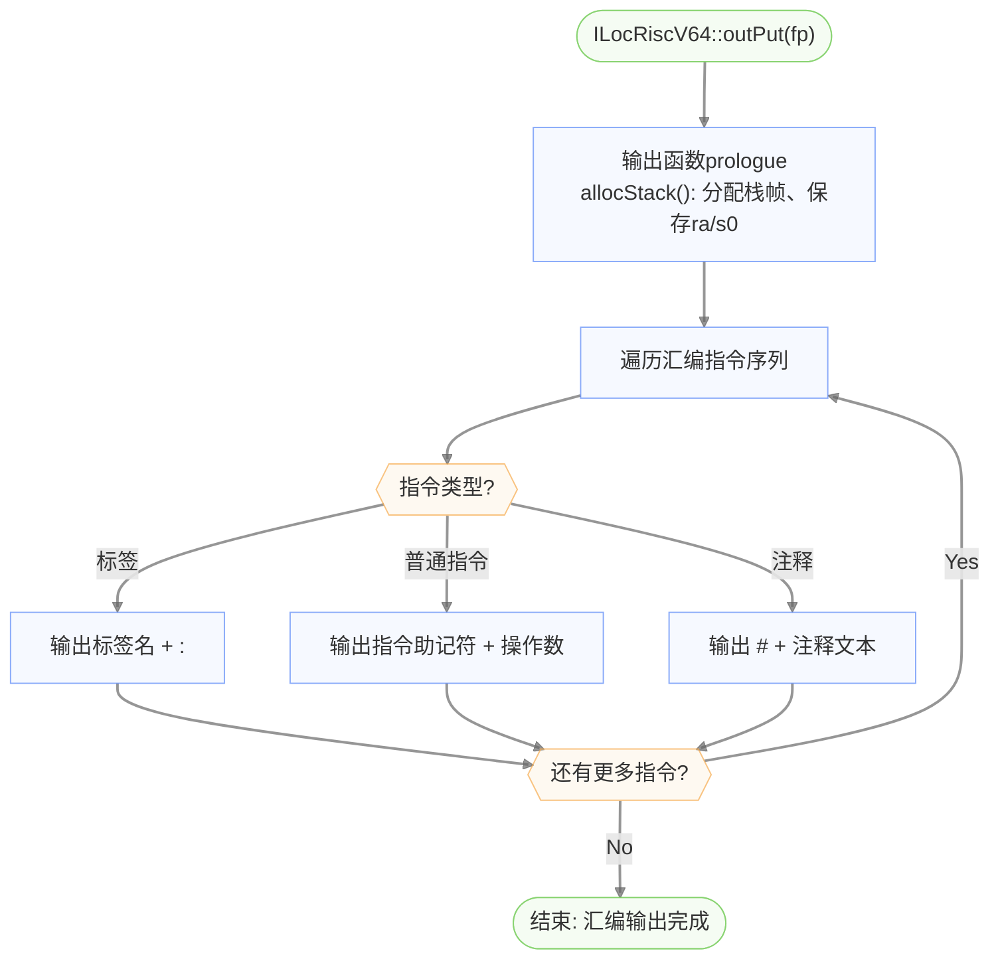

# 指令选择与代码输出流程图

## 指令选择主流程 (InstSelectorRiscV64::run)

## IR指令翻译分派 (translate)

### 总体分派逻辑

### 内存指令翻译

### 算术指令翻译

### 比较指令翻译

### 控制流指令翻译

### 转换与辅助指令翻译

## 操作数加载与结果存储流程

## Scratch寄存器分配流程

## 汇编代码输出流程 (ILocRiscV64::outPut)

## IR指令到RISC-V指令映射表

| IR操作码 | IR指令类 | RISC-V指令 | 说明 |
|----------|----------|------------|------|
| `ALLOCA` | AllocaInst | (栈地址计算) | 计算FP+offset，无实际指令 |
| `LOAD` | LoadInst | `lw`/`fld` | 整数用lw，浮点用fld |
| `STORE` | StoreInst | `sw`/`fsd` | 整数用sw，浮点用fsd |
| `ADD_I` | BinaryInst | `add` | 整数加法 |
| `SUB_I` | BinaryInst | `sub` | 整数减法 |
| `MUL_I` | BinaryInst | `slliw`/`mulw` | 乘以2的幂→左移，否则mulw |
| `DIV_I` | BinaryInst | `sraiw`/`mul`+`srai`/`divw` | 2的幂→移位+bias，常量→magic number，否则divw |
| `MOD_I` | BinaryInst | `sraiw`+`subw`/`remw` | 2的幂→移位求余，常量→magic求余，否则remw |
| `ADD_F` | BinaryInst | `fadd.s` | 浮点加法 |
| `SUB_F` | BinaryInst | `fsub.s` | 浮点减法 |
| `MUL_F` | BinaryInst | `fmul.s` | 浮点乘法 |
| `DIV_F` | BinaryInst | `fdiv.s` | 浮点除法 |
| `LT_I/GT_I/...` | ICmpInst | `slt`/`sgt`+`bnez` | 整数比较+条件分支 |
| `LT_F/GT_F/...` | FCmpInst | `flt`/`fgt`/`feq`+`bnez` | 浮点比较+条件分支 |
| `BR` | BranchInst | `j` | 无条件跳转 |
| `COND_BR` | CondBranchInst | `bnez`/`beqz` | 条件跳转 |
| `RET` | ReturnInst | `mv a0`+`j epilogue` | 返回值移动+跳转到epilogue |
| `CALL` | CallInst | `mv a_i`+`call` | 参数传递+函数调用 |
| `PHI` | PhiInst | (空操作) | Phi已降级为Copy |
| `ZEXT` | ZExtInst | `andi`/零扩展 | 零扩展i1→i32 |
| `COPY` | CopyInst | `mv` | 寄存器间移动 |
| `GEP` | GetElementPtrInst | `slli`+`add` | 数组元素地址计算 |
| `SITOFP` | SIToFPInst | `fcvt.s.w` | 整数转浮点 |
| `FPTOSI` | FPToSIInst | `fcvt.w.s` | 浮点转整数 |

## 相关文档

| 文档 | 内容 |
|------|------|
| [后端整体流程](backend-overview.md) | 编译流水线、函数级代码生成、栈帧布局 |
| [寄存器分配详细流程](backend-regalloc.md) | Greedy分配器、活跃区间分析、干涉图构建 |
| [常量除法优化](backend-const-div-opt.md) | 2的幂次移位、Magic Number算法、强度消减详细流程 |
| [浮点寄存器分配](backend-fpregalloc.md) | FPR池构建、浮点操作数加载/存储、临时FPR借用 |
