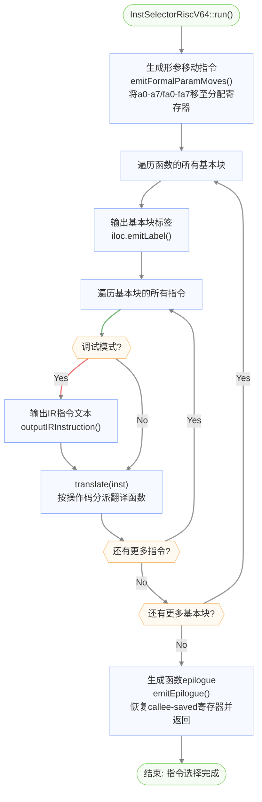
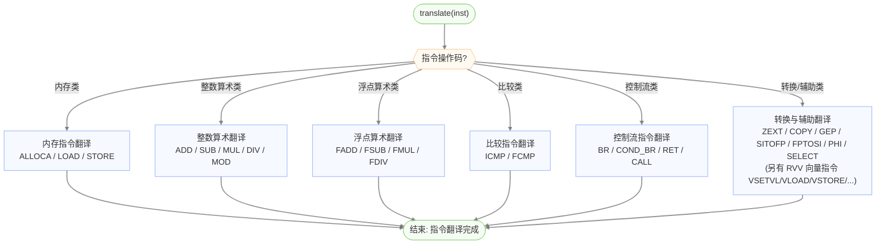
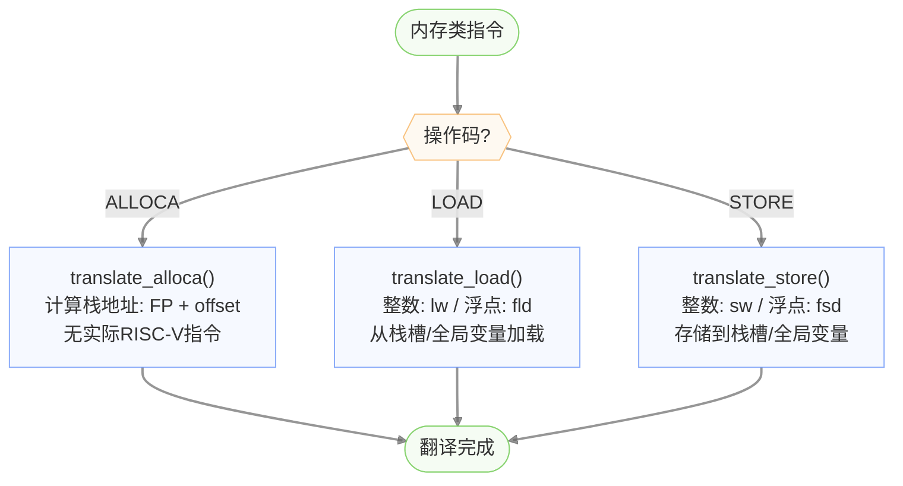
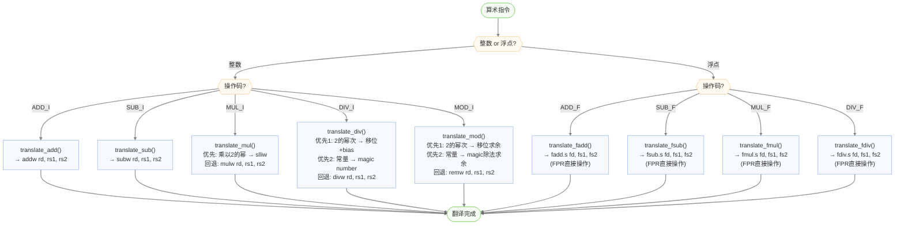
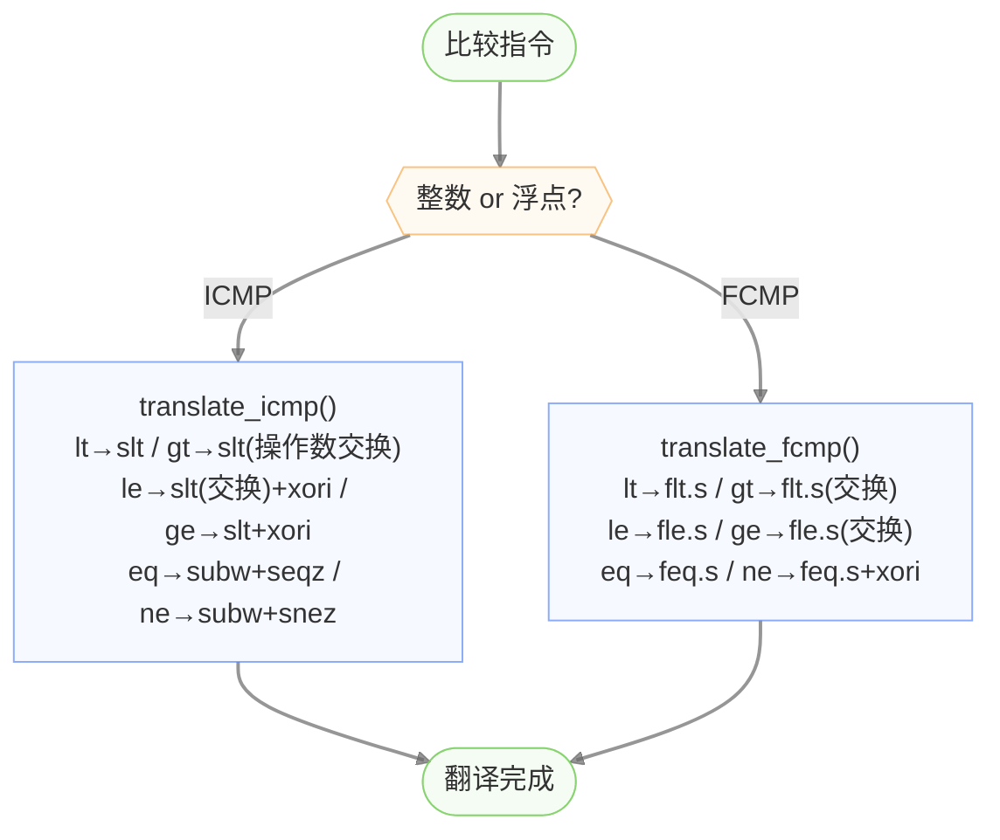
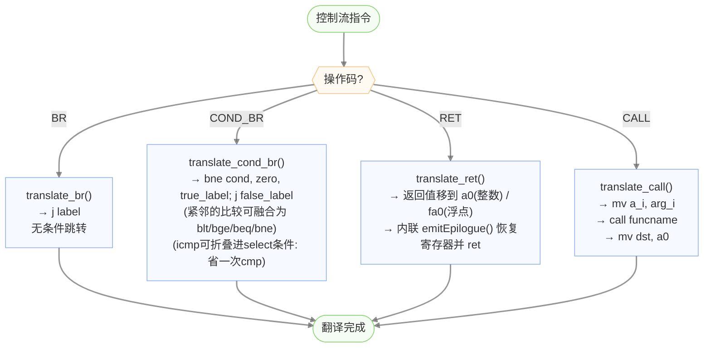
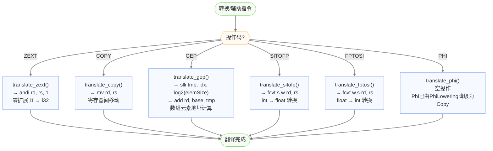
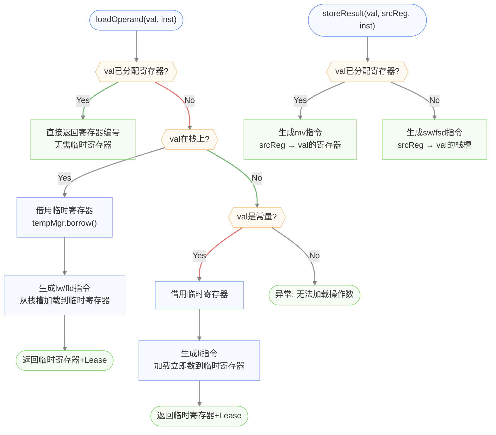
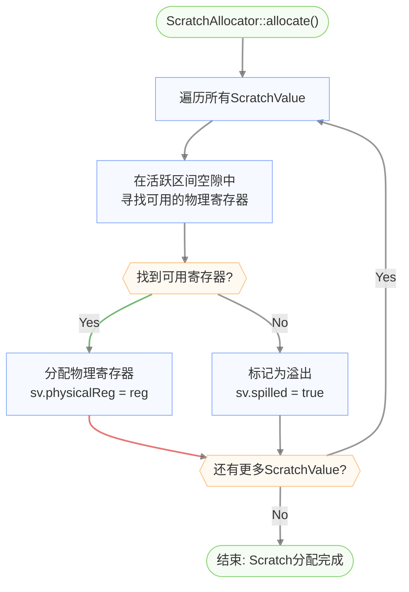
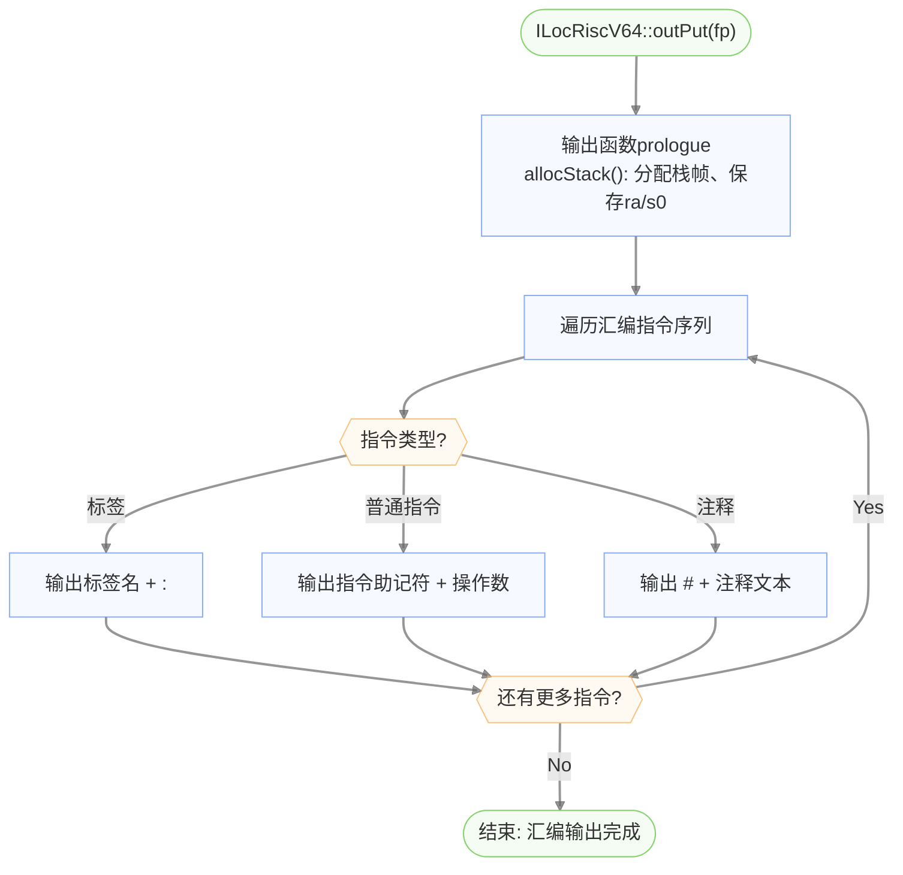

# 指令选择与代码输出流程图

## 指令选择主流程 (InstSelectorRiscV64::run)

```mermaid
flowchart TD
    Start(["InstSelectorRiscV64::run()"]) --> EmitParam["生成形参移动指令<br>emitFormalParamMoves()<br>将a0-a7/fa0-fa7移至分配寄存器"]
    EmitParam --> BBIter["遍历函数的所有基本块"]

    BBIter --> BBLabel["输出基本块标签<br>iloc.emitLabel()"]
    BBLabel --> InstIter["遍历基本块的所有指令"]

    InstIter --> DebugOut{{"调试模式?"}}
    DebugOut -- "Yes" --> OutIR["输出IR指令文本<br>outputIRInstruction()"]
    OutIR --> Translate
    DebugOut -- "No" --> Translate["translate(inst)<br>按操作码分派翻译函数"]

    Translate --> MoreInst{{"还有更多指令?"}}
    MoreInst -- "Yes" --> InstIter
    MoreInst -- "No" --> MoreBB{{"还有更多基本块?"}}

    MoreBB -- "Yes" --> BBIter
    MoreBB -- "No" --> EmitEpi["生成函数epilogue<br>emitEpilogue()<br>恢复callee-saved寄存器并返回"]
    EmitEpi --> End(["结束: 指令选择完成"])

    %%Node styles
    classDef default fill:#E2EAFE4F,stroke:#5A88F6AF
    classDef endNode fill:#DDF4D84F,stroke:#7DCF62AF
    classDef decisionNode fill:#FCEBD34f,stroke:#F6AA4BAF

    %%Link styles
    linkStyle default stroke:#666666AF,stroke-width:2px
    linkStyle 4 stroke:#339933AF,stroke-width:2px
    linkStyle 5 stroke:#DD3333AF,stroke-width:2px

    %%Node classes
    class Start,End endNode
    class DebugOut,MoreInst,MoreBB decisionNode
```

## IR指令翻译分派 (translate)

### 总体分派逻辑

```mermaid
flowchart TD
    Start(["translate(inst)"]) --> OpCheck{{"指令操作码?"}}

    OpCheck -- "内存类" --> MemGroup["内存指令翻译<br>ALLOCA / LOAD / STORE"]
    OpCheck -- "整数算术类" --> IntArithGroup["整数算术翻译<br>ADD / SUB / MUL / DIV / MOD"]
    OpCheck -- "浮点算术类" --> FloatArithGroup["浮点算术翻译<br>FADD / FSUB / FMUL / FDIV"]
    OpCheck -- "比较类" --> CmpGroup["比较指令翻译<br>ICMP / FCMP"]
    OpCheck -- "控制流类" --> CtrlGroup["控制流指令翻译<br>BR / COND_BR / RET / CALL"]
    OpCheck -- "转换/辅助类" --> MiscGroup["转换与辅助翻译<br>ZEXT / COPY / GEP / SITOFP / FPTOSI / PHI / SELECT<br>(另有 RVV 向量指令 VSETVL/VLOAD/VSTORE/...)"]

    MemGroup & IntArithGroup & FloatArithGroup & CmpGroup & CtrlGroup & MiscGroup --> End(["结束: 指令翻译完成"])

    %%Node styles
    classDef default fill:#E2EAFE4F,stroke:#5A88F6AF
    classDef endNode fill:#DDF4D84F,stroke:#7DCF62AF
    classDef decisionNode fill:#FCEBD34f,stroke:#F6AA4BAF

    %%Link styles
    linkStyle default stroke:#666666AF,stroke-width:2px

    %%Node classes
    class Start,End endNode
    class OpCheck decisionNode
```

### 内存指令翻译

```mermaid
flowchart TD
    Start(["内存类指令"]) --> OpCheck{{"操作码?"}}
    OpCheck -- "ALLOCA" --> T_alloca["translate_alloca()<br>计算栈地址: FP + offset<br>无实际RISC-V指令"]
    OpCheck -- "LOAD" --> T_load["translate_load()<br>整数: lw / 浮点: fld<br>从栈槽/全局变量加载"]
    OpCheck -- "STORE" --> T_store["translate_store()<br>整数: sw / 浮点: fsd<br>存储到栈槽/全局变量"]

    T_alloca & T_load & T_store --> End(["翻译完成"])

    %%Node styles
    classDef default fill:#E2EAFE4F,stroke:#5A88F6AF
    classDef endNode fill:#DDF4D84F,stroke:#7DCF62AF
    classDef decisionNode fill:#FCEBD34f,stroke:#F6AA4BAF

    %%Link styles
    linkStyle default stroke:#666666AF,stroke-width:2px

    %%Node classes
    class Start,End endNode
    class OpCheck decisionNode
```

### 算术指令翻译

```mermaid
flowchart TD
    Start(["算术指令"]) --> OpCheck{{"整数 or 浮点?"}}
    OpCheck -- "整数" --> IntCheck{{"操作码?"}}
    OpCheck -- "浮点" --> FloatCheck{{"操作码?"}}

    IntCheck -- "ADD_I" --> T_add["translate_add()<br>→ addw rd, rs1, rs2"]
    IntCheck -- "SUB_I" --> T_sub["translate_sub()<br>→ subw rd, rs1, rs2"]
    IntCheck -- "MUL_I" --> T_mul["translate_mul()<br>优先: 乘以2的幂 → slliw<br>回退: mulw rd, rs1, rs2"]
    IntCheck -- "DIV_I" --> T_div["translate_div()<br>优先1: 2的幂次 → 移位+bias<br>优先2: 常量 → magic number<br>回退: divw rd, rs1, rs2"]
    IntCheck -- "MOD_I" --> T_mod["translate_mod()<br>优先1: 2的幂次 → 移位求余<br>优先2: 常量 → magic除法求余<br>回退: remw rd, rs1, rs2"]

    FloatCheck -- "ADD_F" --> T_fadd["translate_fadd()<br>→ fadd.s fd, fs1, fs2<br>(FPR直接操作)"]
    FloatCheck -- "SUB_F" --> T_fsub["translate_fsub()<br>→ fsub.s fd, fs1, fs2<br>(FPR直接操作)"]
    FloatCheck -- "MUL_F" --> T_fmul["translate_fmul()<br>→ fmul.s fd, fs1, fs2<br>(FPR直接操作)"]
    FloatCheck -- "DIV_F" --> T_fdiv["translate_fdiv()<br>→ fdiv.s fd, fs1, fs2<br>(FPR直接操作)"]

    T_add & T_sub & T_mul & T_div & T_mod --> End
    T_fadd & T_fsub & T_fmul & T_fdiv --> End(["翻译完成"])

    %%Node styles
    classDef default fill:#E2EAFE4F,stroke:#5A88F6AF
    classDef endNode fill:#DDF4D84F,stroke:#7DCF62AF
    classDef decisionNode fill:#FCEBD34f,stroke:#F6AA4BAF

    %%Link styles
    linkStyle default stroke:#666666AF,stroke-width:2px

    %%Node classes
    class Start,End endNode
    class OpCheck,IntCheck,FloatCheck decisionNode
```

### 比较指令翻译

```mermaid
flowchart TD
    Start(["比较指令"]) --> OpCheck{{"整数 or 浮点?"}}
    OpCheck -- "ICMP" --> T_icmp["translate_icmp()<br>lt→slt / gt→slt(操作数交换)<br>le→slt(交换)+xori / ge→slt+xori<br>eq→subw+seqz / ne→subw+snez"]
    OpCheck -- "FCMP" --> T_fcmp["translate_fcmp()<br>lt→flt.s / gt→flt.s(交换)<br>le→fle.s / ge→fle.s(交换)<br>eq→feq.s / ne→feq.s+xori"]

    T_icmp & T_fcmp --> End(["翻译完成"])

    %%Node styles
    classDef default fill:#E2EAFE4F,stroke:#5A88F6AF
    classDef endNode fill:#DDF4D84F,stroke:#7DCF62AF
    classDef decisionNode fill:#FCEBD34f,stroke:#F6AA4BAF

    %%Link styles
    linkStyle default stroke:#666666AF,stroke-width:2px

    %%Node classes
    class Start,End endNode
    class OpCheck decisionNode
```

### 控制流指令翻译

```mermaid
flowchart TD
    Start(["控制流指令"]) --> OpCheck{{"操作码?"}}
    OpCheck -- "BR" --> T_br["translate_br()<br>→ j label<br>无条件跳转"]
    OpCheck -- "COND_BR" --> T_condbr["translate_cond_br()<br>→ bne cond, zero, true_label; j false_label<br>(紧邻的比较可融合为 blt/bge/beq/bne)<br>(icmp可折叠进select条件: 省一次cmp)"]
    OpCheck -- "RET" --> T_ret["translate_ret()<br>→ 返回值移到 a0(整数) / fa0(浮点)<br>→ 内联 emitEpilogue() 恢复寄存器并 ret"]
    OpCheck -- "CALL" --> T_call["translate_call()<br>→ mv a_i, arg_i<br>→ call funcname<br>→ mv dst, a0"]

    T_br & T_condbr & T_ret & T_call --> End(["翻译完成"])

    %%Node styles
    classDef default fill:#E2EAFE4F,stroke:#5A88F6AF
    classDef endNode fill:#DDF4D84F,stroke:#7DCF62AF
    classDef decisionNode fill:#FCEBD34f,stroke:#F6AA4BAF

    %%Link styles
    linkStyle default stroke:#666666AF,stroke-width:2px

    %%Node classes
    class Start,End endNode
    class OpCheck decisionNode
```

### 转换与辅助指令翻译

```mermaid
flowchart TD
    Start(["转换/辅助指令"]) --> OpCheck{{"操作码?"}}
    OpCheck -- "ZEXT" --> T_zext["translate_zext()<br>→ andi rd, rs, 1<br>零扩展 i1 → i32"]
    OpCheck -- "COPY" --> T_copy["translate_copy()<br>→ mv rd, rs<br>寄存器间移动"]
    OpCheck -- "GEP" --> T_gep["translate_gep()<br>→ slli tmp, idx, log2(elemSize)<br>→ add rd, base, tmp<br>数组元素地址计算"]
    OpCheck -- "SITOFP" --> T_sitofp["translate_sitofp()<br>→ fcvt.s.w rd, rs<br>int → float 转换"]
    OpCheck -- "FPTOSI" --> T_fptosi["translate_fptosi()<br>→ fcvt.w.s rd, rs<br>float → int 转换"]
    OpCheck -- "PHI" --> T_phi["translate_phi()<br>空操作<br>Phi已由PhiLowering降级为Copy"]

    T_zext & T_copy & T_gep & T_sitofp & T_fptosi & T_phi --> End(["翻译完成"])

    %%Node styles
    classDef default fill:#E2EAFE4F,stroke:#5A88F6AF
    classDef endNode fill:#DDF4D84F,stroke:#7DCF62AF
    classDef decisionNode fill:#FCEBD34f,stroke:#F6AA4BAF

    %%Link styles
    linkStyle default stroke:#666666AF,stroke-width:2px

    %%Node classes
    class Start,End endNode
    class OpCheck decisionNode
```

## 操作数加载与结果存储流程

```mermaid
flowchart TD
    Start1(["loadOperand(val, inst)"]) --> HasReg{{"val已分配寄存器?"}}
    HasReg -- "Yes" --> DirectReg["直接返回寄存器编号<br>无需临时寄存器"]
    HasReg -- "No" --> OnStack{{"val在栈上?"}}
    OnStack -- "Yes" --> BorrowTemp["借用临时寄存器<br>tempMgr.borrow()"]
    BorrowTemp --> GenLoad["生成lw/fld指令<br>从栈槽加载到临时寄存器"]
    GenLoad --> ReturnTemp(["返回临时寄存器+Lease"])

    OnStack -- "No" --> IsConst{{"val是常量?"}}
    IsConst -- "Yes" --> BorrowTemp2["借用临时寄存器"]
    BorrowTemp2 --> GenLi["生成li指令<br>加载立即数到临时寄存器"]
    GenLi --> ReturnTemp2(["返回临时寄存器+Lease"])
    IsConst -- "No" --> Error(["异常: 无法加载操作数"])

    Start2(["storeResult(val, srcReg, inst)"]) --> HasReg2{{"val已分配寄存器?"}}
    HasReg2 -- "Yes" --> GenMv["生成mv指令<br>srcReg → val的寄存器"]
    HasReg2 -- "No" --> GenStore["生成sw/fsd指令<br>srcReg → val的栈槽"]

    %%Node styles
    classDef default fill:#E2EAFE4F,stroke:#5A88F6AF
    classDef endNode fill:#DDF4D84F,stroke:#7DCF62AF
    classDef decisionNode fill:#FCEBD34f,stroke:#F6AA4BAF

    %%Link styles
    linkStyle default stroke:#666666AF,stroke-width:2px
    linkStyle 1 stroke:#339933AF,stroke-width:2px
    linkStyle 2 stroke:#DD3333AF,stroke-width:2px
    linkStyle 6 stroke:#339933AF,stroke-width:2px
    linkStyle 7 stroke:#DD3333AF,stroke-width:2px

    %%Node classes
    class DirectReg,ReturnTemp,ReturnTemp2,Error,GenMv,GenStore endNode
    class HasReg,OnStack,IsConst,HasReg2 decisionNode
```

## Scratch寄存器分配流程

```mermaid
flowchart TD
    Start(["ScratchAllocator::allocate()"]) --> IterSV["遍历所有ScratchValue"]
    IterSV --> FindReg["在活跃区间空隙中<br>寻找可用的物理寄存器"]
    FindReg --> FoundReg{{"找到可用寄存器?"}}
    FoundReg -- "Yes" --> AssignReg["分配物理寄存器<br>sv.physicalReg = reg"]
    AssignReg --> MoreSV

    FoundReg -- "No" --> MarkSpill["标记为溢出<br>sv.spilled = true"]
    MarkSpill --> MoreSV{{"还有更多ScratchValue?"}}

    MoreSV -- "Yes" --> IterSV
    MoreSV -- "No" --> End(["结束: Scratch分配完成"])

    %%Node styles
    classDef default fill:#E2EAFE4F,stroke:#5A88F6AF
    classDef endNode fill:#DDF4D84F,stroke:#7DCF62AF
    classDef decisionNode fill:#FCEBD34f,stroke:#F6AA4BAF

    %%Link styles
    linkStyle default stroke:#666666AF,stroke-width:2px
    linkStyle 3 stroke:#339933AF,stroke-width:2px
    linkStyle 4 stroke:#DD3333AF,stroke-width:2px

    %%Node classes
    class Start,End endNode
    class FoundReg,MoreSV decisionNode
```

## 汇编代码输出流程 (ILocRiscV64::outPut)

```mermaid
flowchart TD
    Start(["ILocRiscV64::outPut(fp)"]) --> EmitPrologue["输出函数prologue<br>allocStack(): 分配栈帧、保存ra/s0"]

    EmitPrologue --> IterInst["遍历汇编指令序列"]
    IterInst --> InstType{{"指令类型?"}}

    InstType -- "标签" --> EmitLabel["输出标签名 + :"]
    InstType -- "普通指令" --> EmitInst["输出指令助记符 + 操作数"]
    InstType -- "注释" --> EmitComment["输出 # + 注释文本"]

    EmitLabel & EmitInst & EmitComment --> MoreInst{{"还有更多指令?"}}
    MoreInst -- "Yes" --> IterInst
    MoreInst -- "No" --> End(["结束: 汇编输出完成"])

    %%Node styles
    classDef default fill:#E2EAFE4F,stroke:#5A88F6AF
    classDef endNode fill:#DDF4D84F,stroke:#7DCF62AF
    classDef decisionNode fill:#FCEBD34f,stroke:#F6AA4BAF

    %%Link styles
    linkStyle default stroke:#666666AF,stroke-width:2px

    %%Node classes
    class Start,End endNode
    class InstType,MoreInst decisionNode
```

## IR指令到RISC-V指令映射表

| IR操作码 | IR指令类 | RISC-V指令 | 说明 |
|----------|----------|------------|------|
| `ALLOCA` | AllocaInst | (栈地址计算) | 计算FP+offset，无实际指令 |
| `LOAD` | LoadInst | `lw`/`fld` | 整数用lw，浮点用fld |
| `STORE` | StoreInst | `sw`/`fsd` | 整数用sw，浮点用fsd |
| `ADD_I` | BinaryInst | `addw`(常量0操作数折叠至`zero`寄存器) | 整数加法(32位) |
| `SUB_I` | BinaryInst | `subw`(常量0操作数折叠至`zero`寄存器) | 整数减法(32位) |
| `MUL_I` | BinaryInst | `slliw`/`mulw`(常量0操作数折叠至`zero`寄存器) | 乘以2的幂→左移，否则mulw |
| `DIV_I` | BinaryInst | `sraiw`/`mul`+`srai`/`divw` | 2的幂→移位+bias，常量→magic number，否则divw |
| `MOD_I` | BinaryInst | `sraiw`+`subw`/`remw` | 2的幂→移位求余，常量→magic求余，否则remw |
| `ADD_F` | BinaryInst | `fadd.s` | 浮点加法 |
| `SUB_F` | BinaryInst | `fsub.s` | 浮点减法 |
| `MUL_F` | BinaryInst | `fmul.s` | 浮点乘法 |
| `DIV_F` | BinaryInst | `fdiv.s` | 浮点除法 |
| `LT_I/GT_I/...` | ICmpInst | `slt`(GT交换操作数; LE/GE再`xori`; EQ/NE用`subw`+`seqz`/`snez`) 常量操作数优先选用 `slti`/`seqz`/`snez` 立即数形式 | 整数比较，结果0/1 |
| `LT_F/GT_F/...` | FCmpInst | `flt.s`/`fle.s`/`feq.s`(GT/GE交换操作数; NE加`xori`) | 浮点比较，结果0/1 |
| `BR` | BranchInst | `j` | 无条件跳转 |
| `COND_BR` | CondBranchInst | `bne`+`j`(可融合比较为`blt`/`bge`/`beq`/`bne`) | 条件跳转 |
| `RET` | ReturnInst | `mv a0`/`fa0` + 内联epilogue | 返回值移动 + 内联epilogue + `ret` |
| `CALL` | CallInst | `mv a_i`+`call` | 参数传递+函数调用 |
| `PHI` | PhiInst | (空操作) | Phi已降级为Copy |
| `ZEXT` | ZExtInst | `andi`/零扩展 | 零扩展i1→i32 |
| `COPY` | CopyInst | `mv` | 寄存器间移动 |
| `GEP` | GetElementPtrInst | `slli`+`add` | 数组元素地址计算 |
| `SITOFP` | SIToFPInst | `fcvt.s.w` | 整数转浮点 |
| `FPTOSI` | FPToSIInst | `fcvt.w.s` | 浮点转整数 |

## 近期指令选择优化

| 优化 | 说明 | 效果 |
|------|------|------|
| 常量0→`zero`寄存器折叠 | `addw rd, rs, 0` → 直接使用 `zero`(x0)，省去 `li` | 消除零常量物化 |
| `slti`/`seqz`/`snez` 立即数 | icmp 常量操作数优先选用含立即数形式的比较指令 | 减少 `li`+`slt` 两条指令 |
| icmp→select 条件折叠 | 单用途 icmp 结果折叠进 select 条件分支，省去比较 | 消除冗余 cmp |
| 源码行注释 | 汇编按语句输出 `# line N: 源文件` 注释 | 可读性/调试 |
| 紧邻比较融合 | `icmp` 紧邻 `cond_br` 时融合为 `blt`/`bge`/`beq`/`bne` | 消除 cmp+br 间 move |

## 相关文档

| 文档 | 内容 |
|------|------|
| [后端整体流程](backend-overview.md) | 编译流水线、函数级代码生成、栈帧布局 |
| [寄存器分配详细流程](backend-regalloc.md) | Greedy分配器、活跃区间分析、干涉图构建、RegCoalescer |
| [常量除法优化](backend-const-div-opt.md) | 2的幂次移位、Magic Number算法、强度消减详细流程 |
| [浮点寄存器分配](backend-fpregalloc.md) | FPR池构建、浮点操作数加载/存储、临时FPR借用 |
