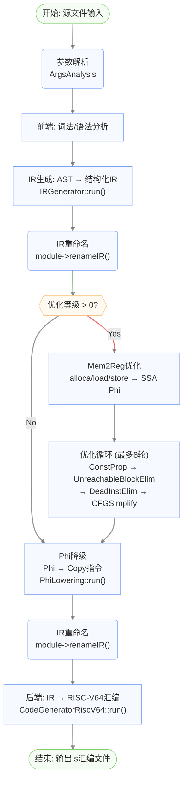
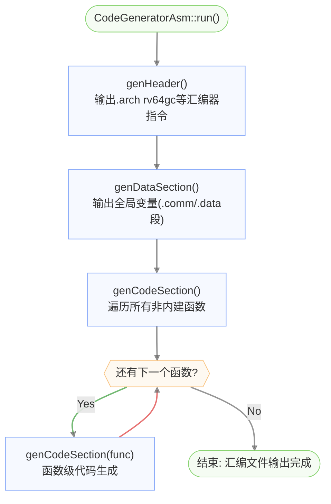
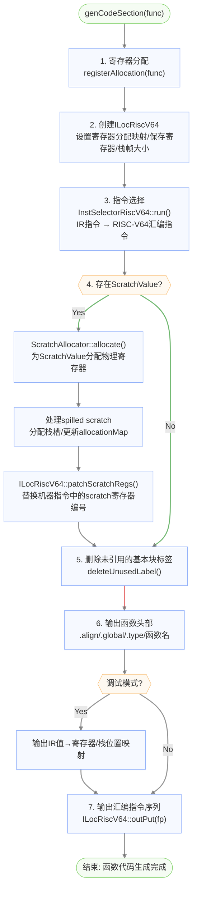
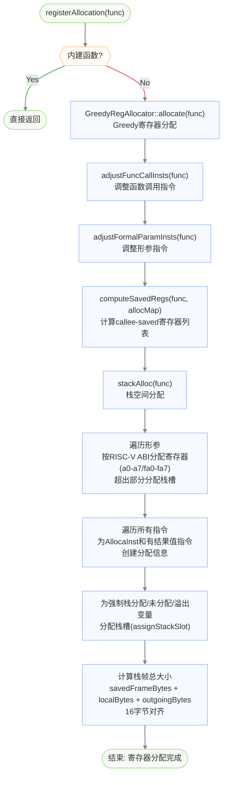

# 后端整体流程图

## 编译流水线总览



## 后端代码生成主流程



## 函数级代码生成流程 (genCodeSection)



## 寄存器分配与栈帧布局流程 (registerAllocation)



## 栈帧布局

```
高地址
┌──────────────────────────────┐
│       caller的栈帧            │
├──────────────────────────────┤
│       返回地址 (ra)           │  ← 若函数包含调用指令
│       帧指针 (s0/FP)         │  ← 始终保存
│       callee-saved (s1-s11)  │  ← 仅保存实际使用的
├──────────────────────────────┤  ← FP (s0) 指向此处
│       局部变量                │  ← AllocaInst分配
│       溢出变量                │  ← 被spill的虚拟寄存器
│       spilled scratch        │  ← 溢出的scratch寄存器
├──────────────────────────────┤
│       outgoing参数            │  ← 超过8个参数的调用参数
└──────────────────────────────┘  ← SP (sp) 指向此处
低地址
```
