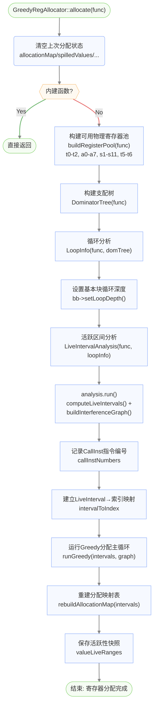
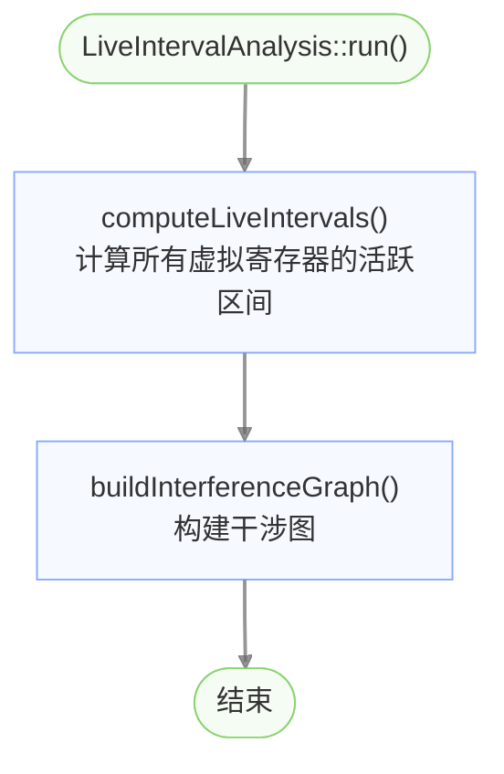
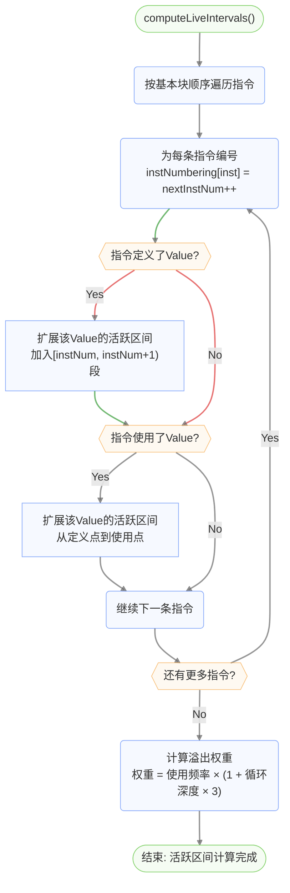
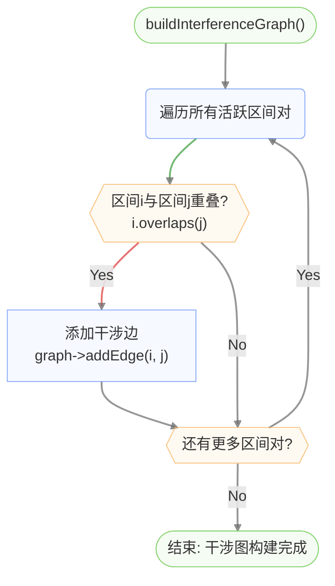
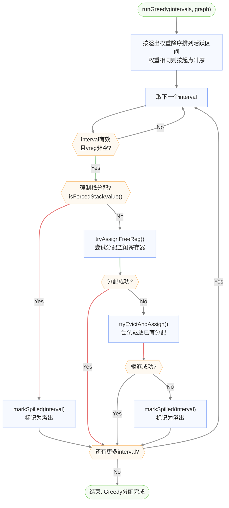
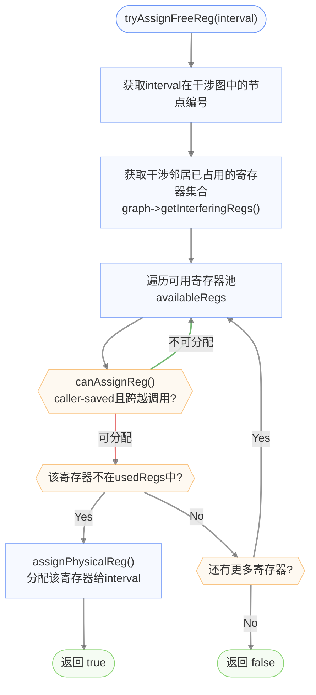
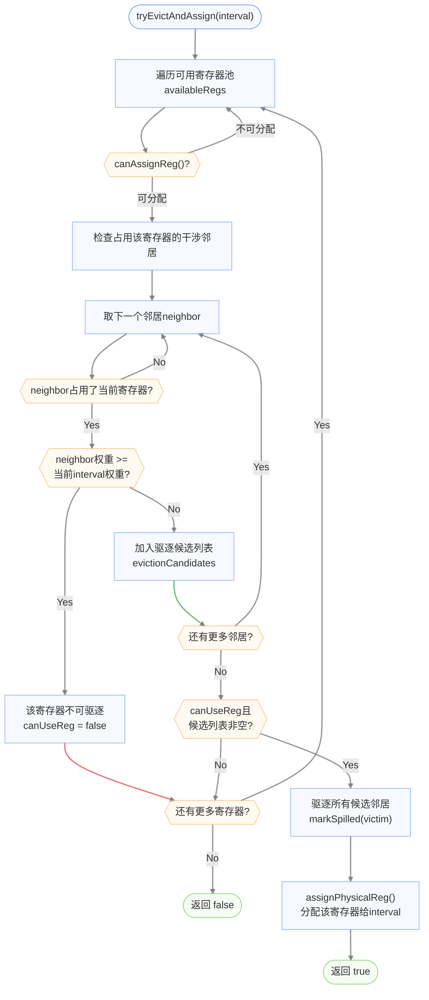

# 寄存器分配详细流程图

## GreedyRegAllocator::allocate 总流程

## 活跃区间分析流程 (LiveIntervalAnalysis::run)

### 总体流程

### computeLiveIntervals 详细流程

### buildInterferenceGraph 详细流程

## Greedy分配主循环 (runGreedy)

## tryAssignFreeReg 详细流程

## tryEvictAndAssign 详细流程

## 可用寄存器池

| 类别 | 寄存器 | 编号 | 说明 |
|------|--------|------|------|
| caller-saved | t0-t2 | 5,6,7 | 临时寄存器 |
| caller-saved | a0-a7 | 10-17 | 参数/返回值寄存器 |
| callee-saved | s1-s11 | 9,18-27 | 保存寄存器 |
| caller-saved | t5-t6 | 30,31 | 临时寄存器 |
| **保留** | zero,ra,sp,gp,tp,s0/fp | - | 不参与分配 |
| **保留** | t3-t4 | 28,29 | 保留为scratch寄存器 |
