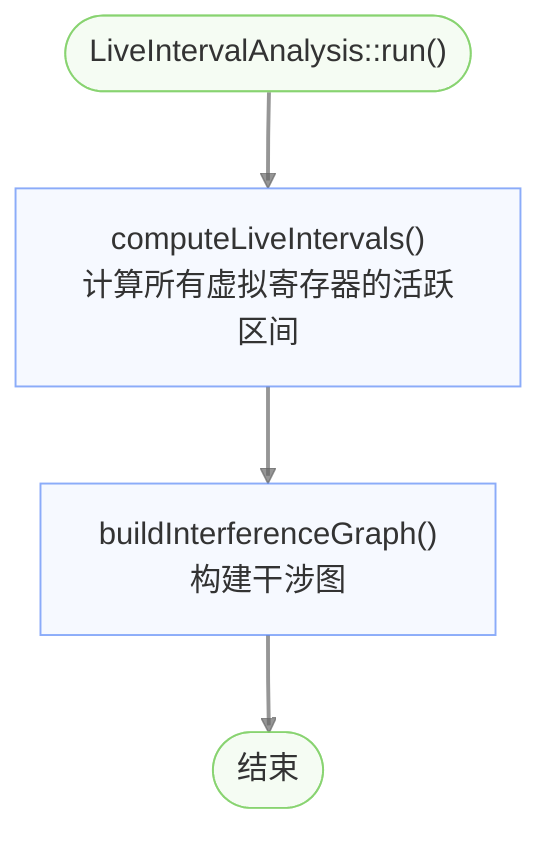
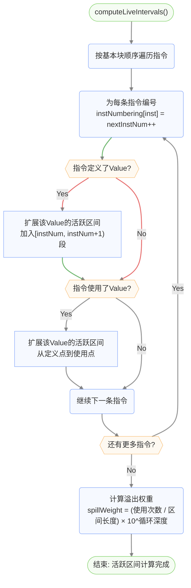
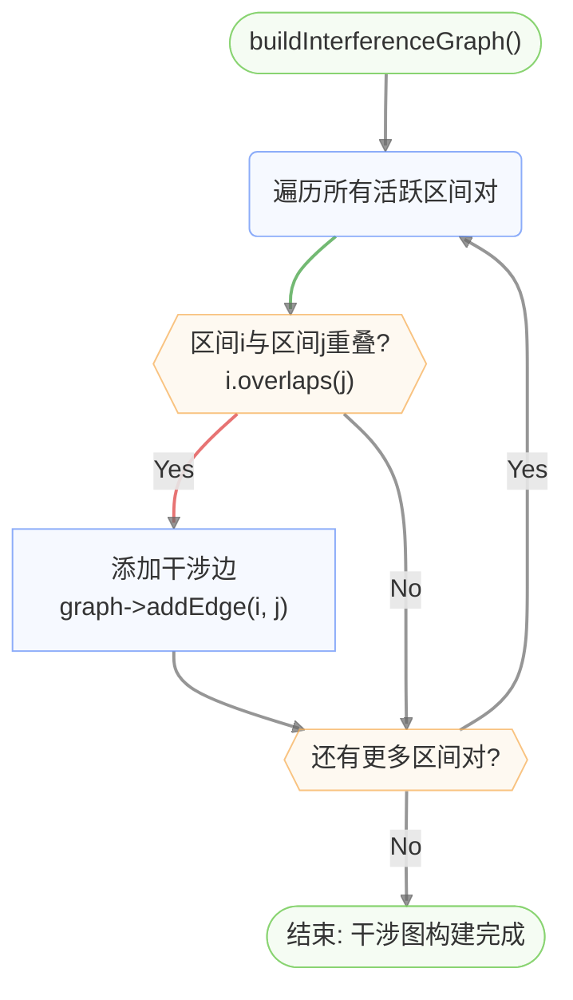
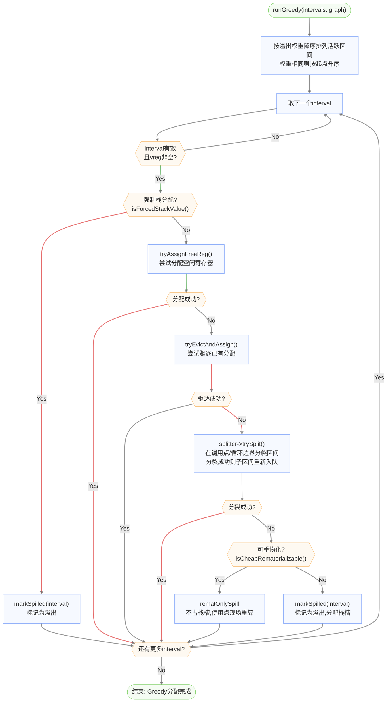
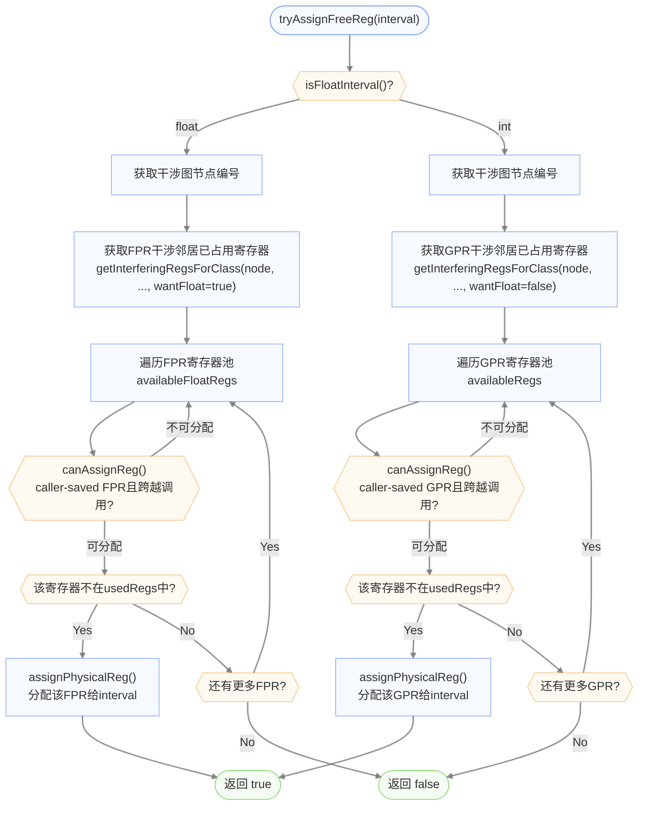
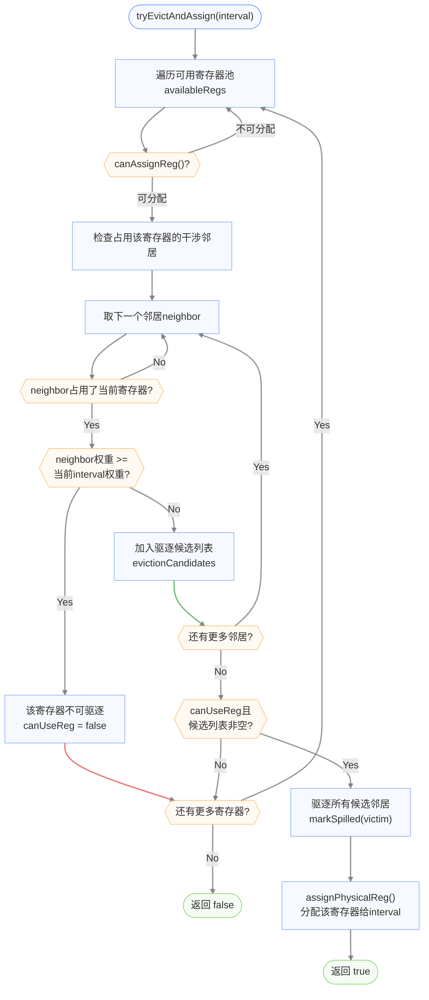

# 寄存器分配详细流程图

## GreedyRegAllocator::allocate 总流程

```mermaid
flowchart TD
    Start(["GreedyRegAllocator::allocate(func)"]) --> Clear("清空上次分配状态<br>allocationMap/spilledValues/...")

    Clear --> BuiltinCheck{{"内建函数?"}}
    BuiltinCheck -- "Yes" --> Return(["直接返回"])
    BuiltinCheck -- "No" --> BuildPool["构建可用物理寄存器池<br>buildRegisterPool(func)<br>t0-t2, a0-a7, s1-s11, t5-t6"]

    BuildPool --> BuildFloatPool["构建可用浮点寄存器池<br>buildFloatRegisterPool(func): ft0-ft7, fa0-fa7, ft8-ft9 (18个caller-saved FPR)<br>ft10-ft11 保留作指令选择临时FPR<br>默认经 CalleeSavedFPREnabler 追加 fs0-fs11 → 共30个"]
    BuildFloatPool --> DomTree["构建支配树<br>DominatorTree(func)"]
    DomTree --> LoopInfo["循环分析<br>LoopInfo(func, domTree)"]
    LoopInfo --> SetDepth["设置基本块循环深度<br>bb->setLoopDepth()"]

    SetDepth --> LIA["活跃区间分析<br>LiveIntervalAnalysis(func, loopInfo)"]
    LIA --> LIARun["analysis.run()<br>computeLiveIntervals() +<br>buildInterferenceGraph()"]
    LIARun --> RecordCall["记录CallInst指令编号<br>收集split候选点(循环内指令编号)"]
    RecordCall --> BuildIndex["建立LiveInterval→索引映射 intervalToIndex<br>建立valueToInterval反向映射"]
    BuildIndex --> PreciseSnapshot["快照精确def-use活跃段<br>供RegCoalescer做hole-aware干涉判断"]

    PreciseSnapshot --> Coalesce["RegCoalescer::run()<br>消除冗余copy: 合并不干涉的src/dst虚拟寄存器<br>(含回边携带空洞守卫、二元破坏性更新伪干涉识别)"]
    Coalesce --> Remat["Rematerialization分析<br>isCheapRematerializable()判定<br>常量/GEP链/廉价add-shl链标记为可重物化"]

    Remat --> RunGreedy["运行Greedy分配主循环<br>runGreedy(intervals, graph)<br>含LiveIntervalSplitter分裂"]
    RunGreedy --> Rebuild["重建分配映射表<br>rebuildAllocationMap(intervals)"]
    Rebuild --> SaveLive["保存活跃性快照<br>valueLiveRanges"]
    SaveLive --> CollectFPR["收集被使用的callee-saved FPR<br>CalleeSavedFPREnabler::collectUsedCalleeSavedFPRs()"]
    CollectFPR --> End(["结束: 寄存器分配完成"])

    %%Node styles
    classDef default fill:#E2EAFE4F,stroke:#5A88F6AF
    classDef endNode fill:#DDF4D84F,stroke:#7DCF62AF
    classDef decisionNode fill:#FCEBD34f,stroke:#F6AA4BAF

    %%Link styles
    linkStyle default stroke:#666666AF,stroke-width:2px
    linkStyle 2 stroke:#339933AF,stroke-width:2px
    linkStyle 3 stroke:#DD3333AF,stroke-width:2px

    %%Node classes
    class Start,End,Return endNode
    class BuiltinCheck decisionNode
```

## 活跃区间分析流程 (LiveIntervalAnalysis::run)

### 总体流程

```mermaid
flowchart TD
    Start(["LiveIntervalAnalysis::run()"]) --> ComputeLI["computeLiveIntervals()<br>计算所有虚拟寄存器的活跃区间"]
    ComputeLI --> BuildIG["buildInterferenceGraph()<br>构建干涉图"]
    BuildIG --> End(["结束"])

    %%Node styles
    classDef default fill:#E2EAFE4F,stroke:#5A88F6AF
    classDef endNode fill:#DDF4D84F,stroke:#7DCF62AF

    %%Link styles
    linkStyle default stroke:#666666AF,stroke-width:2px

    %%Node classes
    class Start,End endNode
```

### computeLiveIntervals 详细流程

```mermaid
flowchart TD
    Start(["computeLiveIntervals()"]) --> A1("按基本块顺序遍历指令")
    A1 --> A2("为每条指令编号<br>instNumbering[inst] = nextInstNum++")
    A2 --> A3{{"指令定义了Value?"}}
    A3 -- "Yes" --> A4["扩展该Value的活跃区间<br>加入[instNum, instNum+1)段"]
    A4 --> A5
    A3 -- "No" --> A5{{"指令使用了Value?"}}
    A5 -- "Yes" --> A6["扩展该Value的活跃区间<br>从定义点到使用点"]
    A6 --> A7
    A5 -- "No" --> A7("继续下一条指令")
    A7 --> A8{{"还有更多指令?"}}
    A8 -- "Yes" --> A2
    A8 -- "No" --> A9("计算溢出权重<br>spillWeight = (使用次数 / 区间长度) × 10^循环深度")
    A9 --> End(["结束: 活跃区间计算完成"])

    %%Node styles
    classDef default fill:#E2EAFE4F,stroke:#5A88F6AF
    classDef endNode fill:#DDF4D84F,stroke:#7DCF62AF
    classDef decisionNode fill:#FCEBD34f,stroke:#F6AA4BAF

    %%Link styles
    linkStyle default stroke:#666666AF,stroke-width:2px
    linkStyle 2,4 stroke:#339933AF,stroke-width:2px
    linkStyle 3,5 stroke:#DD3333AF,stroke-width:2px

    %%Node classes
    class Start,End endNode
    class A3,A5,A8 decisionNode
```

### buildInterferenceGraph 详细流程

```mermaid
flowchart TD
    Start(["buildInterferenceGraph()"]) --> B1("遍历所有活跃区间对")
    B1 --> B2{{"区间i与区间j重叠?<br>i.overlaps(j)"}}
    B2 -- "Yes" --> B3["添加干涉边<br>graph->addEdge(i, j)"]
    B3 --> B4
    B2 -- "No" --> B4{{"还有更多区间对?"}}
    B4 -- "Yes" --> B1
    B4 -- "No" --> End(["结束: 干涉图构建完成"])

    %%Node styles
    classDef default fill:#E2EAFE4F,stroke:#5A88F6AF
    classDef endNode fill:#DDF4D84F,stroke:#7DCF62AF
    classDef decisionNode fill:#FCEBD34f,stroke:#F6AA4BAF

    %%Link styles
    linkStyle default stroke:#666666AF,stroke-width:2px
    linkStyle 1 stroke:#339933AF,stroke-width:2px
    linkStyle 2 stroke:#DD3333AF,stroke-width:2px

    %%Node classes
    class Start,End endNode
    class B2,B4 decisionNode
```

## Greedy分配主循环 (runGreedy)

```mermaid
flowchart TD
    Start(["runGreedy(intervals, graph)"]) --> Sort["按溢出权重降序排列活跃区间<br>权重相同则按起点升序"]
    Sort --> NextIter["取下一个interval"]
    NextIter --> ValidCheck{{"interval有效<br>且vreg非空?"}}
    ValidCheck -- "No" --> NextIter
    ValidCheck -- "Yes" --> ForcedCheck{{"强制栈分配?<br>isForcedStackValue()"}}

    ForcedCheck -- "Yes" --> Spill["markSpilled(interval)<br>标记为溢出"]
    Spill --> MoreCheck

    ForcedCheck -- "No" --> TryFree["tryAssignFreeReg()<br>尝试分配空闲寄存器"]
    TryFree --> FreeOk{{"分配成功?"}}

    FreeOk -- "Yes" --> MoreCheck{{"还有更多interval?"}}
    FreeOk -- "No" --> TryEvict["tryEvictAndAssign()<br>尝试驱逐已有分配"]
    TryEvict --> EvictOk{{"驱逐成功?"}}

    EvictOk -- "Yes" --> MoreCheck
    EvictOk -- "No" --> TrySplit["splitter->trySplit()<br>在调用点/循环边界分裂区间<br>分裂成功则子区间重新入队"]
    TrySplit --> SplitOk{{"分裂成功?"}}
    SplitOk -- "Yes" --> MoreCheck
    SplitOk -- "No" --> RematCheck{{"可重物化?<br>isCheapRematerializable()"}}
    RematCheck -- "Yes" --> RematSpill["rematOnlySpill<br>不占栈槽,使用点现场重算"]
    RematCheck -- "No" --> Spill2["markSpilled(interval)<br>标记为溢出,分配栈槽"]
    RematSpill --> MoreCheck
    Spill2 --> MoreCheck

    MoreCheck -- "Yes" --> NextIter
    MoreCheck -- "No" --> End(["结束: Greedy分配完成"])

    %%Node styles
    classDef default fill:#E2EAFE4F,stroke:#5A88F6AF
    classDef endNode fill:#DDF4D84F,stroke:#7DCF62AF
    classDef decisionNode fill:#FCEBD34f,stroke:#F6AA4BAF

    %%Link styles
    linkStyle default stroke:#666666AF,stroke-width:2px
    linkStyle 4,8 stroke:#339933AF,stroke-width:2px
    linkStyle 5,9,11,13,15 stroke:#DD3333AF,stroke-width:2px

    %%Node classes
    class Start,End endNode
    class ValidCheck,ForcedCheck,FreeOk,EvictOk,SplitOk,RematCheck,MoreCheck decisionNode
```

## tryAssignFreeReg 详细流程

```mermaid
flowchart TD
    Start(["tryAssignFreeReg(interval)"]) --> Classify{{"isFloatInterval()?"}}
    Classify -- "float" --> GetNodeF["获取干涉图节点编号"]
    Classify -- "int" --> GetNodeI["获取干涉图节点编号"]

    GetNodeF --> GetUsedF["获取FPR干涉邻居已占用寄存器<br>getInterferingRegsForClass(node, ..., wantFloat=true)"]
    GetNodeI --> GetUsedI["获取GPR干涉邻居已占用寄存器<br>getInterferingRegsForClass(node, ..., wantFloat=false)"]

    GetUsedF --> NextRegF["遍历FPR寄存器池availableFloatRegs"]
    GetUsedI --> NextRegI["遍历GPR寄存器池availableRegs"]

    NextRegF --> CanAssignF{{"canAssignReg()<br>caller-saved FPR且跨越调用?"}}
    NextRegI --> CanAssignI{{"canAssignReg()<br>caller-saved GPR且跨越调用?"}}

    CanAssignF -- "不可分配" --> NextRegF
    CanAssignF -- "可分配" --> NotUsedF{{"该寄存器不在usedRegs中?"}}
    CanAssignI -- "不可分配" --> NextRegI
    CanAssignI -- "可分配" --> NotUsedI{{"该寄存器不在usedRegs中?"}}

    NotUsedF -- "Yes" --> AssignF["assignPhysicalReg()<br>分配该FPR给interval"]
    NotUsedF -- "No" --> MoreRegF{{"还有更多FPR?"}}
    NotUsedI -- "Yes" --> AssignI["assignPhysicalReg()<br>分配该GPR给interval"]
    NotUsedI -- "No" --> MoreRegI{{"还有更多GPR?"}}

    AssignF --> Success(["返回 true"])
    AssignI --> Success
    MoreRegF -- "Yes" --> NextRegF
    MoreRegF -- "No" --> Fail(["返回 false"])
    MoreRegI -- "Yes" --> NextRegI
    MoreRegI -- "No" --> Fail

    %%Node styles
    classDef default fill:#E2EAFE4F,stroke:#5A88F6AF
    classDef endNode fill:#DDF4D84F,stroke:#7DCF62AF
    classDef decisionNode fill:#FCEBD34f,stroke:#F6AA4BAF

    %%Link styles
    linkStyle default stroke:#666666AF,stroke-width:2px

    %%Node classes
    class Success,Fail endNode
    class Classify,CanAssignF,CanAssignI,NotUsedF,NotUsedI,MoreRegF,MoreRegI decisionNode
```

## tryEvictAndAssign 详细流程

```mermaid
flowchart TD
    Start(["tryEvictAndAssign(interval)"]) --> NextReg["遍历可用寄存器池availableRegs"]
    NextReg --> CanAssign{{"canAssignReg()?"}}
    CanAssign -- "不可分配" --> NextReg
    CanAssign -- "可分配" --> CheckNeighbors["检查占用该寄存器的干涉邻居"]

    CheckNeighbors --> NextNeighbor["取下一个邻居neighbor"]
    NextNeighbor --> SameReg{{"neighbor占用了当前寄存器?"}}
    SameReg -- "No" --> NextNeighbor
    SameReg -- "Yes" --> WeightCmp{{"neighbor权重 >=<br>当前interval权重?"}}

    WeightCmp -- "Yes" --> CannotUse["该寄存器不可驱逐<br>canUseReg = false"]
    CannotUse --> MoreReg2

    WeightCmp -- "No" --> AddCandidate["加入驱逐候选列表<br>evictionCandidates"]
    AddCandidate --> MoreNeighbor{{"还有更多邻居?"}}
    MoreNeighbor -- "Yes" --> NextNeighbor
    MoreNeighbor -- "No" --> CanUse{{"canUseReg且<br>候选列表非空?"}}

    CanUse -- "No" --> MoreReg2{{"还有更多寄存器?"}}
    MoreReg2 -- "Yes" --> NextReg
    MoreReg2 -- "No" --> Fail(["返回 false"])

    CanUse -- "Yes" --> Evict["驱逐所有候选邻居<br>markSpilled(victim)"]
    Evict --> Assign["assignPhysicalReg()<br>分配该寄存器给interval"]
    Assign --> Success(["返回 true"])

    %%Node styles
    classDef default fill:#E2EAFE4F,stroke:#5A88F6AF
    classDef endNode fill:#DDF4D84F,stroke:#7DCF62AF
    classDef decisionNode fill:#FCEBD34f,stroke:#F6AA4BAF

    %%Link styles
    linkStyle default stroke:#666666AF,stroke-width:2px
    linkStyle 11 stroke:#339933AF,stroke-width:2px
    linkStyle 9 stroke:#DD3333AF,stroke-width:2px

    %%Node classes
    class Success,Fail endNode
    class CanAssign,SameReg,WeightCmp,MoreNeighbor,CanUse,MoreReg2 decisionNode
```

## 可用寄存器池

### 通用寄存器 (GPR)

| 类别 | 寄存器 | 编号 | 说明 |
|------|--------|------|------|
| caller-saved | t0-t2 | 5,6,7 | 临时寄存器 |
| caller-saved | a0-a7 | 10-17 | 参数/返回值寄存器 |
| callee-saved | s1-s11 | 9,18-27 | 保存寄存器 |
| caller-saved | t5-t6 | 30,31 | 临时寄存器 |
| **保留** | zero,ra,sp,gp,tp,s0/fp | - | 不参与分配 |
| **保留** | t3-t4 | 28,29 | 保留为scratch寄存器 |

### 浮点寄存器 (FPR)

| 类别 | 寄存器 | 编号 | 说明 |
|------|--------|------|------|
| caller-saved | ft0-ft7 | 0-7 | 临时寄存器 |
| caller-saved | fa0-fa7 | 10-17 | 参数/返回值寄存器 |
| caller-saved | ft8-ft9 | 28-29 | 临时寄存器 |
| **保留 (scratch)** | ft10-ft11 | 30-31 | 指令选择阶段临时FPR，不参与分配 |
| callee-saved | fs0-fs1 | 8-9 | 保存寄存器 (默认 `--ra-callee-saved-fpr` 开启时纳入分配) |
| callee-saved | fs2-fs11 | 18-27 | 保存寄存器 (默认 `--ra-callee-saved-fpr` 开启时纳入分配) |

> **注意**：GPR和FPR都使用0-31编号，编号相同不代表同一物理资源。干涉集合必须通过 `getInterferingRegsForClass()` 按类别过滤。

> **默认配置**：callee-saved FPR (`--ra-callee-saved-fpr`)、寄存器合并 (`--ra-coalesce`) 和活跃区间分裂 (`--ra-split`) 均默认开启。可通过 `--ra-no-callee-saved-fpr`、`--ra-no-coalesce`、`--ra-no-split` 关闭。

## 寄存器合并 (RegCoalescer)

在 Greedy 分配主循环之前执行，消除 IR 中的冗余 copy 指令。当 copy 的源和目标虚拟寄存器不干涉时，将两者合并为同一虚拟寄存器，消除该 copy。

### 合并条件 (canCoalesce)

1. **类型兼容**：src 和 dst 类型一致
2. **不干涉**：两个区间在干涉图中无边，或仅在 copy 位置有"伪干涉"（copy 本身定义 dst、最后使用 src，这一拍的表面重叠可忽略）
3. **精确 interfer 判断**：使用保守循环扩展前的 `preciseSegments` 做 hole-aware 判断

### 伪干涉放行

- **二元破坏性更新**：`%x = add %x, %y` 形式的指令，在定义点 src 和 dst 重叠一拍，可安全合并
- **循环累加器合并**：循环回边上 `phi` 对应的 copy，借助精确区间识别回边携带空洞放行

### 回边携带空洞守卫 (spansCarriedHole)

当 src/dst 的一个成员（合并类可能已包含多个原始值）在循环回边处因携带值而产生活跃空洞，且另一方以"外来"方式插入该空洞时，判定为真干涉、拒绝合并。逐原始成员判定，避免误判。

**源码位置**: `backend/riscv64/RegCoalescer.cpp`

## 重物化 (Rematerialization)

当寄存器压力导致需要 spill 时，对廉价可重算的值不分配栈槽，而是在每个使用点现场重算。

### 可重物化判定 (isCheapRematerializable)

使用不依赖具体寄存器分配结果的静态判定：

1. **常量**：`ConstInteger`、`ConstFloat` — 一条 `li` 即可
2. **全局/栈对象地址**：`GlobalVariable`、`AllocaInst` — 一条地址加载
3. **纯常量下标 GEP 链** (`isConstOffsetChainFromMaterializableRoot`)：以全局/栈地址为根、每次偏移均为常量的 GEP 链 — 整链折叠为 `根地址 + 总偏移`，重物化仅需 `lea`+`addi`
4. **廉价 add/shl 链**：由上述可重物化值组成的运算链（递归深度限制）

### Remat-only Spill

溢出的可重物化值标记为 `rematOnlySpill`：不分配栈槽（不生成 spill store），各使用点由指令选择阶段自行物化常量或地址。节省了栈空间和 store 指令，代价是可能重复计算。

**源码位置**: `backend/riscv64/Rematerialization.cpp`

## 溢出策略 (HeuristicSpillStrategy)

默认的 `HeuristicSpillStrategy` 根据活跃区间的溢出权重决定溢出/驱逐优先级。权重受循环深度指数加权（`10^loopDepth`），使循环内值的溢出代价远高于循环外值。

**源码位置**: `backend/riscv64/HeuristicSpillStrategy.cpp`

## 相关文档

| 文档 | 内容 |
|------|------|
| [后端整体流程](backend-overview.md) | 编译流水线、函数级代码生成、栈帧布局 |
| [指令选择与代码输出](backend-instselect.md) | IR指令翻译分派、操作数加载/存储 |
| [活跃性分析流程](liveness-analysis-flowchart.md) | 活跃区间计算、数据流方程、下游消费 |
| [常量除法优化](backend-const-div-opt.md) | 2的幂次移位、Magic Number算法、强度消减 |
| [浮点寄存器分配](backend-fpregalloc.md) | FPR池构建、类别区分、临时FPR借用、并行移动解析 |
