# 活跃性分析流程图

```mermaid
flowchart TD
    Start(["开始: CodeGeneratorRiscV64::emitFunction(func)"]) --> InitAnalysis("初始化: 构建支配树 DominatorTree 与循环信息 LoopInfo")
    InitAnalysis --> RunLIA("调用 LiveIntervalAnalysis::run()")

    RunLIA --> ComputeLI("阶段1: computeLiveIntervals() 计算活跃区间")

    subgraph Phase1["阶段1: 计算活跃区间"]
        ComputeLI --> Step11("步骤1.1: 指令线性编号与局部use/def收集")
        Step11 --> Step11Detail("遍历基本块和指令<br>为每条指令分配递增编号<br>形参: addSegment(0,1)<br>源操作数: addUsePosition(instNum)<br>结果值: addSegment(instNum, instNum+1)")

        Step11Detail --> Step12("步骤1.2: 求解live-in/live-out数据流方程")
        Step12 --> Step12Detail("后向数据流分析, 迭代至不动点<br>liveOut[bb] = ∪ liveIn[succ]<br>liveIn[bb] = use[bb] ∪ (liveOut[bb] - def[bb])<br>为live-in/live-out值添加基本块范围存活段")

        Step12Detail --> Step13("步骤1.3: 根据使用点扩展活跃区间")
        Step13 --> Step13Detail("对每个LiveInterval<br>找到lastUse, 从定义点延伸到lastUse+1<br>addSegment自动合并相邻/重叠子段")

        Step13Detail --> Step14("步骤1.4: 循环回边保守扩展")
        Step14 --> Step14Detail("检测回边(后继bb序号 ≤ 当前bb序号)<br>对循环内使用、循环外定义的值<br>保守延长活跃区间到循环头之后即活跃区间为整个循环体")

        Step14Detail --> Step15{"步骤1.5: 是否提供LoopInfo?"}
        Step15 -- "是" --> Step15Yes("循环感知扩展<br>对循环头中使用、循环外定义的值<br>扩展活跃区间到循环体末尾")
        Step15 -- "否" --> Step16
        Step15Yes --> Step16("步骤1.6: 计算溢出权重")

        Step16 --> Step16Detail("建立指令编号→循环深度映射<br>计算maxLoopDepth<br>spillWeight = (useCount/intervalLength) × 10^loopDepth<br>权重越高越不应溢出")
    end

    Step16Detail --> BuildIG("阶段2: buildInterferenceGraph() 构建干涉图")

    subgraph Phase2["阶段2: 构建干涉图"]
        BuildIG --> SortIntervals("将活跃区间按start排序")
        SortIntervals --> CheckOverlap("遍历每对区间(i,j)")
        CheckOverlap --> OverlapDecision{{"i.overlaps(j)?"}}
        OverlapDecision -- "是" --> AddEdge("addEdge(i,j) 添加干涉边")
        OverlapDecision -- "否" --> SkipCheck{{"j.start ≥ i.end?"}}
        AddEdge --> NextPair("继续下一对区间")
        SkipCheck -- "是" --> EarlyBreak("提前终止内层循环(后续区间不与i重叠)")
        SkipCheck -- "否" --> NextPair
        EarlyBreak --> NextPair
        NextPair --> Finalize("finalizeEdges() 邻接表去重排序")
    end

    Finalize --> GreedyAlloc("阶段3: Greedy寄存器分配")

    subgraph Phase3["阶段3: Greedy寄存器分配"]
        GreedyAlloc --> SortByWeight("按溢出权重降序排列活跃区间")
        SortByWeight --> PickInterval("取出下一个活跃区间")
        PickInterval --> TryFree{{"tryAssignFreeReg()<br>能否分配空闲寄存器?"}}
        TryFree -- "成功" --> Assigned("分配物理寄存器")
        TryFree -- "失败" --> TryEvict{{"tryEvictAndAssign()<br>能否驱逐低权重邻居?"}}
        TryEvict -- "成功" --> Evicted("驱逐邻居并分配")
        TryEvict -- "失败" --> Spilled("markSpilled() 标记为溢出")
        Assigned --> MoreIntervals{{"还有未处理区间?"}}
        Evicted --> MoreIntervals
        Spilled --> MoreIntervals
        MoreIntervals -- "是" --> PickInterval
        MoreIntervals -- "否" --> AllocDone("分配完成")
    end

    AllocDone --> Downstream("阶段4: 活跃性信息下游使用")

    subgraph Phase4["阶段4: 下游消费"]
        Downstream --> SpillMgr("SpillManager: 溢出代码插入<br>为溢出区间分配栈槽<br>定义点后插入StoreInst(spill)<br>使用点前插入LoadInst(reload)")
        Downstream --> LocalTmp("LocalTempManager: 临时寄存器管理<br>isLiveAllocatedReg()判断寄存器是否承载live值<br>borrow()借用时避开活跃值")
        Downstream --> ScratchAlloc("ScratchAllocator: Scratch寄存器分配<br>isRegOccupiedByIR()检查与IR活跃值冲突")
        Downstream --> FloatTmp("浮点临时寄存器管理<br>borrowFloatTemp(): 遍历FPR池避开活跃值<br>isFloatRegLiveAt(): 查询FPR活跃性<br>emitFloatRegMoves(): 解析FPR并行移动")
    end

    SpillMgr --> End(["结束: 活跃性分析完成, 寄存器分配结果可用"])
    LocalTmp --> End
    ScratchAlloc --> End
    FloatTmp --> End

    %%Node styles
    classDef default fill:#E2EAFE4F,stroke:#5A88F6AF
    classDef endNode fill:#DDF4D84F,stroke:#7DCF62AF
    classDef decisionNode fill:#FCEBD34f,stroke:#F6AA4BAF

    %%Link styles
    linkStyle default stroke:#666666AF,stroke-width:2px
    linkStyle 7,17,21,25,28,32,35 stroke:#339933AF,stroke-width:2px
    linkStyle 8,18,22,26,29,33,36 stroke:#DD3333AF,stroke-width:2px

    %%Node classes
    class Start,End endNode
    class Step15,OverlapDecision,SkipCheck,TryFree,TryEvict,MoreIntervals decisionNode

    %%Subgraph styles
    style Phase1 fill:#E2EAFE3F,stroke:#6666669F,stroke-width:1px,stroke-dasharray: 5 5
    style Phase2 fill:#E2EAFE3F,stroke:#6666669F,stroke-width:1px,stroke-dasharray: 5 5
    style Phase3 fill:#E2EAFE3F,stroke:#6666669F,stroke-width:1px,stroke-dasharray: 5 5
    style Phase4 fill:#E2EAFE3F,stroke:#6666669F,stroke-width:1px,stroke-dasharray: 5 5
```

## 相关文档

| 文档 | 内容 |
|------|------|
| [后端整体流程](backend-overview.md) | 编译流水线、函数级代码生成、栈帧布局 |
| [指令选择与代码输出](backend-instselect.md) | IR指令翻译分派、操作数加载/存储 |
| [寄存器分配详细流程](backend-regalloc.md) | Greedy分配器、tryAssignFreeReg、tryEvictAndAssign |
| [常量除法优化](backend-const-div-opt.md) | 2的幂次移位、Magic Number算法、强度消减 |
| [浮点寄存器分配](backend-fpregalloc.md) | FPR池构建、类别区分、临时FPR借用、并行移动解析 |
